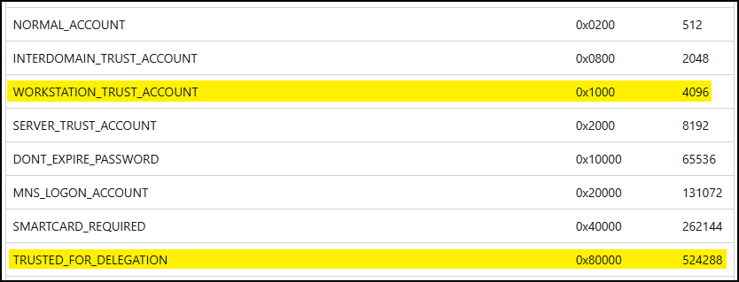

---
layout:
  width: default
  title:
    visible: true
  description:
    visible: false
  tableOfContents:
    visible: true
  outline:
    visible: true
  pagination:
    visible: true
  metadata:
    visible: true
  tags:
    visible: true
---

# SeEnableDelegation

The [`SeEnableDelegation`](https://learn.microsoft.com/en-us/previous-versions/windows/it-pro/windows-server-2012-R2-and-2012/dn221977\(v=ws.11\)?redirectedfrom=MSDN) privilege can be used to enable computer and user accounts to be trusted for unconstrained delegation. By default, only DAs have this right.

This can be done by setting the `TRUSTED_FOR_DELEGATION` flag to `true` in the `userAccountControl` attribute of the target account.&#x20;

As an example, the standard value for a [`WORKSTATION_TRUST_ACCOUNT`](https://learn.microsoft.com/en-us/troubleshoot/windows-server/active-directory/useraccountcontrol-manipulate-account-properties#list-of-property-flags) is 4096 and the [`TRUSTED_FOR_DELEGATION`](https://learn.microsoft.com/en-us/troubleshoot/windows-server/active-directory/useraccountcontrol-manipulate-account-properties#list-of-property-flags) flag's value is 524288.&#x20;

<figure><figcaption></figcaption></figure>

Thus, the UAC would have to be set to 4096 + 524288 = 528384. For more details on how this can be done from both Powershell and Linux, see [here](../attacks/delegations.md#coercive-connection).
