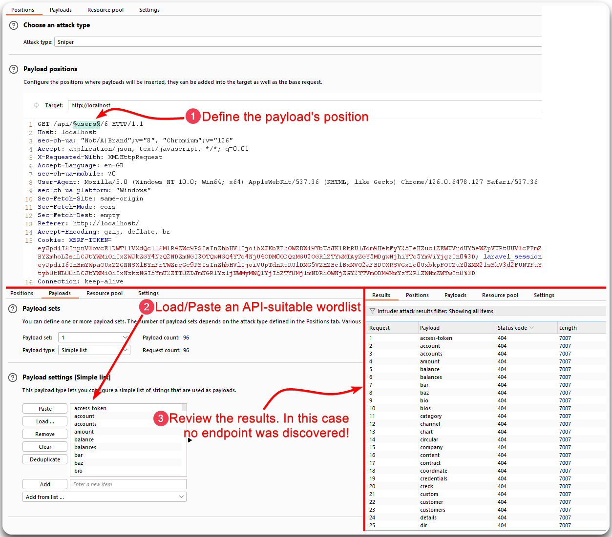
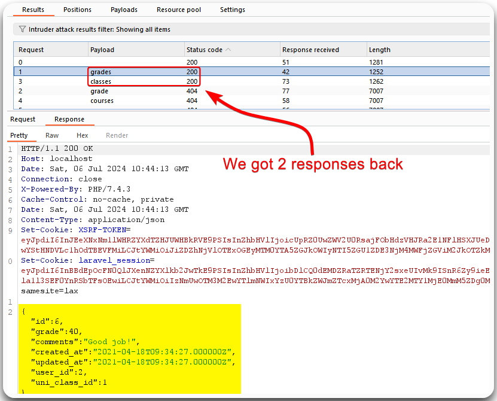
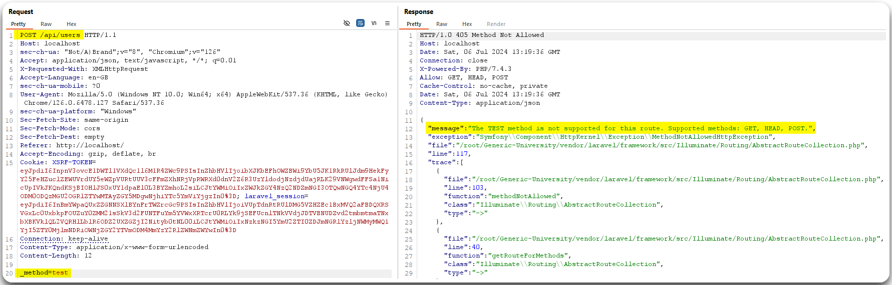
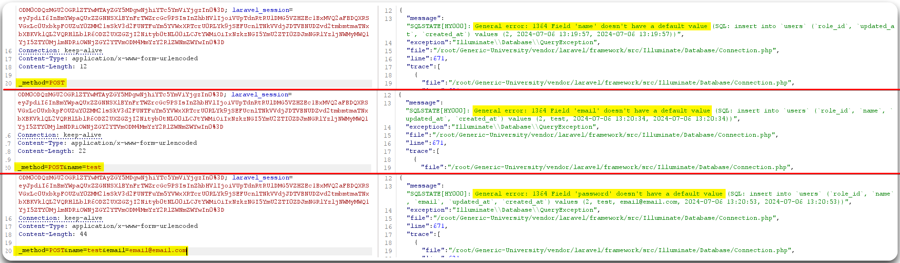
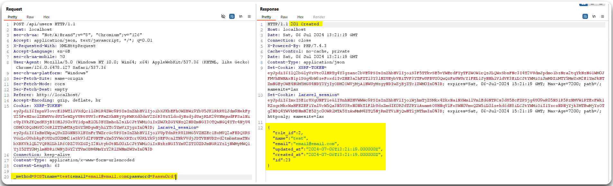
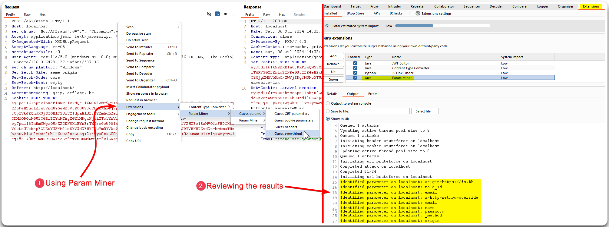

---
layout:
  title:
    visible: true
  description:
    visible: false
  tableOfContents:
    visible: true
  outline:
    visible: true
  pagination:
    visible: true
---

# Enumeration

## General Info

> _The information below is mostly based on this_ [_video_](https://www.youtube.com/watch?v=fvcKwUS4PTE\&list=PLbyncTkpno5HqX1h2MnV6Qt4wvTb8Mpol\&index=3)_._

**Discover and increase the attack surface**, i.e., find new endpoints and/or parameters. The end goal is to **create a legit API endpoint list**.

| Automated                                                                                                          | Manual               |
| ------------------------------------------------------------------------------------------------------------------ | -------------------- |
| Brute-forcing tools                                                                                                | Public documentation |
| Suitable wordlists                                                                                                 | Application poking   |
| Burp Intruder/[`ffuf`](broken-reference) (brute-force), [`arjun`](../../tools/web/api/arjun.md) (parameter mining) |                      |

1. Assess the API structure before using automated tools.
   1. Explore the app manually.
   2. Which one is the resource name and what changes?
   3. What endpoints exist for that resource and what do they do?
2. Use/Create a wordlist customized to the target.
   * [`seclists/Discovery/Web-Content/api/`](https://github.com/danielmiessler/SecLists/tree/master/Discovery/Web-Content/api) (api-specific)
   * [`common-methods.txt`](https://raw.githubusercontent.com/fuzzdb-project/fuzzdb/master/discovery/common-methods/common-methods.txt) (api-specific)
   * [`seclists/Discovery/Web-Content/raft-small-words.txt`](https://raw.githubusercontent.com/danielmiessler/SecLists/master/Discovery/Web-Content/raft-small-words.txt)

## Endpoint Enumeration

> _The examples below are based on the_ [_Generic University_](https://github.com/InsiderPhD/Generic-University) _application. The wordlist used is_ [_objects-lowercase.txt_](https://raw.githubusercontent.com/danielmiessler/SecLists/master/Discovery/Web-Content/api/objects-lowercase.txt)_._

Using an API-specific, but still generic, wordlist sometimes does not work (Figure 1).

<figure><figcaption><p>Figure 1: Brute-forcing API endpoints with Intruder using a generic API wordlist.</p></figcaption></figure>

In this case, it might be better to create a small customized wordlist (Figure 2).

```bash
$ cat generic_uni_endpoints.txt
grades
grade
classes
courses
course
teachers
professors
university
universities
teacher
professor
class
payments
fees
fee
payment
alumni
students
student
```

<figure><figcaption><p>Figure 2: Brute-forcing API endpoints with Intruder using a customised wordlist.</p></figcaption></figure>

Since we now know that `/api/grades/6` and `/api/classes/6` exist, we can proceed to brute force the `6` value to see what else is there. We can also use [`ffuf`](broken-reference) to brute force those endpoints and also proxy them to Burp so they can be added to Target and "bypass" the throttling of Intruder's community edition.


```bash
$ ffuf -u http://localhost/api/FUZZ/6 -w generic_uni_endpoints.txt -c -ac -x http://127.0.0.1:8081
```


[Kiterunner](../../tools/web/api/kiterunner.md), an API-specific tool, can also be used to enumerate endpoints.

## Parameter Enumeration




```bash
$ arjun -u http://localhost/api/users -m POST -o users_results.txt
<SNIP>
[*] Logicforcing the URL endpoint
[✓] parameter detected: _method, based on: http code
[+] Parameters found: _method
```


<figure><figcaption><p>Figure 3: Passing the parameter found with <code>arjun</code>.</p></figcaption></figure>

<figure><figcaption><p>Figure 4: Enumerating more parameters.</p></figcaption></figure>

<figure><figcaption><p>Figure 5: Successfully creating a new user.</p></figcaption></figure>

We can also use the Param Miner extension to discover new parameters (Figure 6).

<figure><figcaption><p>Figure 6: Discovering request parameters with Burp's Param Miner extension.</p></figcaption></figure>

