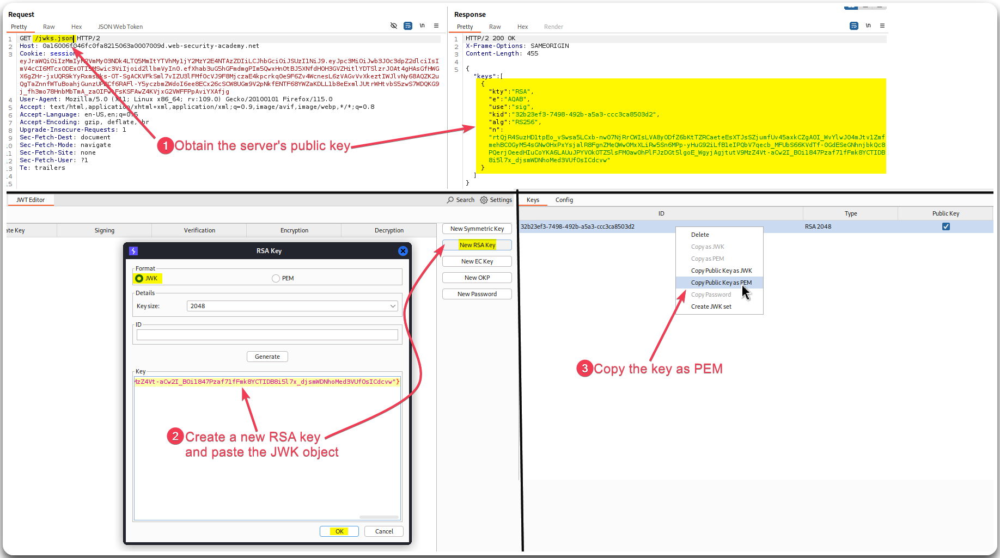
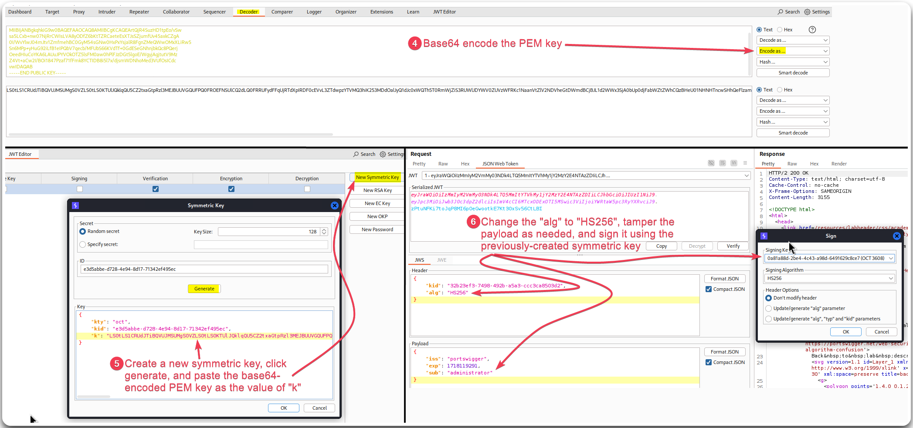
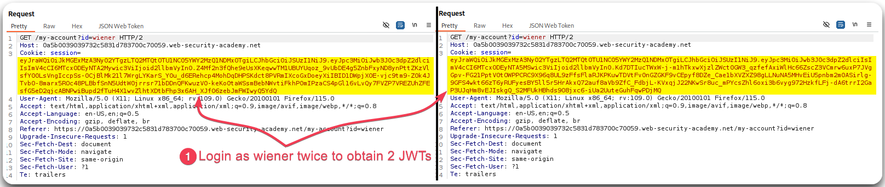
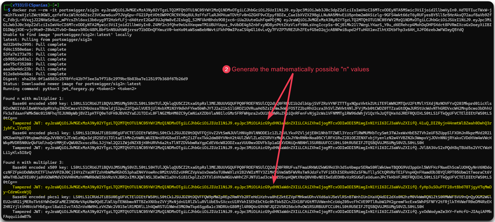
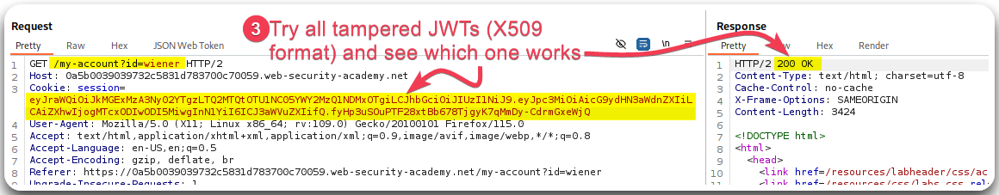
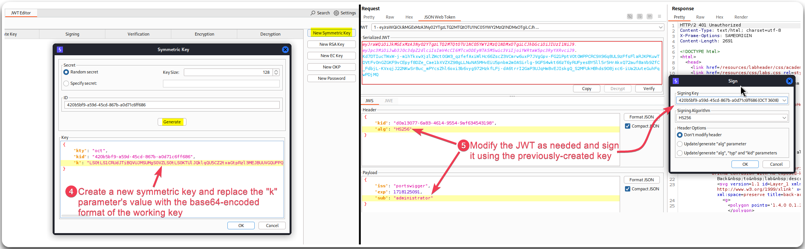

---
layout:
  title:
    visible: true
  description:
    visible: false
  tableOfContents:
    visible: true
  outline:
    visible: true
  pagination:
    visible: true
---

# Algorithm Confusion

> _The below content & examples are based on PortSwigger's_ [_JWT attacks_](https://portswigger.net/web-security/jwt) _module._


_**Symmetric algorithms** use the **same key** to both sign and verify the token, whereas **asymmetric algorithms** use a **key pair**, i.e., a private key to sign the token and a public key to verify it._


## Process <a href="#process" id="process"></a>

1. Obtain the server's public key.
   * This might be done through conventional endpoints such as `/jwks.json` or `/well-known/jwks.json`.
2. Convert it to a suitable format.
   * The exposed keys (JWK format) must be identical with the server's keys.
3. Create a malicious JWT with a modified payload and the `alg` set to `HS256`.
4. Sign the token with `HS256` using the public key as the secret.

<figure><figcaption><p>Figure 1: Obtaining the server's public key &#x26; creating a new one.</p></figcaption></figure>

<figure><figcaption><p>Figure 2: Tampering the JWT's key.</p></figcaption></figure>

## Deriving Public Keys from Existing Tokens <a href="#deriving-public-keys-from-existing-tokens" id="deriving-public-keys-from-existing-tokens"></a>

If no exposed public keys are available, we can derive one from a pair of existing JWTs using [`jwt_forgery.py`](https://github.com/silentsignal/rsa\_sign2n).

```bash
# Simplified version of the above tool
docker run --rm -it portswigger/sig2n <token1> <token2>
```

The above command is using the provided token to calculate one or more potential `n` values. For each potential value, the script outputs:

1. A base64-encoded PEM key in both `X.509` and `PKCS1` format.
2. A forged JWT signed using each of these keys.

To identify the correct key we need to try both and see which is accepted by the server.

<figure><figcaption><p>Figure 3: Obtaining 2 different JWTs.</p></figcaption></figure>

<figure><figcaption><p>Figure 4: Generating the PEM-signed JWTs.</p></figcaption></figure>

<figure><figcaption><p>Figure 5: Finding the working JWT.</p></figcaption></figure>

<figure><figcaption><p>Figure 6: Tampering the JWT.</p></figcaption></figure>
