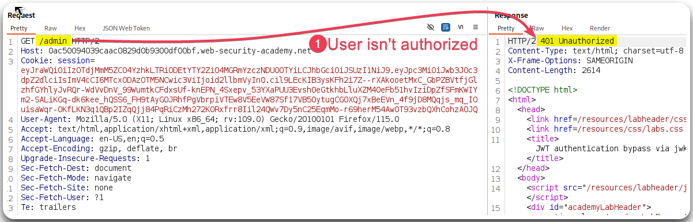

---
layout:
  title:
    visible: true
  description:
    visible: false
  tableOfContents:
    visible: true
  outline:
    visible: true
  pagination:
    visible: true
---

# Header Injection


JWT **header parameter injection** occurs when an attacker manipulates or injects malicious data into the JWT's header section. This vulnerability arises from inadequate validation and handling of JWT header parameters, allowing attackers to exploit or manipulate the token's integrity and authentication.


> _The below content is based on PortSwigger's_ [_JWT attacks_](https://portswigger.net/web-security/jwt) _module._

Only the `alg` header parameter is mandatory, but often there are other parameters as well.

* `jwk` (JSON Web Key) - Provides an embedded JSON object representing the key.
* `jku` (JSON Web Key Set URL) - Provides a URL from which servers can fetch a set of keys containing the correct key.
* `kid` (Key ID) - Provides an ID that servers can use to identify the correct key in cases where there are multiple keys to choose from. Depending on the format of the key, this may have a matching `kid` parameter.


_The above parameters **tell the server which key to use when veryfing the signature**._


### Via JWK 

> The below example is based on PortSwigger's [_JWT authentication bypass via jwk header injection_](https://portswigger.net/web-security/jwt/lab-jwt-authentication-bypass-via-jwk-header-injection) lab.

`jwk` is an optional parameter for JWS which servers use to **embed their public key directly within the token itself** in `JWK` format, i.e., a standardized format for representing keys as a JSON object. Typically, servers use a limited whitelist of public keys for JWT signature verification, but they can be misconfigured and **use any key that's embedded** within the `jwt` parameter.

<figure><figcaption>
Figure 1: Trying to access an unauthorized page.
</figcaption></figure>

<figure><figcaption>
Figure 2: Creating a new key and embedding it into the JWT header. 
</figcaption></figure>

<figure><figcaption>
Figure 3: Using the tampered JWT to access the previously unauthorized page.
</figcaption></figure>

> _This can be also done manually, but **make sure to also change the**** ****`kid`**** ****parameters**; they need to also be matching. The above extension does this automatically._

### Via JKU 

> The below example is based on PortSwigger's [_JWT authentication bypass via jku header injection_](https://portswigger.net/web-security/jwt/lab-jwt-authentication-bypass-via-jku-header-injection) lab.

Some servers let you use the `jku` (JWK Set URL) header parameter to reference a JWK set, i.e., a JSON object containing an array of JWKs representing different keys. When verifying the signature, the server fetches the relevant key from this URL. JWK Sets are sometimes exposed publicly via a standard endpoint, such as `/.well-known/jwks.json`. More secure websites will only fetch keys from trusted domains, but you can sometimes take advantage of URL parsing discrepancies to bypass this kind of filtering.

<figure><figcaption>
Figure 4: Creating a JWK set on a malicious server.
</figcaption></figure>

<figure><figcaption>
Figure 5: Creating a new key as JWK.
</figcaption></figure>

<figure><figcaption>
Figure 6: Leveraging the JWK and exploiting for privilege escalation. 
</figcaption></figure>

### Via KID 

> The below example is based on PortSwigger's [_JWT authentication bypass via kid header path traversal_](https://portswigger.net/web-security/jwt/lab-jwt-authentication-bypass-via-kid-header-path-traversal) lab.

* Servers may use several keys for signing different kinds of data, no just JWTs.
* The `kid` parameter identifies which key to use when verifying the signature.
* The `kid` parameter is just an arbitraty string of the developer's choosing.
* If `kid` is vulnerable to **directory traversal**, an attacker could force the server to use an arbitraty file from their filesystem as the verification key.
* If the server stores its verification keys in a database, `kid` might be vulnerable to SQLi.

<figure><figcaption>
Figure 7: Performing a KID-based injection.
</figcaption></figure>

### Other interesting JWT header parameters 

* `cty` (Content Type) - Sometimes used to declare a media type for the content in the JWT payload. This is usually omitted from the header, but the underlying parsing library may support it anyway. If you have found a way to bypass signature verification, you can try injecting a `cty` header to change the content type to `text/xml` or `application/x-java-serialized-object`, which can potentially enable new vectors for [XXE](https://portswigger.net/web-security/xxe) and [deserialization](https://portswigger.net/web-security/deserialization) attacks.
* `x5c` (X.509 Certificate Chain) - Sometimes used to pass the X.509 public key certificate or certificate chain of the key used to digitally sign the JWT. This header parameter can be used to inject self-signed certificates, similar to the `jwk` header injection attacks discussed above. Due to the complexity of the X.509 format and its extensions, parsing these certificates can also introduce vulnerabilities.
