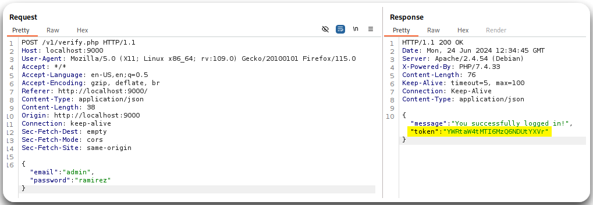
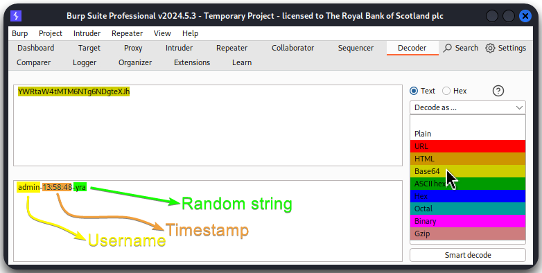

---
layout:
  title:
    visible: true
  description:
    visible: false
  tableOfContents:
    visible: true
  outline:
    visible: true
  pagination:
    visible: true
---

# Tokens


**Token BFAs** involves systematically trying different token values to guess or brute force valid tokens for authentication. If tokens are weak, predictable, or lack proper rate-limiting, attackers can automate these attempts to gain unauthorized access to an API or system by guessing valid tokens.


> _The below example is based on TCM's_ [_Practical API Hacking_](https://academy.tcm-sec.com/p/hacking-apis) _course._

We can obtain a valid token (Figure 1) and then use Burp's Sequencer to analyze it (Figure 2) and/or Burp's Decoder to decipher its value (Figure 3). In case there is a predictable pattern, we can create a script for generating more tokens and then attempt a BFA with them.

<figure><figcaption>
Figure 1: Obtaining a token as <code>admin</code>.
</figcaption></figure>

<figure><figcaption>
Figure 2: Performing token analysis with Burp's Sequencer.
</figcaption></figure>

<figure><figcaption>
Figure 3: Decoding the token with Burp's Decoder.
</figcaption></figure>
