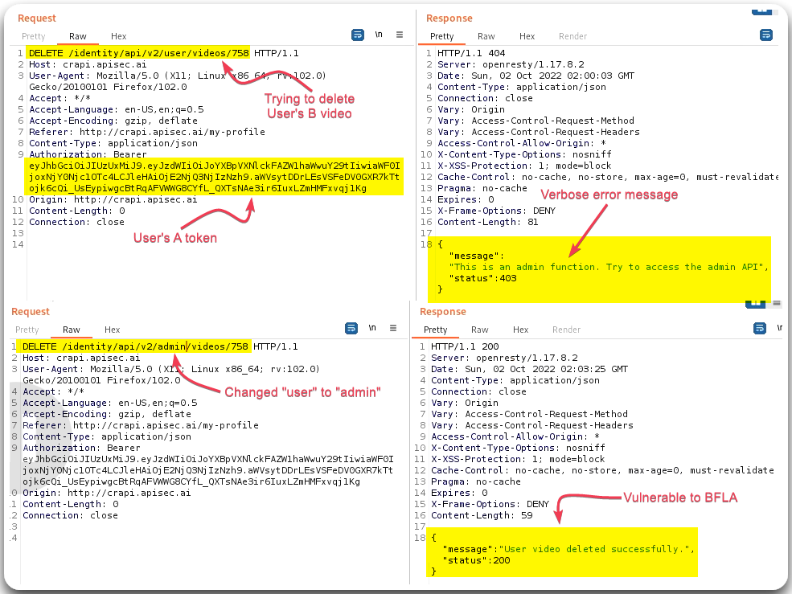
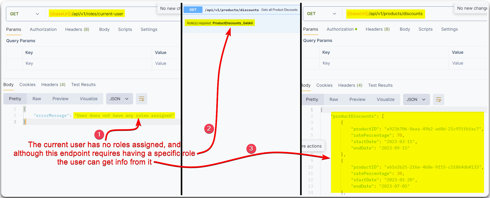

---
layout:
  title:
    visible: true
  description:
    visible: false
  tableOfContents:
    visible: true
  outline:
    visible: true
  pagination:
    visible: true
---

# BFLA

> [API5:2023 Broken Function Level Authorization](https://owasp.org/API-Security/editions/2023/en/0xa5-broken-function-level-authorization/): Similar concept with [BOLA](bola.md), but instead of looking at other user's resources, we are testing other role's functionality, e.g. guest vs. authenticated vs. administrative.

## General Information

Testing for BFLA involves the same steps as [BOLA](bola.md); instead of creating and using same permission accounts, such as `userA` and `userB`, we need to have different permission accounts, such as authenticated vs. unauthenticated and/or low-privileged vs. high-privileged.

1. Find functional endpoints that require specific permissions.
2. Login to an account that does not have these permissions.
3. Repeat the requests identified in Step 1 with the account used on Step 2.&#x20;


_In the case of BOLA the user is authorized to interact with the vulnerable endpoint, whereas in BFLA the user is not._


## Examples

### Admin Access

> _The below example is based on the_ [_crAPI_](https://github.com/OWASP/crAPI) _application._

<figure><figcaption>
Figure 1: Deleting <code>userB</code>'s video with <code>userA</code>'s token.
</figcaption></figure>

### No-Role Access

> _The below example is based on HTB's_ [_API Attacks_](https://academy.hackthebox.com/course/preview/api-attacks) _module._

<figure><figcaption>
Figure 2: Discovering a BFLA vulnerability.
</figcaption></figure>
