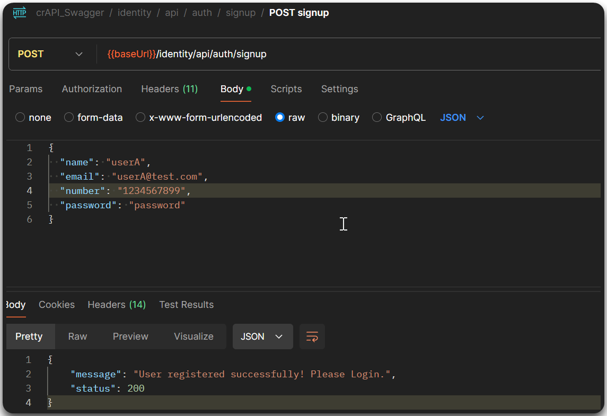
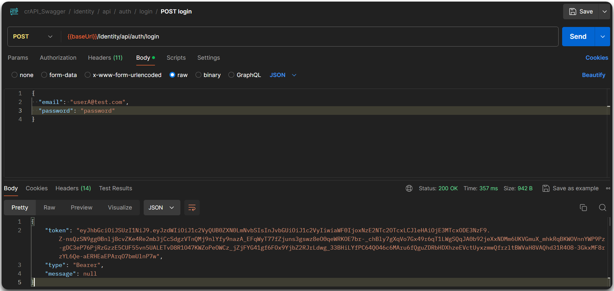
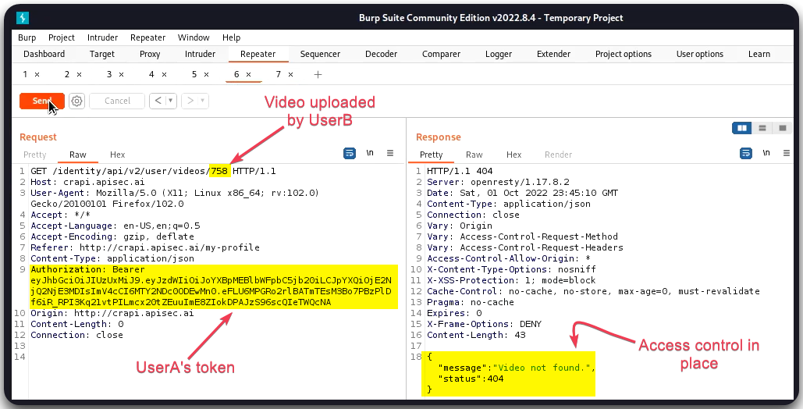
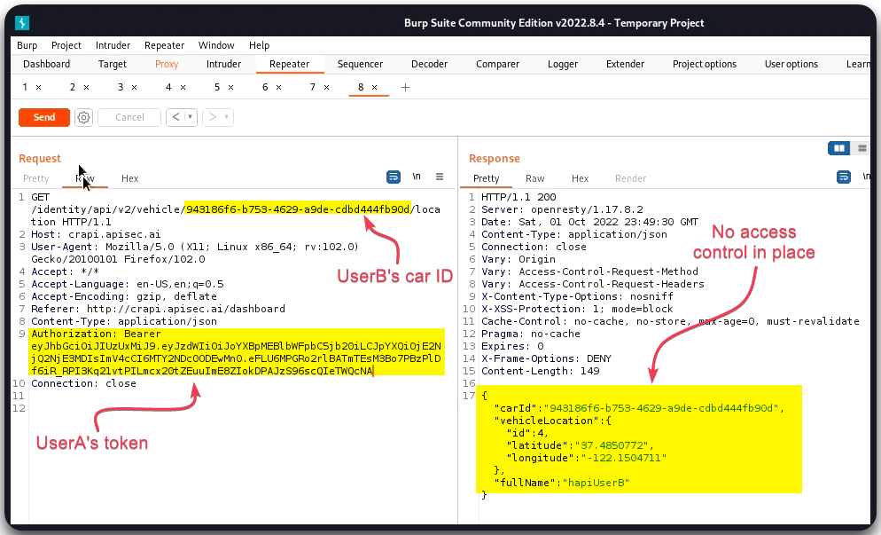

---
layout:
  title:
    visible: true
  description:
    visible: false
  tableOfContents:
    visible: true
  outline:
    visible: true
  pagination:
    visible: true
---

# BOLA

> [API1:2023 Broken Object Level Authorization](https://owasp.org/API-Security/editions/2023/en/0xa1-broken-object-level-authorization/): An unauthenticated and/or authenticated user can access another user's information. Same as [IDOR](https://owasp.org/www-project-web-security-testing-guide/latest/4-Web\_Application\_Security\_Testing/05-Authorization\_Testing/04-Testing\_for\_Insecure\_Direct\_Object\_References).

## General Information

Testing for BOLA involves:

1. Identifying relevant requests, i.e., requests that have resources IDs and/or that access other resources.
2. Perform **A-B testing**:
   1. Create and make requests as `userA`.&#x20;
   2. Create `userB` and repeat the requests to `userA`'s resources using `userB`'s token.

## Example

> _The below example is based on the_ [_crAPI_](https://github.com/OWASP/crAPI) _application._

The below example shows how A-B testing works. In brief:

1. Two users are created: `userA` and `userB` (Figure 1).
2. We have uploaded a video on `userB`'s profile as well as booked a vehicle.
3. We request the video and car's details with `userB`'s token and we save these requests.
4. We then replace `userB`'s with `userA`'s token and trying to access the same information.
5. We are unable to access the video information (Figure 3), but we are able to access the car's information (Figure 4). The latter is considered a BOLA flaw.

<figure><figcaption>
Figure 1: Creating a new user account (<code>userA</code>).
</figcaption></figure>

<figure><figcaption>
Figure 2: Logging in &#x26; getting <code>userA</code>'s token.
</figcaption></figure>

<figure><figcaption>
Figure 3: Trying to access <code>userB</code>'s video with <code>userA</code>'s token.
</figcaption></figure>

<figure><figcaption>
Figure 4: Trying to access <code>userB</code>'s vehicle details with <code>userA</code>'s token.
</figcaption></figure>
