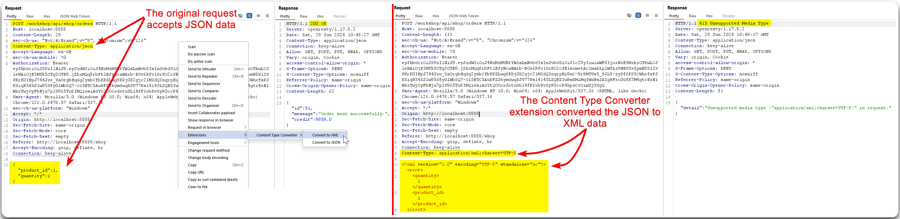

---
layout:
  title:
    visible: true
  description:
    visible: false
  tableOfContents:
    visible: true
  outline:
    visible: true
  pagination:
    visible: true
---

# Content Type Tampering


Content-Type Tampering is a vulnerability where an attacker manipulates the `Content-Type` header of HTTP requests to bypass security checks or exploit vulnerabilities.



This can lead to unauthorized actions, such as bypassing file type validation, injecting malicious content, or compromising data integrity.



Validate and sanitize the `Content-Type` header on the server side, implement proper file type validation, and enforce security policies that restrict content types to expected and safe values.


## JSON to XML

We can check the behaviour on different `Content-Type` formats. This could result in:

* Triggering verbose erros.
* Bypass flawed defences.
* Leverage differences in processing logic (e.g. secure with JSON but flawed with XML).

We can easily do that using Burp's [Content Type Converter](https://portswigger.net/bappstore/db57ecbe2cb7446292a94aa6181c9278) extension (Figure 1).

> _The below example is based on the_ [_crAPI_](https://github.com/OWASP/crAPI) _application._

<figure><figcaption>
Figure 1: Converting JSON to XML.
</figcaption></figure>

## Adding Content-Type in the Request

Try adding `Content-Type: application/json` in the request and send a blank body. This might return a **stack trace**!
