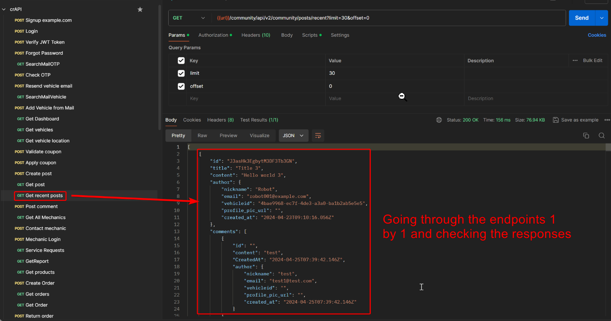
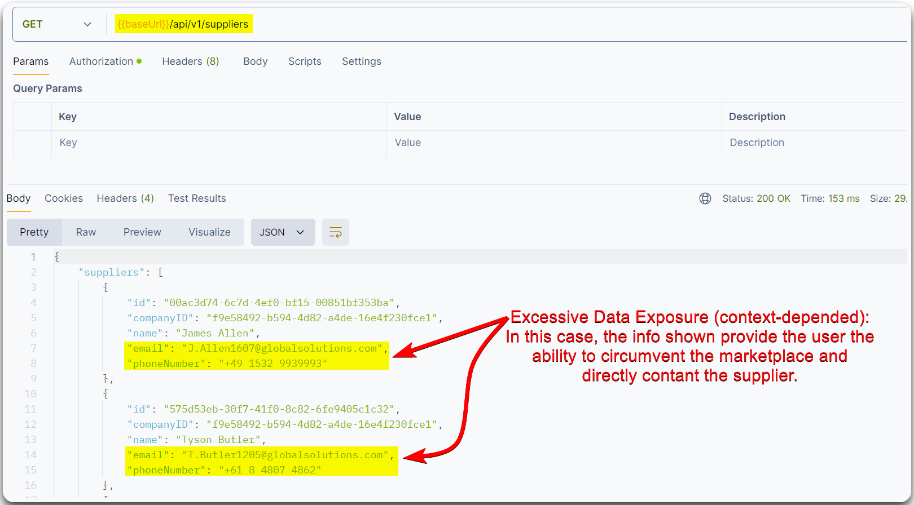

---
layout:
  title:
    visible: true
  description:
    visible: false
  tableOfContents:
    visible: true
  outline:
    visible: true
  pagination:
    visible: true
---

# Excessive Data Exposure

> [API3:2019 Excessive Data Exposure](https://owasp.org/API-Security/editions/2019/en/0xa3-excessive-data-exposure/): The API returns sensitive data to the client. This data is typically filtered on the client side, but can be easily sniffed.


Checking for this flaw, requires to **go through the responses of each endpoint**.


> _The below example is based on the_ [_crAPI_](https://github.com/OWASP/crAPI) _application._

<figure><figcaption>
Figure 1: Identifying an excessive data exposure vulnerability.
</figcaption></figure>

> _The below example is based on HTB's_ [_API Attacks_](https://academy.hackthebox.com/course/preview/api-attacks) _module._

<figure><figcaption>
Figure 2: Discovering an Excessive Data Exposure flaw.
</figcaption></figure>
