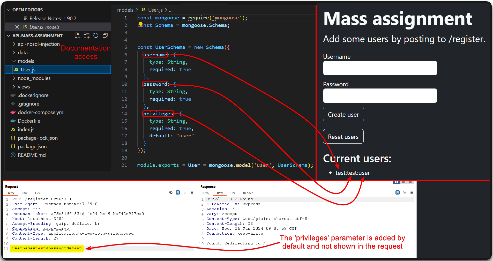
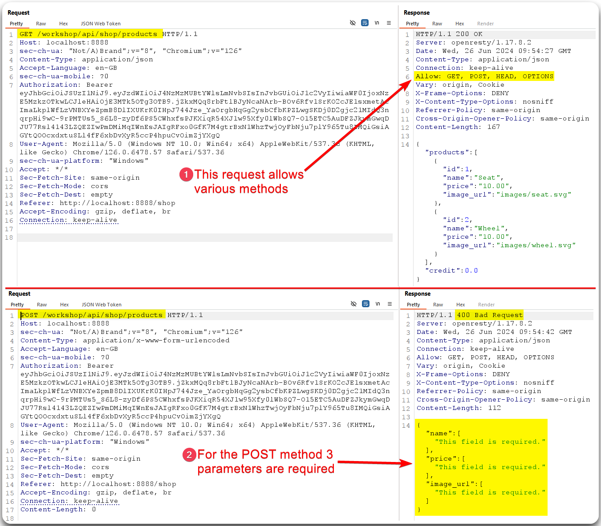

---
layout:
  title:
    visible: true
  description:
    visible: false
  tableOfContents:
    visible: true
  outline:
    visible: true
  pagination:
    visible: true
---

# Mass Assignment


**Mass assignment** (aka _auto-binding_) is a vulnerability where an attacker can update or set unintended fields in an API request due to insufficient validation of input data.

[API6:2019](https://owasp.org/API-Security/editions/2019/en/0xa6-mass-assignment/)


* Registration requests are a good candidate for mass assignment flaws (Figure 1 & 2).
* Check documentation if available (Figure 1, 2, & 3).
* `POST` requests that accept user input (convert `GET` requests to `POST`) (Figure 4 & 5).
* Potential parameters can be identified via fuzzing, code review, JWTs, leaky API endpoints, front-end code review, etc.

> _The below example is based on TCM's_ [_Practical API Hacking_](https://academy.tcm-sec.com/p/hacking-apis) _course._

<figure><figcaption>
Figure 1: Finding 'hidden' parameters in the documentation.
</figcaption></figure>

<figure><figcaption>
Figure 2: Adding the <code>privileges</code> parameter to the registration request.
</figcaption></figure>

<figure><figcaption>
Figure 3: The root cause of the above mass assignment vulnerability.
</figcaption></figure>

> _The below example is based on the_ [_crAPI_](https://github.com/OWASP/crAPI) _application._

<figure><figcaption>
Figure 4: Tampering with the HTTP verbs.
</figcaption></figure>

<figure><figcaption>
Figure 5: Exploiting a mass assignment vulnerability.
</figcaption></figure>
