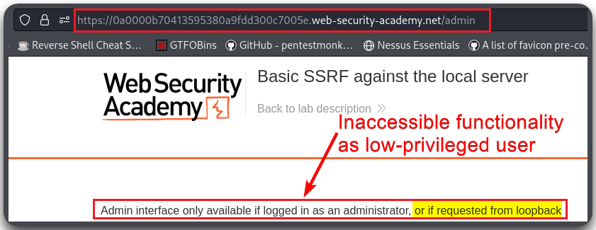
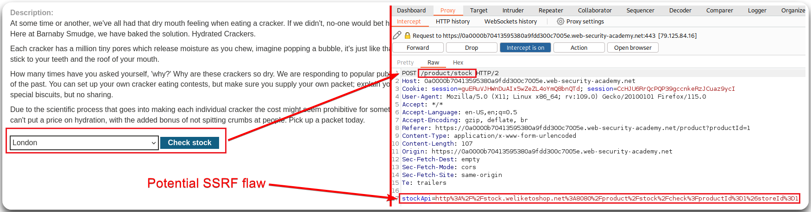
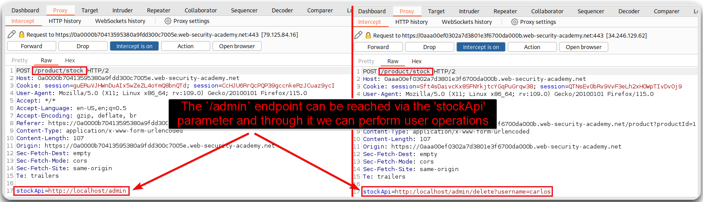
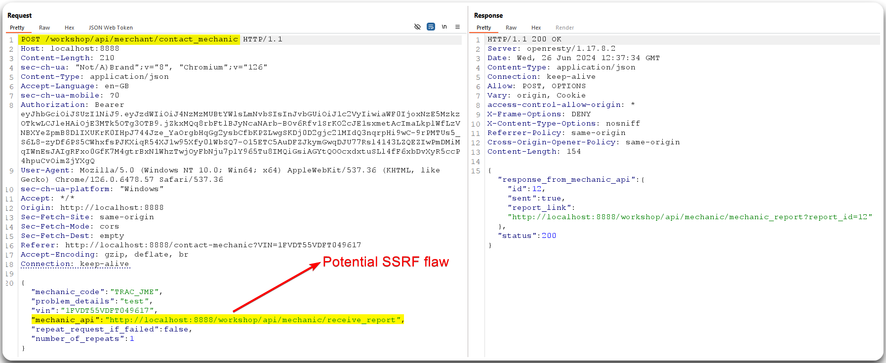
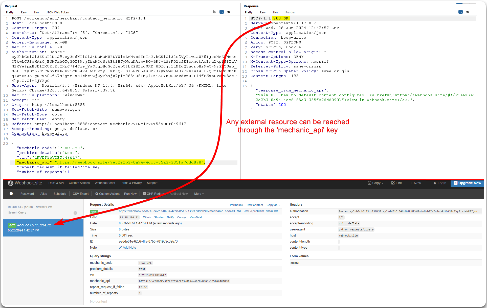

---
layout:
  title:
    visible: true
  description:
    visible: false
  tableOfContents:
    visible: true
  outline:
    visible: true
  pagination:
    visible: true
---

# SSRF

> [API7:2023 Server Side Request Forgery](https://owasp.org/API-Security/editions/2023/en/0xa7-server-side-request-forgery/): The attacker forces a server to perform requests on their behalf.

## General Information

We are searching for request that have:

* Include full URLs in the `POST` body or parameters
* Include full or partial URL paths in the `POST` body or parameters
* Headers that include URLs, such as `Referer`
* Allow for user input that may result in a server retrieving resources

To test SSRF we can use Burp's Collaborator or free alternatives, such as:

* [http://webhook.site](http://webhook.site/)
* [http://pingb.in/](http://pingb.in/)
* [https://requestbin.com/](https://requestbin.com/)
* [https://canarytokens.org/](https://canarytokens.org/)

Automated tools can be use to check for SSRF, such as [SSRFmap](https://github.com/swisskyrepo/SSRFmap).

## Examples

### Typical Flaws

> _The below example is based on PortSwigger's_ [_SSRF_](https://x7331.gitbook.io/notes/htb/api-attacks/ssrf) _module._

The `/admin` directory is restricted to normal users and is accessible only to `administrator` and if someone request it from `localhost` (Figure 1).

<figure><figcaption><p>Figure 1: Trying to access administrative functionality.</p></figcaption></figure>

The `Check Stock` functionality makes a call to an external resource (Figure 2).

<figure><figcaption><p>Figure 2: Discovering a potential vulnerable-to-SSRF endpoint.</p></figcaption></figure>

The `stockApi` parameter is vulnerable to SSRF and can be leverage to perform administrative operations (Figure 3).

<figure><figcaption><p>Figure 3: Exploiting the SSRF flaw.</p></figcaption></figure>

> _The below example is based on the_ [_crAPI_](https://github.com/OWASP/crAPI) _application._

<figure><figcaption><p>Figure 4: Identifying a potential SSRF vulnerability.</p></figcaption></figure>

<figure><figcaption><p>Figure 5: Validating the SSRF vulnerability.</p></figcaption></figure>

### Encoding Payloads

> _The below example is based on HTB's_ [_Web Service & API Attacks_](https://academy.hackthebox.com/course/preview/web-service--api-attacks) _module._

The payload might need to be encoded for the SSRF to work (Figure 6).

```bash
# Encoding the payload
$ echo http://10.10.15.28 | tr -d '\n' | base64
aHR0cDovLzEwLjEwLjE1LjI4
```

<figure><figcaption><p>Figure 6: Based64-encoding the payload to make SSRF work.</p></figcaption></figure>

### URI Paths

> _The below example is based on HTB's_ [_API Attacks_](https://academy.hackthebox.com/course/preview/api-attacks) _module._

<figure><figcaption><p>Figure 7: Leveraging SSRF &#x26; URI paths to read a local file.</p></figcaption></figure>
