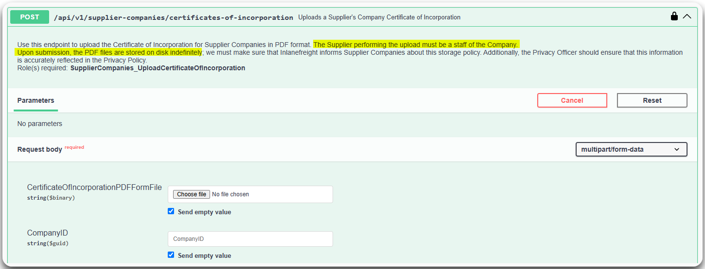
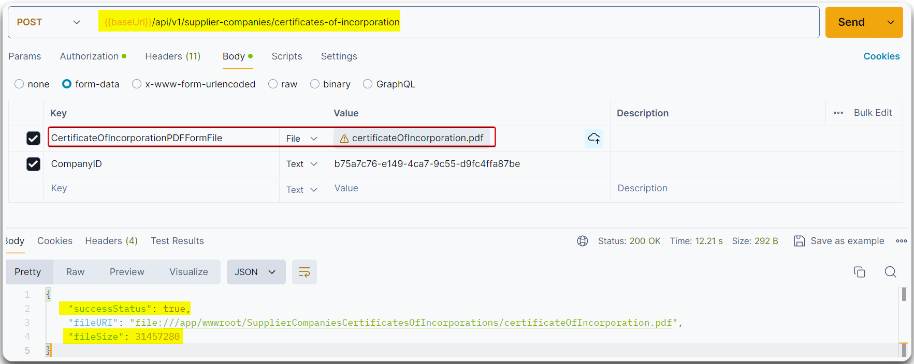

---
layout:
  title:
    visible: true
  description:
    visible: false
  tableOfContents:
    visible: true
  outline:
    visible: true
  pagination:
    visible: true
---

# Unrestriced Resource Consumption


**Unrestricted resource consumption** happens when an API does not limit the amount of resources that a user can consume, such as like CPU, memory, or bandwidth. This can lead to DoS (Denial-of-Service) & BF (Brute Force) attacks and/or performance degradation by allowing excessive or abusive resource usage.


> _The below example is based on HTB's_ [_API Attacks_](https://academy.hackthebox.com/course/preview/api-attacks) _module._

**Lack of limiting user-initiated requests** that consume resources can lead to DoS attacks (Figure 1) as well as BF attacks (Figure 2).

<figure><figcaption><p>Figure 1: A potentlally-vulnerable to Uncontrolled Resource Consumption endpoint.</p></figcaption></figure>

```bash
# Creating a 30 megabytes PDF file
$ dd if=/dev/urandom of=certificateOfIncorporation.pdf bs=1M count=30
30+0 records in
30+0 records out
31457280 bytes (31 MB, 30 MiB) copied, 0.0632942 s, 497 MB/s

$ ls -l
-rw-r--r-- 1 x7331 x7331 31457280 Jul 11 09:18 certificateOfIncorporation.pdf
```

<figure><figcaption><p>Figure 2: Uploading the PDF file.</p></figcaption></figure>


There are  three main issues here:

1. **The backend does not validate that the file size** is within a specified size and since there are **no rate-limiting measures**, an attacker can consume all the marketplace's disk storage.
2. There is **no check of the file extension or content**, which means we can uploiad any file type we want.
3. **The uploaded files are stored within the `wwwroot` directory**. The web API is developed using ASP.NET Core which means that the static files within `wwwroot` are publicly accessible.


<figure><figcaption><p>Figure 3: Performing a BFA for the user's email due to lack of rate-limiting measures.</p></figcaption></figure>
