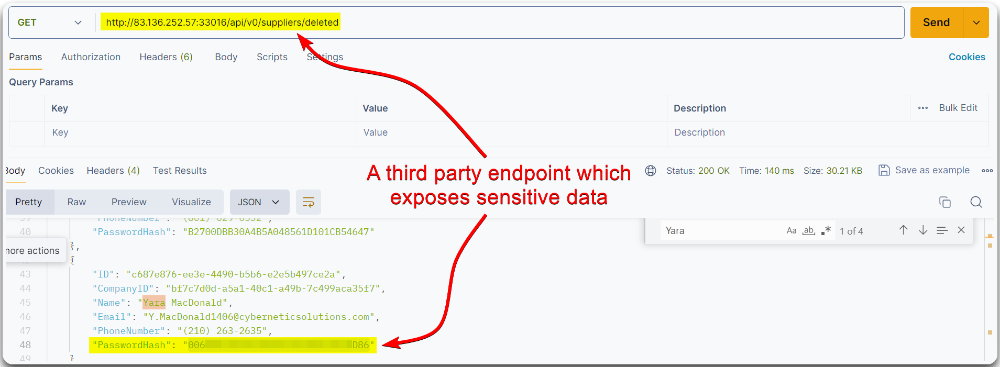

---
layout:
  title:
    visible: true
  description:
    visible: false
  tableOfContents:
    visible: true
  outline:
    visible: true
  pagination:
    visible: true
---

# Unsafe API Consumption


**Unsafe API consumption** happens when APIs are used in ways that expose vulnerabilities or security risks, such as lacking proper validation, exposing sensitive data, or not enforcing access controls.


> _The below example is based on HTB's_ [_API Attacks_](https://academy.hackthebox.com/course/preview/api-attacks) _module._

This flaw is present when an API consumes another API in an insecure manner, for instance, a 3rd party endpoint vulnerable to [Excessive Data Exposure](excessive-data-exposure.md) (Figure 1).

<figure><figcaption>
Figure 1: A vulnerable 3rd party endpoint.
</figcaption></figure>
