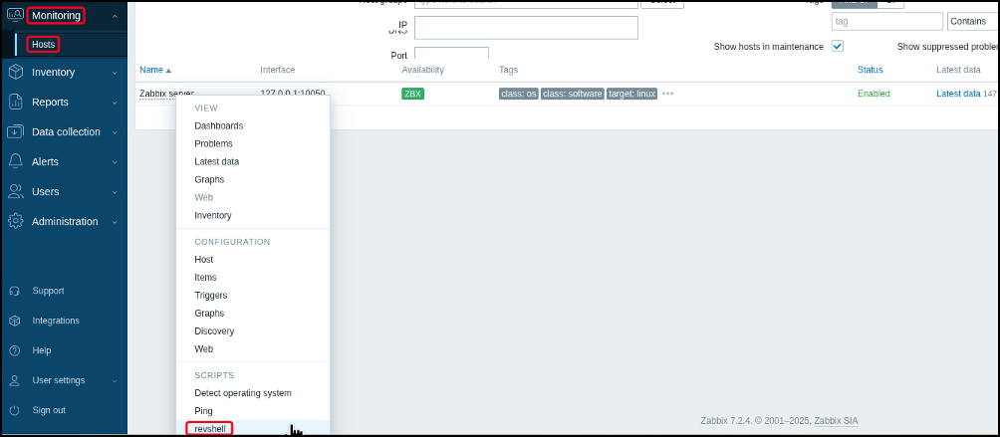

---
layout:
  width: default
  title:
    visible: true
  description:
    visible: false
  tableOfContents:
    visible: true
  outline:
    visible: true
  pagination:
    visible: true
  metadata:
    visible: true
---

# Zabbix

Zabbix is an open-source monitoring platform used to track the health and performance of infrastructure components such as networks, servers, and applications. It follows a client-server model, with agents or SNMP endpoints reporting to a central server over TCP ports `10050` (passive) and `10051` (active). Data is visualized through a web frontend with dashboards, triggers, and alerts, supporting both passive and active checks, script execution, and integrations. In internal environments, Zabbix is often misconfigured or left with default credentials.&#x20;

```bash
# Default credentials
$ uv run creds search Zabbix
+--------------+----------+----------+
| Product      | username | password |
+--------------+----------+----------+
| zabbix (web) |  Admin   |  zabbix  |
+--------------+----------+----------+
```

Access to its web UI—especially with admin privileges—can enable RCE through monitored items or automation features, making it a reliable pivot point during post-exploitation and lateral movement.

<figure><figcaption></figcaption></figure>

<figure><figcaption></figcaption></figure>
