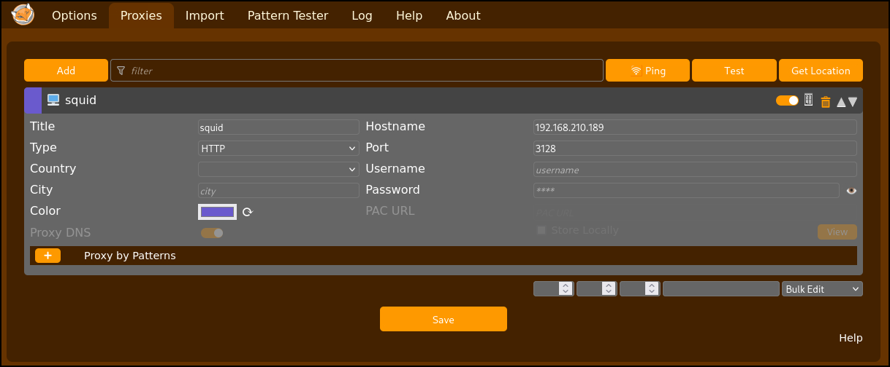

---
layout:
  width: default
  title:
    visible: true
  description:
    visible: false
  tableOfContents:
    visible: true
  outline:
    visible: true
  pagination:
    visible: true
  metadata:
    visible: true
---

# Squid

[Squid Proxy](https://github.com/squid-cache/squid) is a high-performance caching proxy capable of handling HTTP, HTTPS, FTP, and other protocols. It operates as an intermediary between clients and servers, retrieving and caching resources to reduce bandwidth usage and improve response times. In addition to performance optimization, Squid can enforce access controls, filter traffic, and log requests for monitoring or compliance purposes.

In network environments, Squid is often configured with Access Control Lists (ACLs) to determine which clients can connect and what destinations or ports are permitted. When properly configured, these restrictions limit the scope of outbound connections. However, misconfigurations can lead to security risks, such as allowing unrestricted `CONNECT` requests, which may provide attackers with the ability to reach internal services or use the proxy as an anonymizing relay.

## Internal Recon

An exposed Squid proxy can process requests on behalf of an attacker. When misconfigured, it may allow **access to internal network resources that would otherwise be unreachable**. This can enable targeted port scanning against internal hosts by requesting internal IPs through the proxy.

A MSF module is available ([`auxiliary/scanner/http/open_proxy`](https://www.rapid7.com/db/modules/auxiliary/scanner/http/squid_pivot_scanning/)) which can identify open proxies and differentiate between closed ports, unreachable hosts, and ACL-blocked requests by analyzing Squid’s HTTP responses. A Python-based PoC ([spose](https://github.com/aancw/spose)) also exists.

```bash
$ python3 spose.py --proxy http://192.168.210.189:3128 --target 127.0.0.1
Scanning default common ports
Using proxy address http://192.168.210.189:3128
127.0.0.1:3306 seems OPEN
127.0.0.1:8080 seems OPEN
```

If open ports are found, FoxyProxy can be used to reach them directly via the attacking host:

<figure><figcaption></figcaption></figure>
