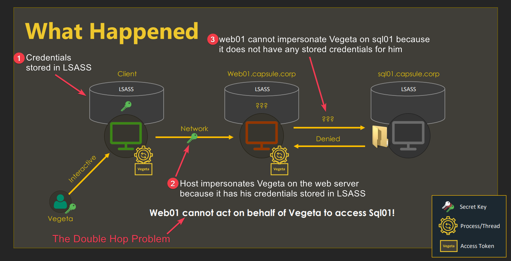
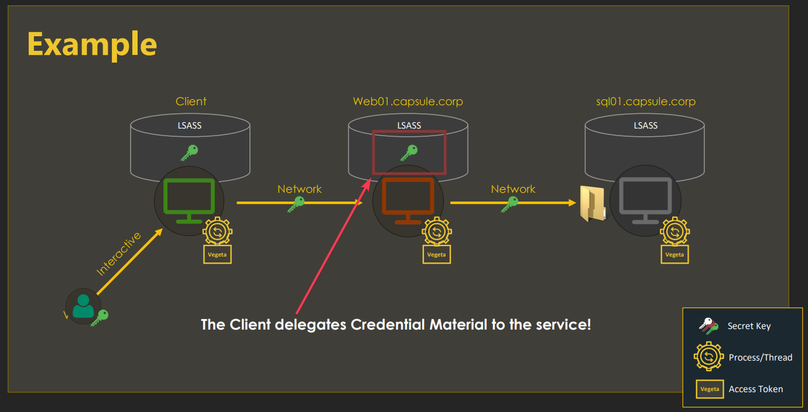

---
layout:
  title:
    visible: true
  description:
    visible: false
  tableOfContents:
    visible: true
  outline:
    visible: true
  pagination:
    visible: true
---

# Delegation

## TL;DR

### About Delegation

**Access tokens** represent the **local security context** of a user, are cached in `LSASS` (SSO[^1]), and they are tied to a logon session's ID. Therefore, both the access token and the logon session exist on the same host (Figure 1)

<figure><figcaption><p>Figure 1: Local authentication (<em>image taken from</em><a href="https://attl4s.github.io/assets/pdf/You_do_(not)_Understand_Kerberos_Delegation.pdf"> <em>here</em></a><em>).</em></p></figcaption></figure>

**Credentials** represent the **network security context** of a user (hashes, tickets, etc.) and are **tied to a logon session**. Thus, if a user authenticates to an application with its access token, and then the application needs to authenticate to a remote server, the **double hop problem** arises (Figure 2).

<figure><figcaption><p>Figure 2: The double hop problem (<em>image taken from</em><a href="https://attl4s.github.io/assets/pdf/You_do_(not)_Understand_Kerberos_Delegation.pdf"> <em>here</em></a><em>).</em></p></figcaption></figure>

**Delegation aims to solve the double hop issue by allowing services to impersonate users, not only locally, but in the network**. In brief, the user sends its "whole" credentials  to the server, which results in a similar situation as if the user and the server were residing on the same host (Figure 3).

<figure><figcaption><p>Figure 3: How the delegation process works (<em>image taken from</em><a href="https://attl4s.github.io/assets/pdf/You_do_(not)_Understand_Kerberos_Delegation.pdf"> <em>here</em></a><em>).</em></p></figcaption></figure>

### Kerberos Delegation

Kerberos delegations **allow services to impersonate domain users in order to access another service**. There are 3 delegation types: unconstrained (KUD), constrained (KCD), and resource-based (RBCD).

### **Unconstrained**


&#x20;**a service can impersonate users on any other service**.

* The user sends a TGS to access the service, **along with their TGT**, and then the service can use the user’s TGT to request a TGS for the user to any other service and impersonate the user.

<figure><figcaption><p>Figure 1: Unconstrained delegation process (<em>image taken from</em> <a href="https://www.thehacker.recipes/a-d/movement/kerberos/delegations#resources"><em>here</em></a>).</p></figcaption></figure>

### **Constrained**

#### Without Protocol Transition

In KCD without protocol transition (`S4U2Proxy`) a **service can impersonate users on a set of services**. The user sends a TGS to access the service (`Service A`), and if the service is allowed to delegate to another pre-defined service (`Service B`), then `Service A` can present to the authentication service the TGS that the user provided and obtain a TGS for the user to `Service B`.&#x20;

Note that **the TGS provided in the `S4U2Proxy` request must have the `FORWARDABLE` flag set**. This flag is never set for accounts that are configured as _sensitive for delegation_ (the `USER_NOT_DELEGATED` attribute is set to `true`) or for members of the `Protected Users` group.

<figure><figcaption><p>Figure 2: Constrained delegation without protocol transition process (<em>image taken from</em> <a href="https://www.thehacker.recipes/a-d/movement/kerberos/delegations#resources"><em>here</em></a>).</p></figcaption></figure>

#### With Protocol Transition

In KCD with protocol transition (`S4U2SELF`/`TrustedToAuthForDelegation`) the `S4U2Proxy` request **requires the service to present a TGS for the user to itself**, known as _**additional ticket**_ or _**evidence**_, before the authentication service produces a TGS for the user to another service.&#x20;

However, sometimes users authenticate to services via other protocols, such as NTLM or even form-based authentication, and so they do not send a TGS to the service. In such cases, a service can invoke `S4U2Self` to ask the authentication service to produce a TGS for arbitrary users to itself, which can then be used as _evidence_ when invoking `S4U2Proxy`. **This feature allows impersonating users out of thin air, and it is only possible when the `TrustedToAuthForDelegation` flag is set for the service account that invokes `S4U2Self`.**

<figure><figcaption><p>Figure 3: Constrained delegation with protocol transition process (<em>image taken from</em> <a href="https://www.thehacker.recipes/a-d/movement/kerberos/delegations#resources"><em>here</em></a>).</p></figcaption></figure>

### **Resource-based**

In RBDC a set of **services can impersonate users on a service**. It allows resources to configure which accounts are trusted to delegate to them and requires the `SeEnableDelegation` privilege.

<figure><figcaption><p>Figure 4: Resource-based constrained delegation process (<em>image taken from</em> <a href="https://www.thehacker.recipes/a-d/movement/kerberos/delegations#resources"><em>here</em></a>).</p></figcaption></figure>

This flavour of constrained delegation is very **similar to the classic constrained delegation but works in the opposite direction**. Classic constrained delegation from account A to account B is configured on account A in the `msDS-AllowedToDelegateTo` attribute, and defines an “outgoing” trust from A to B, while RBCD is configured on account B in the `msDS-AllowedToActOnBehalfOfOtherIdentity` attribute, and defines an “incoming” trust from A to B (requires lower privileges). An important observation is that **every resource can configure RBCD for itself**.

<figure><figcaption><p>Figure 5: RCD vs RBCD (<em>image taken from</em> <a href="https://shenaniganslabs.io/2019/01/28/Wagging-the-Dog.html"><em>here</em></a>).</p></figcaption></figure>

## Attack

Enumerate.



```bash
findDelegation.py '<domain>/<user>':'<pass>' -user <account>
```




```powershell
# TrustedForDelegation -> KUD, TrustedToAuthForDelegation -> KCD+PT
# AllowedToDelegateTo -> KCD-PT, PrincipalsAllowedToDelegateTo -> RBCD
Get-ADComputer <account> -Properties TrustedForDelegation, TrustedToAuthForDelegation,msDS-AllowedToDelegateTo,PrincipalsAllowedToDelegateToAccount
```





```bash
# assign delegation
impacket-rbcd '<domain>/<user>' -hashes <:hash> -k -delegate-from <account> -delegate-to <account> -action write -dc-ip <hostname> -use-ldaps
# check delegation
impacket-findDelegation '<domain>/<user>':'<pass>' -dc-ip <ip> -k
```


## Resources















[PDF Presentation](https://shenaniganslabs.io/media/Constructing%20Kerberos%20Attacks%20with%20Delegation%20Primitives.pdf)



[^1]: Single Sign-On
