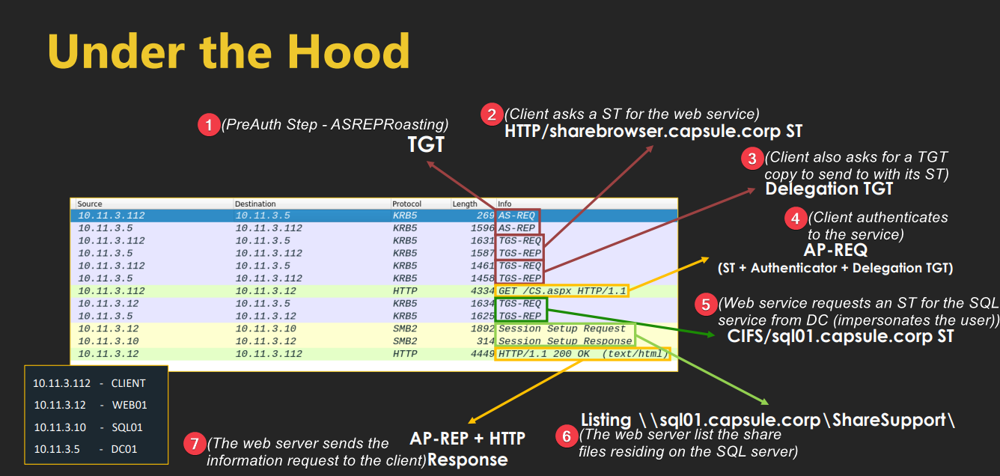

---
layout:
  title:
    visible: true
  description:
    visible: false
  tableOfContents:
    visible: true
  outline:
    visible: true
  pagination:
    visible: true
---

# Unconstrained


All information found below has been adapted from [Attl4s](https://attl4s.github.io/) [video-presentation](https://www.youtube.com/watch?v=xDFRUYv1-eU) and its corresponding [slide deck](https://attl4s.github.io/assets/pdf/You\_do\_\(not\)\_Understand\_Kerberos\_Delegation.pdf).


## Theory

To configure a service to have Unconstrained Delegation (UD) the option _Trust this user for delegation to any service (Kerberos only) (_`Trusted_For_Delegation`) must be enabled (Figure 1).

<figure><figcaption>
Figure 1: The <code>Trusted_For_Delegation</code> setting (<em>image taken from</em><a href="https://attl4s.github.io/assets/pdf/You_do_(not)_Understand_Kerberos_Delegation.pdf"> <em>here</em></a><em>)</em>.
</figcaption></figure>

Below we can see step-by-step what happens under the hood (Figure 2).

<figure><figcaption>
Figure 2: Delegation process under the hood (<em>image taken from</em><a href="https://attl4s.github.io/assets/pdf/You_do_(not)_Understand_Kerberos_Delegation.pdf"> <em>here</em></a><em>)</em>.
</figcaption></figure>

In Step 2 ([`TGS-REP`](#user-content-fn-1)[^1]) the KDC[^2] will notice that the service (`HTTP/sharebrowser`) is set with UD[^3] and the resulting ST[^4] will have the `ok-as-delegate` flag. This way the client will also know that the service is suitable for delegation (Figure 3).

<figure><figcaption>
Figure 3: The ST contains the <code>ok-as-delegate</code> flag (<em>image taken from</em><a href="https://attl4s.github.io/assets/pdf/You_do_(not)_Understand_Kerberos_Delegation.pdf"> <em>here</em></a><em>)</em>.
</figcaption></figure>

The delegation TGT[^5] which the client asks for in Step 3 ([`TGS-REQ`](#user-content-fn-6)[^6]) will have the `forwarded` flag set (Figure 4).

<figure><figcaption>
Figure 4: The delegation ticket has the <code>forwarded</code> flag set (<em>image taken from</em><a href="https://attl4s.github.io/assets/pdf/You_do_(not)_Understand_Kerberos_Delegation.pdf"> <em>here</em></a><em>)</em>.
</figcaption></figure>

Once the service receives the delegation TGT (Step 4), then it can request a ST for any service from the KDC while impersonating the user (Figure 5).

<figure><figcaption>
Figure 5: The service requests a ST for another service impersonating the user (<em>image taken from</em><a href="https://attl4s.github.io/assets/pdf/You_do_(not)_Understand_Kerberos_Delegation.pdf"> <em>here</em></a><em>)</em>.
</figcaption></figure>

The TGT-REQ in Step 5 will request a ST for another service (`cifs`) as the user (`vegeta`) and the corresponding TGT-REP from the KDC will be issued for that user (`vegeta`) (Figure 6).

<figure><figcaption>
Figure 6: The TGT-REQ and TGT-REP containing the user's details (<em>image taken from</em><a href="https://attl4s.github.io/assets/pdf/You_do_(not)_Understand_Kerberos_Delegation.pdf"> <em>here</em></a><em>)</em>.
</figcaption></figure>

## Exploitation

If we control a service with UD set, then all clients talking to that service will drop their TGTs, therefore, we will be ablle to impersonate them. We can even force a privileged client to connect to our service, for example, through phishing.

If we are able to impersonate the `DC01$`, which has [DCSync rights](../../rights/dcsync.md), then we will be able to perform a [DCSync attack](../dcsync.md) and get the `administrator`'s hash.

[^1]: Ticket Granting Service-Replay

[^2]: Key Distribution Center

[^3]: Unconstrained Delegation

[^4]: Service Ticket

[^5]: Ticket Granting Ticket

[^6]: Ticket Granting Service-Request
