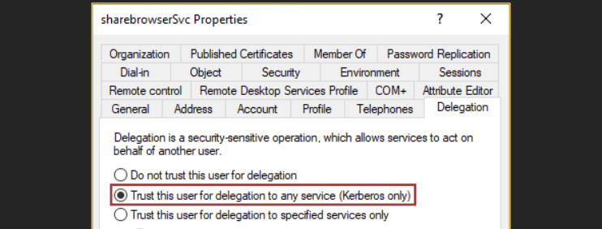

---
layout:
  title:
    visible: true
  description:
    visible: false
  tableOfContents:
    visible: true
  outline:
    visible: true
  pagination:
    visible: true
---

# Unconstrained

To configure a service to have Unconstrained Delegation (UD) the option _Trust this user for delegation to any service (Kerberos only) (_`Trusted_For_Delegation`) must be enabled (Figure 1).

<figure><figcaption>
Figure 1: The <code>Trusted_For_Delegation</code> setting (<em>image taken from</em><a href="https://attl4s.github.io/assets/pdf/You_do_(not)_Understand_Kerberos_Delegation.pdf"> <em>here</em></a><em>)</em>.
</figcaption></figure>

Below we can see step-by-step what happens under the hood (Figure 2).

<figure><figcaption>
Figure 2: Delegation process under the hood (<em>image taken from</em><a href="https://attl4s.github.io/assets/pdf/You_do_(not)_Understand_Kerberos_Delegation.pdf"> <em>here</em></a><em>)</em>.
</figcaption></figure>
