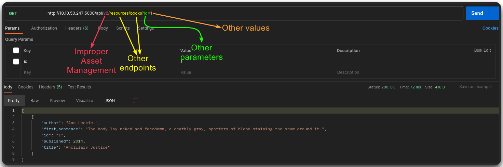
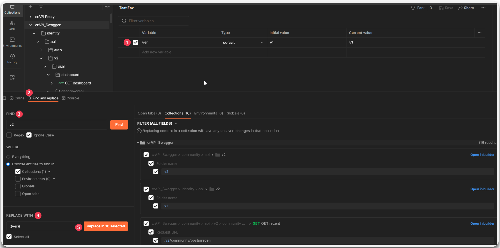
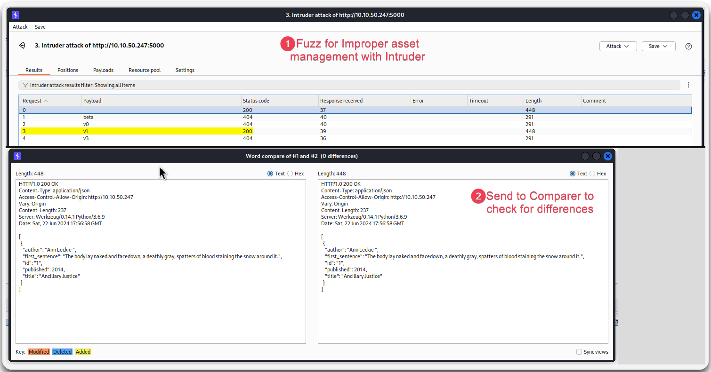

---
layout:
  title:
    visible: true
  description:
    visible: false
  tableOfContents:
    visible: true
  outline:
    visible: true
  pagination:
    visible: true
---

# Improper Asset Management

> [API9:2023 Improper Inventory Management](https://owasp.org/API-Security/editions/2023/en/0xa9-improper-inventory-management/): Seaching for deprecated API versions and exposed debug endpoints.

<figure><figcaption>
Identifying potentially vulnerable to improper asset management endpoints.
</figcaption></figure>

<figure><figcaption>
Fuzzing for improper asset management with Postman.
</figcaption></figure>

<figure><figcaption>
Fuzzing for improper asset management with Burp's Intruder.
</figcaption></figure>
