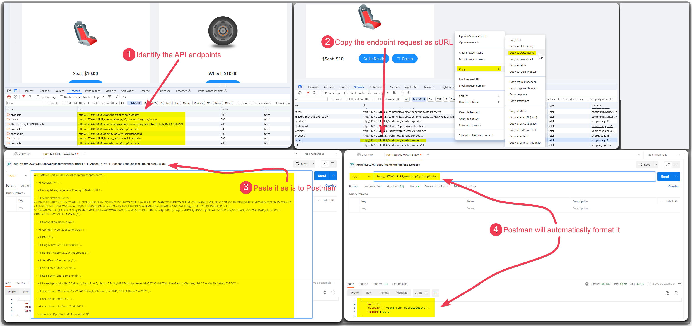
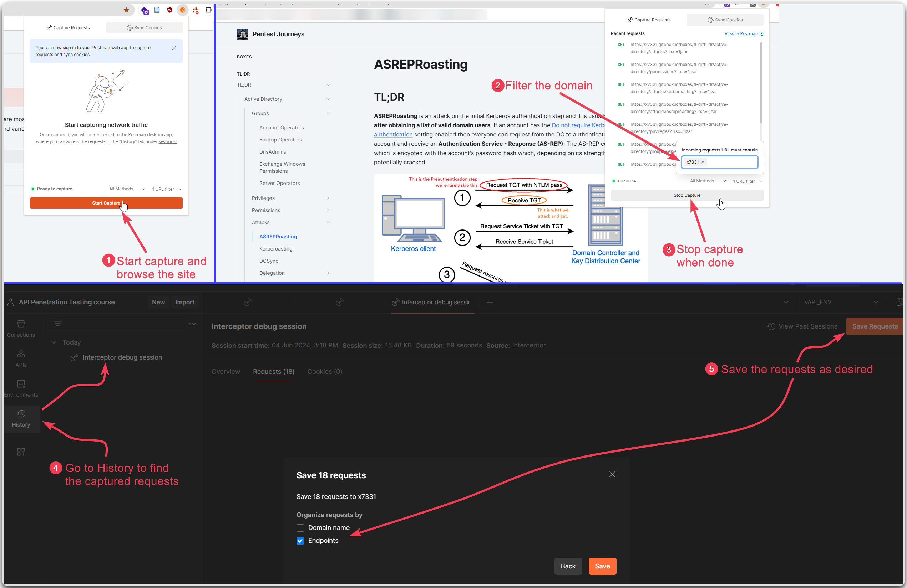

---
layout:
  title:
    visible: true
  description:
    visible: false
  tableOfContents:
    visible: true
  outline:
    visible: true
  pagination:
    visible: true
---

# Collection Creation

1. Identify API endpoints
   * Within the URL, e.g. `https://example.com/api/v1`.
   * In directory names, e.g. `/rest`, `/swagger`, `/api/v2`, etc.
   * By `Content-Type` header (`application/json`, `application/xml`).
2. Create a collection (if none is provided)
   * Copy & Paste the `cURL` command from Developer Tools to Postman (Figure 1).
   * Reverse engineering using [Postman Interceptor](https://learning.postman.com/docs/sending-requests/capturing-request-data/interceptor/) (Figure 2).

<figure><figcaption>
Figure 1: Pasting a request from browser to Postman.
</figcaption></figure>

<figure><figcaption>
Figure 2: Using Postman Interceptor.
</figcaption></figure>
