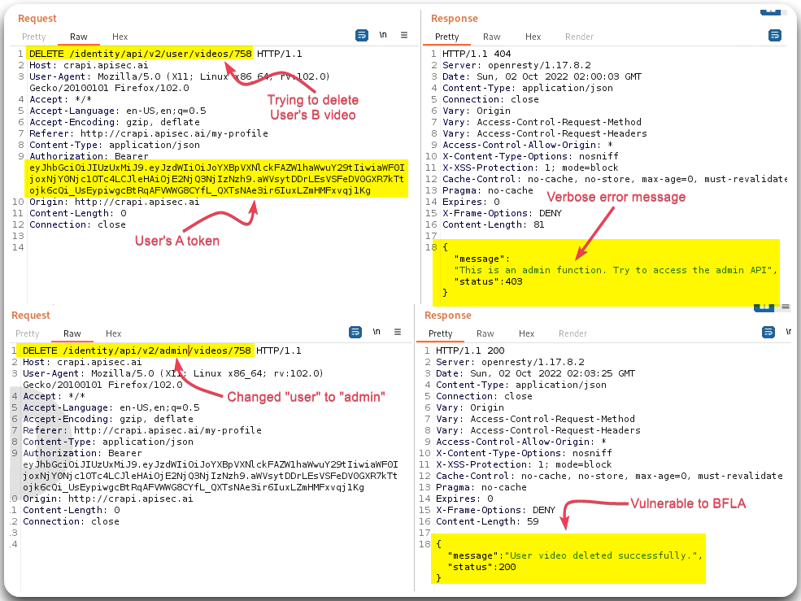

---
layout:
  title:
    visible: true
  description:
    visible: false
  tableOfContents:
    visible: true
  outline:
    visible: true
  pagination:
    visible: true
---

# BFLA

> [API5:2023 Broken Function Level Authorization](https://owasp.org/API-Security/editions/2023/en/0xa5-broken-function-level-authorization/): Similar concept with [BOLA](bola.md), but instead of looking at other user's resources, we are testing other role's functionality, e.g. guest vs. authenticated vs. administrative.

## General Information

Testing for BFLA involves the same steps as [BOLA](bola.md); instead of creating and using same permission accounts, such as `userA` and `userB`, we need to have a low- and a high-privileged account instead:

1. Find functional endpoints that require specific permissions.
2. Login to an account that does not have these permissions.
3. Repeat the requests identified in Step 1 with the account used on Step 2.&#x20;

## Example

> _The below example is based on the_ [_crAPI_](https://github.com/OWASP/crAPI) _application._

<figure><figcaption>
Figure 1: Deleting <code>userB</code>'s video with <code>userA</code>'s token.
</figcaption></figure>
