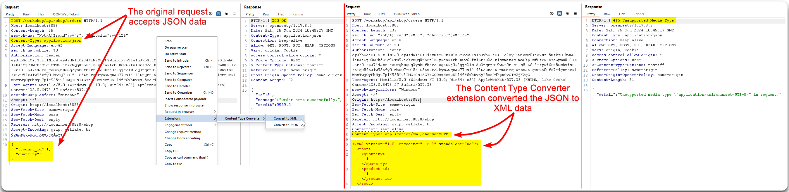

---
layout:
  title:
    visible: true
  description:
    visible: false
  tableOfContents:
    visible: true
  outline:
    visible: true
  pagination:
    visible: true
---

# Content Type Tampering

We can check the behaviour on different `Content-Type` formats. This could result in:

* Triggering verbose erros.
* Bypass flawed defences.
* Leverage differences in processing logic (e.g. secure with JSON but flawed with XML).

We can easily do that using Burp's [Content Type Converter](https://portswigger.net/bappstore/db57ecbe2cb7446292a94aa6181c9278) extension (Figure 1).

> _The below example is based on the_ [_crAPI_](https://github.com/OWASP/crAPI) _application._

<figure><figcaption>
Figure 1: Converting JSON to XML.
</figcaption></figure>
