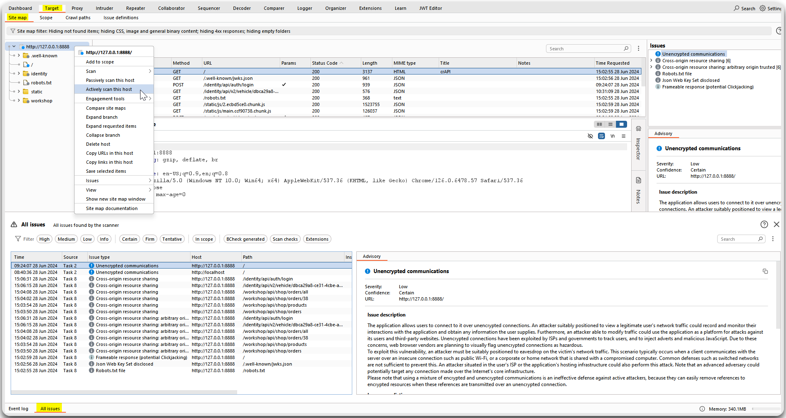

---
layout:
  title:
    visible: true
  description:
    visible: false
  tableOfContents:
    visible: true
  outline:
    visible: true
  pagination:
    visible: true
---

# General

1. Use Burp/ZAP to actively scan the target for common security misconfigurations, such as missing security headers (Figure 1). Validate each one as this may include many false positives.

<figure><figcaption>
Figure 1: Actively scanning the target with Burp Suite.
</figcaption></figure>

2. Investigate the base path of each endpoint (Figure 2 & 3).

<figure><figcaption>
Figure 2: Testing the endpoint's base path.
</figcaption></figure>

<figure><figcaption>
Figure 3: Continuing testing the endpoint's base path reveals a non-documented endpoint that results in BFLA.
</figcaption></figure>
