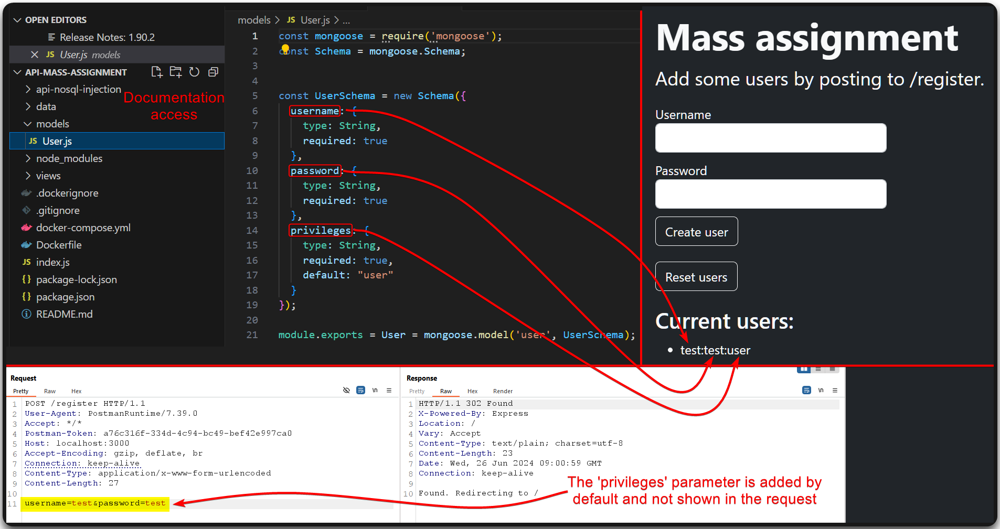
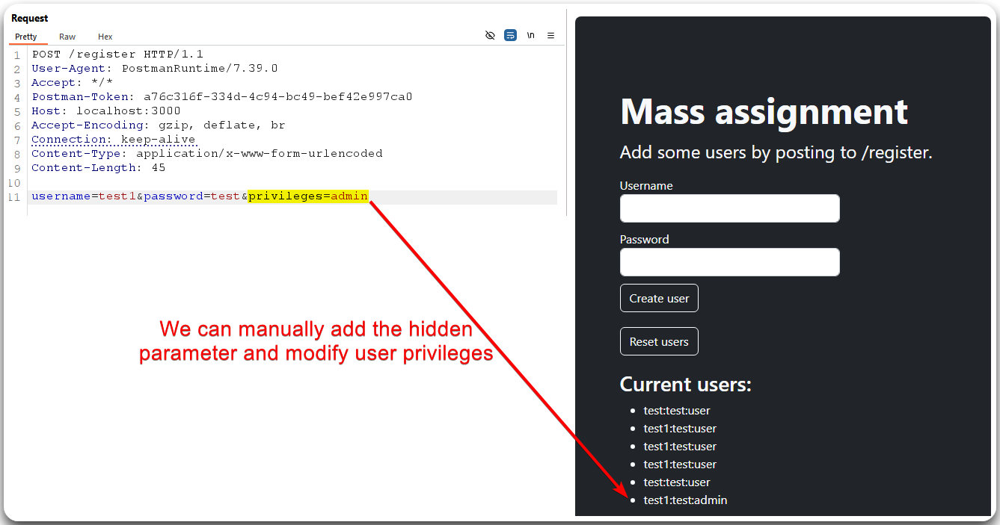
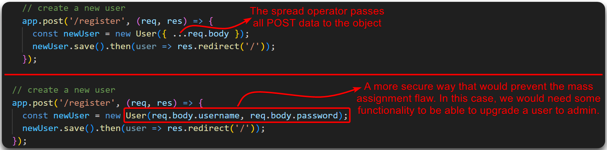
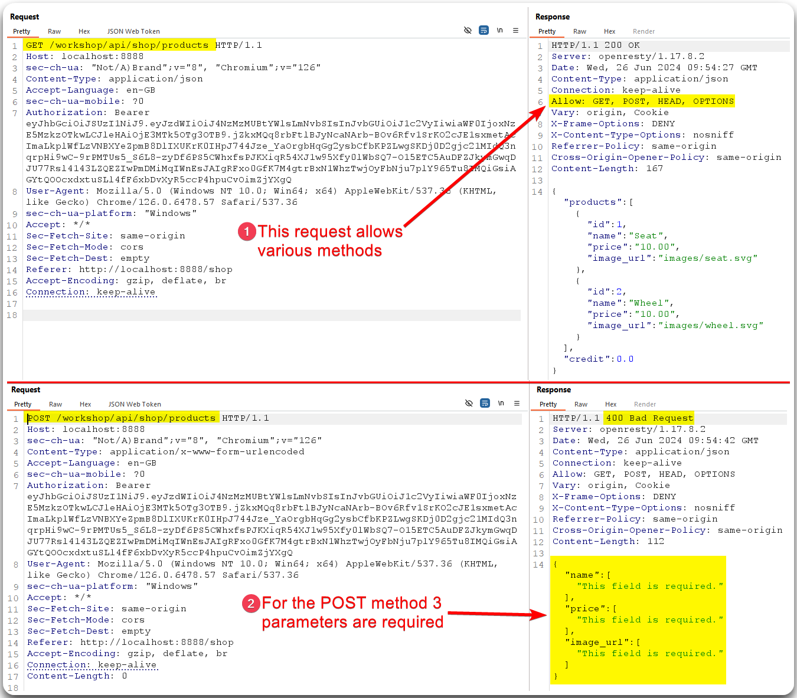
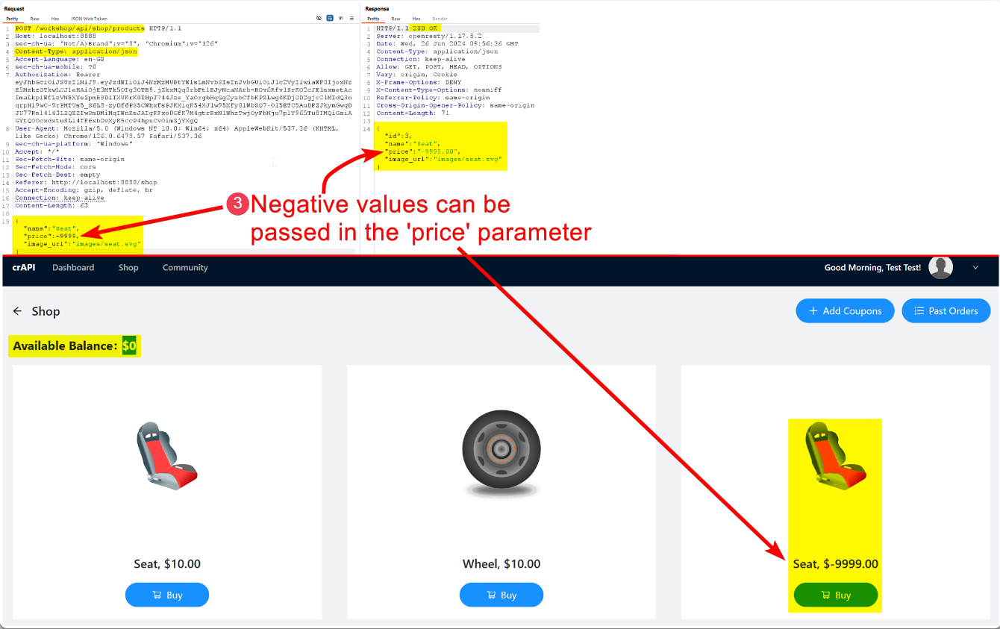

---
layout:
  title:
    visible: true
  description:
    visible: false
  tableOfContents:
    visible: true
  outline:
    visible: true
  pagination:
    visible: true
---

# Mass Assignment

> [API6:2019 - Mass Assignment](https://owasp.org/API-Security/editions/2019/en/0xa6-mass-assignment/) (aka _auto-binding_): Checking if the application automatically binds requests parameters to an internal object that are not originally shown.&#x20;

* Registration requests are a good candidate for mass assignment flaws (Figure 1 & 2).
* Check documentation if available (Figure 1, 2, & 3).
* `POST` requests that accept user input (convert `GET` requests to `POST`) (Figure 4 & 5).

> _The below example is based on_ [_this_](https://academy.tcm-sec.com/p/hacking-apis) _TCM Security course._

<figure><figcaption>
Figure 1: Finding 'hidden' parameters in the documentation.
</figcaption></figure>

<figure><figcaption>
Figure 2: Adding the <code>privileges</code> parameter to the registration request.
</figcaption></figure>

<figure><figcaption>
Figure 3: The root cause of the above mass assignment vulnerability.
</figcaption></figure>

> _The below example is based on the_ [_crAPI_](https://github.com/OWASP/crAPI) _application._

<figure><figcaption>
Figure 4: Tampering with the HTTP verbs.
</figcaption></figure>

<figure><figcaption>
Figure 5: Exploiting a mass assignment vulnerability.
</figcaption></figure>
