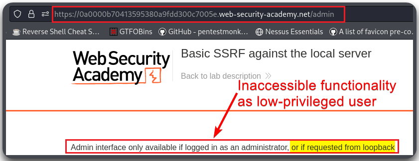
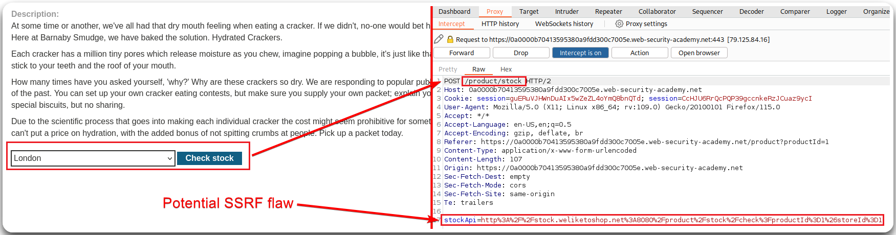
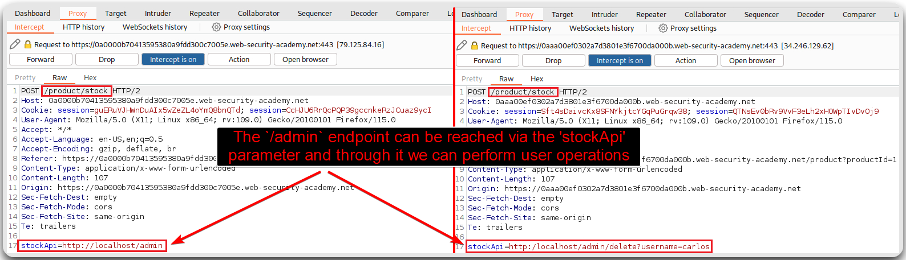
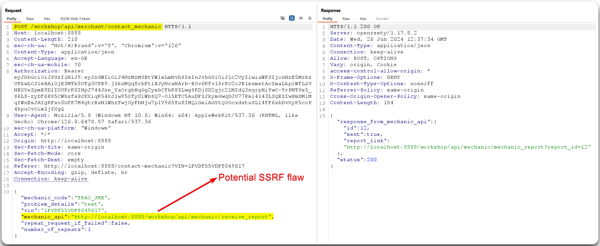
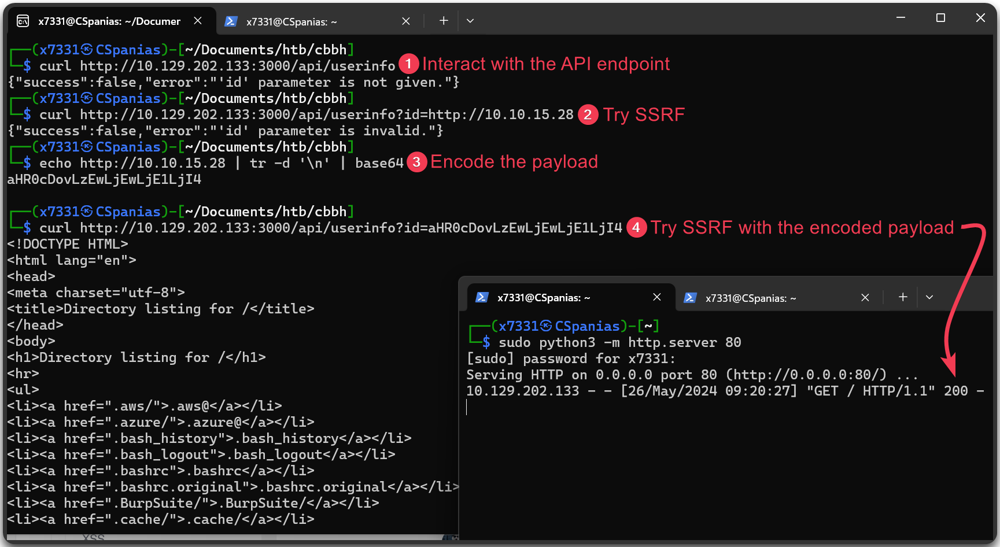

---
layout:
  title:
    visible: true
  description:
    visible: false
  tableOfContents:
    visible: true
  outline:
    visible: true
  pagination:
    visible: true
---

# SSRF

> [API7:2023 Server Side Request Forgery](https://owasp.org/API-Security/editions/2023/en/0xa7-server-side-request-forgery/): The attacker forces a server to perform requests on their behalf.

We are searching for request that have:

* Include full URLs in the `POST` body or parameters
* Include full or partial URL paths in the `POST` body or parameters
* Headers that include URLs, such as `Referer`
* Allow for user input that may result in a server retrieving resources

To test SSRF we can use Burp's Collaborator or free alternatives, such as:

* [http://webhook.site](http://webhook.site/)
* [http://pingb.in/](http://pingb.in/)
* [https://requestbin.com/](https://requestbin.com/)
* [https://canarytokens.org/](https://canarytokens.org/)

> _The below example is based on_ [_this_](https://portswigger.net/web-security/ssrf/lab-basic-ssrf-against-localhost) _PortSwigger Lab._

<figure><figcaption><p>The <code>/admin</code> directory is restricted to <code>administrator</code> and if requested from <code>localhost</code>.</p></figcaption></figure>

<figure><figcaption><p>The <code>Check Stock</code> functionality makes a call to an external resource.</p></figcaption></figure>

<figure><figcaption><p>The <code>stockApi</code> parameter is vulnerable to SSRF and can be leverage to perform user operations.</p></figcaption></figure>

## crAPI example

> _The below example is based on the_ [_crAPI_](https://github.com/OWASP/crAPI) _application._

<figure><figcaption><p>Identifying a potential SSRF vulnerability.</p></figcaption></figure>

<figure><figcaption><p>Validating the SSRF vulnerability.</p></figcaption></figure>

The payload might need to be encoded for the SSRF to work.

> _The below example is based on_ [_this_](https://academy.hackthebox.com/course/preview/web-service--api-attacks) _Hack The Box module._

```bash
# Encoding the payload
$ echo http://10.10.15.28 | tr -d '\n' | base64
aHR0cDovLzEwLjEwLjE1LjI4
```

<figure><figcaption><p>Based64-encoding the payload to make SSRF work.</p></figcaption></figure>
