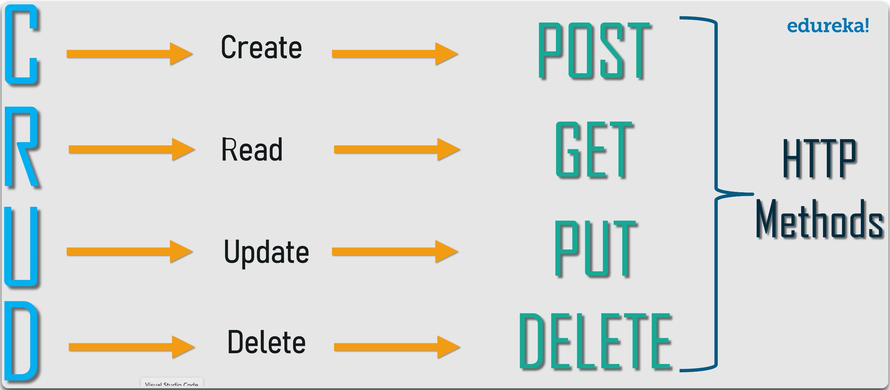

---
layout:
  title:
    visible: true
  description:
    visible: false
  tableOfContents:
    visible: true
  outline:
    visible: true
  pagination:
    visible: true
---

# What is an API?

**Application Programming Interfaces (APIs)** allow applications/servers to connect to each other (Figure 1). APIs are **predictable**, i.e., they follow a set structure and they usually return JSON data. APIs differ from traditional websites as the former use **routing** and the latter use **files** (Figure 2).

<figure><figcaption>
Figure 1: Restaurant analogy (image taken from <a href="https://academy.postman.com/path/api-beginner/what-is-an-api-1/40752"><em>here</em></a>).
</figcaption></figure>

<figure><figcaption>
Figure 2: Traditional website directories vs. API endpoints (image taken from <a href="https://www.youtube.com/watch?v=hNs8fpWfcyU">here</a>).
</figcaption></figure>

The most common types are RESTful (**RE**presentational **S**tate **T**ransfer) APIs which in layman's terms includes the process of:

1. The client makes a request for some specific data.
2. The server creates an object based on this request.
3. The server sends the "state" of this object as a response to the client.

<figure><figcaption>
The CRUD operations of a RESTful API (image taken from <a href="https://www.edureka.co/blog/what-is-rest-api/">here</a>).
</figcaption></figure>
