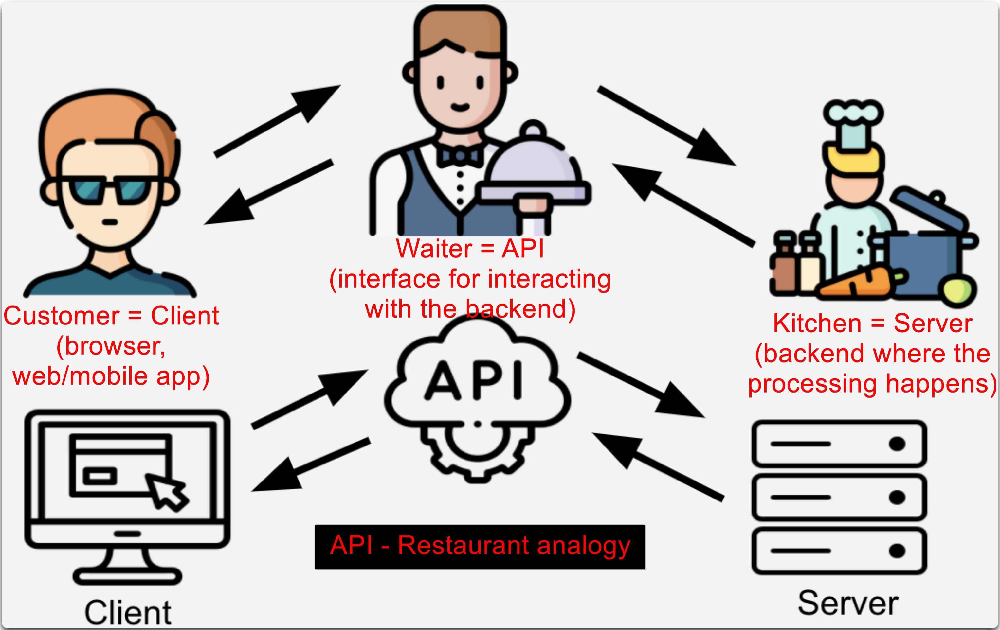
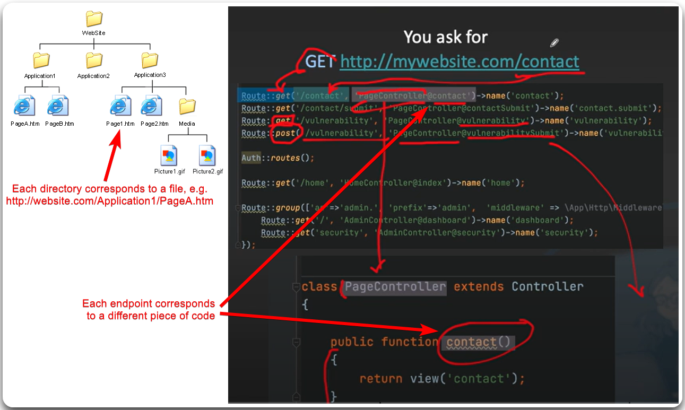

---
layout:
  title:
    visible: true
  description:
    visible: false
  tableOfContents:
    visible: true
  outline:
    visible: true
  pagination:
    visible: true
---

# What is an API?

* **Application Programming Interfaces (APIs)** allow applications/servers to connect to each other (Figure 1).
* Traditional website use files, whereas API endpoints use routing (Figure 2).

<figure><figcaption>
Figure 1: Restaurant analogy (image taken from <a href="https://academy.postman.com/path/api-beginner/what-is-an-api-1/40752"><em>here</em></a>).
</figcaption></figure>

<figure><figcaption>
Figure 2: Traditional website directories vs. API endpoints (image taken from <a href="https://www.youtube.com/watch?v=hNs8fpWfcyU">here</a>).
</figcaption></figure>
