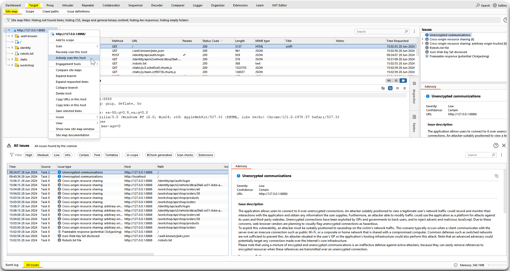
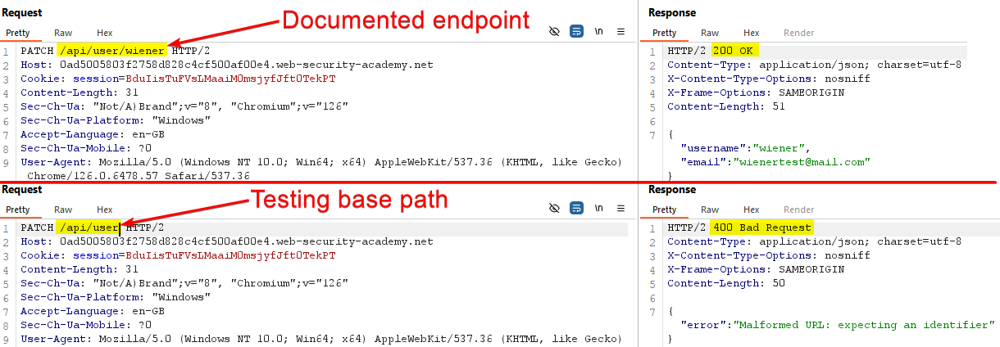
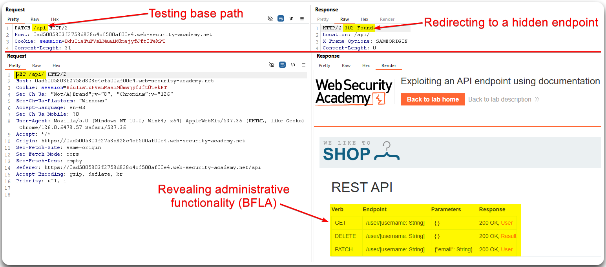
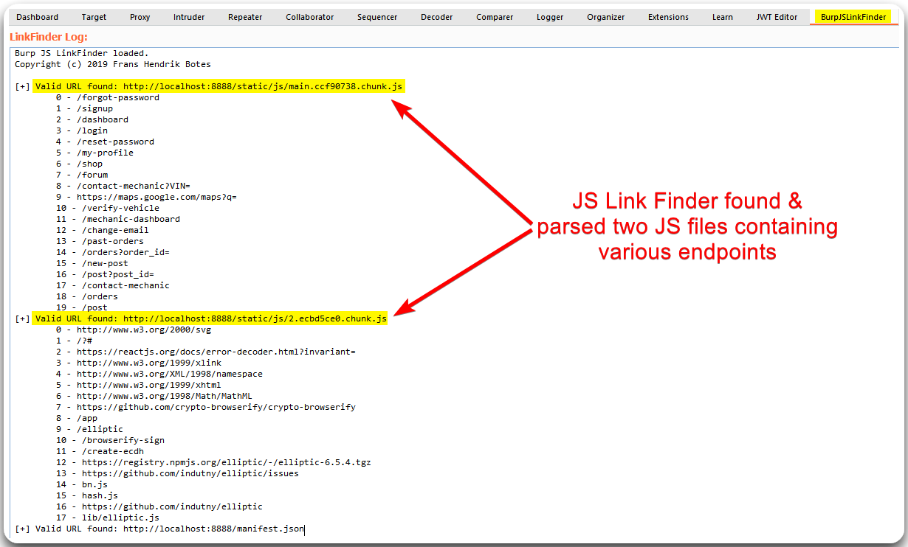

---
layout:
  title:
    visible: true
  description:
    visible: false
  tableOfContents:
    visible: true
  outline:
    visible: true
  pagination:
    visible: true
---

# General

## Active Scan

Use Burp/ZAP to actively scan the target for common security misconfigurations, such as missing security headers (Figure 1). Validate each one as this may include many false positives.

> _The below example as well as the one on the_ [_JavaScript Files section_](general.md#javascript-files) _are based on the_ [_crAPI_](https://github.com/OWASP/crAPI) _application._

<figure><figcaption>
Figure 1: Actively scanning the target with Burp Suite.
</figcaption></figure>

## Base Path

> _The example below is based on PostSwigger's_ [_API Testing_](https://portswigger.net/web-security/api-testing) _module._

Investigate the base path of each endpoint (Figure 2 & 3).

<figure><figcaption>
Figure 2: Testing the endpoint's base path.
</figcaption></figure>

<figure><figcaption>
Figure 3: Continuing testing the endpoint's base path reveals a non-documented endpoint that results in BFLA.
</figcaption></figure>

## JavaScript Files

We can use the [JS Link Finder](https://portswigger.net/bappstore/0e61c786db0c4ac787a08c4516d52ccf) Burp extension to search within the JavaScript files for patterns that suggest API endpoints (Figure 4).

<figure><figcaption>
Figure 4: Reviewing the JS Link Finder log.
</figcaption></figure>
