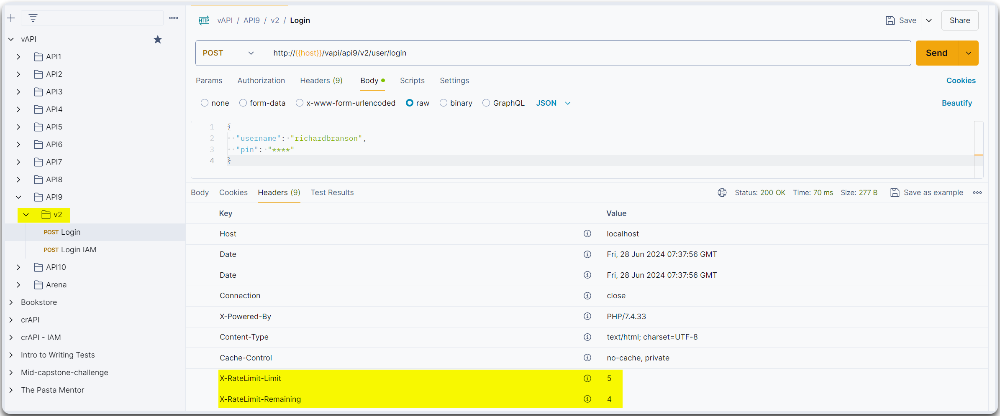

---
layout:
  title:
    visible: true
  description:
    visible: false
  tableOfContents:
    visible: true
  outline:
    visible: true
  pagination:
    visible: true
---

# Improper Asset Management


Improper Asset Management occurs when an organization fails to properly inventory, classify, or secure its assets, including hardware, software, and data.



This can lead to vulnerabilities due to unpatched software, exposed sensitive information, or loss of control over critical assets, increasing the risk of security breaches.



Maintain an up-to-date inventory of all assets, regularly assess and classify them based on sensitivity and importance, apply security patches promptly, and implement access controls and monitoring to ensure proper management and protection of assets.


## vAPI example

We are interested in endpoints that include some kind of versioning, such as vAPI's API9 (`v2`). We can see that the `v2/user/login` has rate-limiting controls (Figure 1).

> _The below example is based on the_ [_vAPI_](http://vapi.apisec.ai/) _application._

<figure><figcaption><p>Figure 1: The new version of vAPI has rate-limiting controls.</p></figcaption></figure>

Testing for IIM requires us to check if different endpoint versions are accessible, such as `beta`, `v1`, `v3`, etc. For instance, the older `v1` endpoint is still active and does not have rate-limiting controls like `v2` (Figure 2).

<figure><figcaption><p>Figure 2: The older <code>v1</code> version does not have rate-limiting controls in place.</p></figcaption></figure>

The lack of rate-limiting controls makes this endpoint vulnerable to brute force attacks (Figure 3).

<figure><figcaption><p>Figure 3: Brute forcing the user's pin number leveraging the lack of rate-limiting controls.</p></figcaption></figure>

## Testing with Postman

We can efficiently test multiple endpoints for IIM by leveraging Postman's `Find and replace` function and `Collection Runner` :

1. Duplicate the original collection for backup purposes (Figure 3.1).
2. Open the `Find and replace` function from Postman's footer (Figure 3.2).
3. Add a test script, such as `Status code: code is 200` (Figure 4.3), and open the run collection menu (Figure 4.4).
4. Filter the desired requests & select to save the responses option (Figure 5).
5. Review the results and dig deeper into the non-404 status codes (Figure 6).

> _The below examples are based on the_ [_crAPI_](https://github.com/OWASP/crAPI) _application._

<figure><figcaption><p>Figure 3: Duplicating the collection &#x26; configuring the find and replace function.</p></figcaption></figure>

<figure><figcaption><p>Figure 4: Adding a default test script &#x26; preparing to run the collection.</p></figcaption></figure>

<figure><figcaption><p>Figure 5: Selecting requests &#x26; saving responses.</p></figcaption></figure>

<figure><figcaption><p>Figure 6: Reviewing the runner's results.</p></figcaption></figure>

## Testing with Burp

Burp does not have an option to fuzz multiple endpoints, but we can test for IIM for `GET` requests with a little extra effort :

1. Manually create an endpoint list (example code below).
2. Configure the payload position on Intruder (Figure 7).
3. Load the endpoint list, add a match and replace rule, and remove URL-encoding (Figure 8).
4. Run the attack and review the results (Figure 9).


```bash
# Extracting the endpoints from the JSON postman collection file
$ cat crAPI\ -\ IIM.postman_collection.json | grep http://127.0.0.1 | awk '{print $2}' | awk -F'"' '{print $2}' > crapi_endpoints.txt

# Displaying the first 5 lines
$ head -n5 crapi_endpoints.txt
http://127.0.0.1:8888/identity/api/v1/vehicle/{{param1}}/location
http://127.0.0.1:8888/identity/api/v1/vehicle/dbca29a8-ce31-4cbe-a337-27a07cc3afbf/location
http://127.0.0.1:8888/identity/api/auth/login
http://127.0.0.1:8888/identity/api/auth/login
http://127.0.0.1:8888/identity/api/v1/user/dashboard

# Extracting the endpoints that include versioning without the host part
$ cat crapi_endpoints.txt | grep v1 | awk -F'8888' '{print $2}' > crapi_v1_endpoints.txt

# Displaying the first 5 lines
$ head -n5 crapi_v1_endpoints.txt
/identity/api/v1/vehicle/{{param1}}/location
/identity/api/v1/vehicle/dbca29a8-ce31-4cbe-a337-27a07cc3afbf/location
/identity/api/v1/user/dashboard
/identity/api/v1/user/dashboard
/identity/api/v1/user/videos/convert_video
```


<figure><figcaption><p>Figure 7: Configuring payload's position.</p></figcaption></figure>

<figure><figcaption><p>Figure 8: Improting the endpoint list and configure its processing.</p></figcaption></figure>

<figure><figcaption><p>Figure 9: Reviewing the attack's results.</p></figcaption></figure>

## Testing with CLI

We could also use CLI tools, such as `ffuf`, to check for IIM for `GET` requests adopting a similar process as with Burp (Figure 10).

```bash
ffuf -u http://127.0.0.1:8888FUZZ -w crapi_v2_endpoints.txt -c -fc 405
```

<figure><figcaption><p>Figure 10: Testing for IIM with CLI tools.</p></figcaption></figure>
