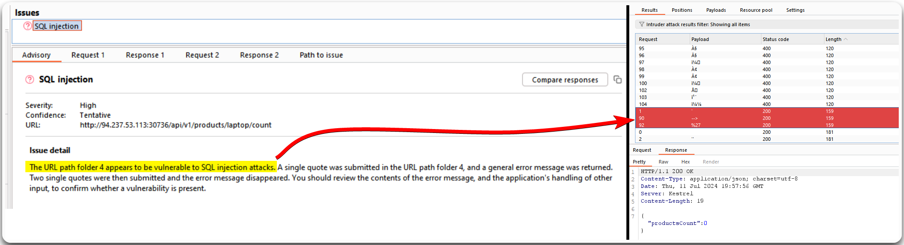
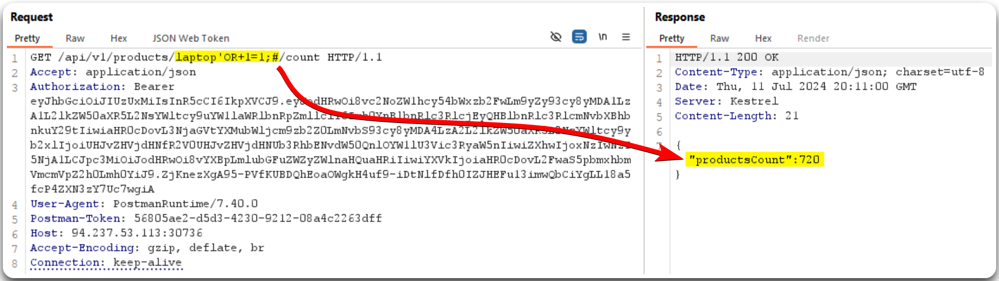

---
layout:
  title:
    visible: true
  description:
    visible: false
  tableOfContents:
    visible: true
  outline:
    visible: true
  pagination:
    visible: true
---

# Security Misconfigurations

We can use Burp's Active Scan to scan for common security misconfigurations, such as SQL injection flaws (Figure 1).

> _The below example is based on HTB's_ [_API Attacks_](https://academy.hackthebox.com/course/preview/api-attacks) _module._

<figure><figcaption>
Figure 1: Burp's active scanning reveals an SQLi flaw.
</figcaption></figure>

Scans can always produce false-positive results, thus, we need to always validating the findings (Figure 2).

<figure><figcaption>
Figure 2: Validating the SQLi vulnerability.
</figcaption></figure>
