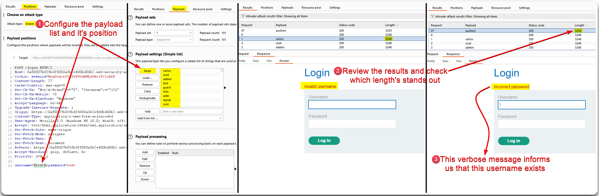
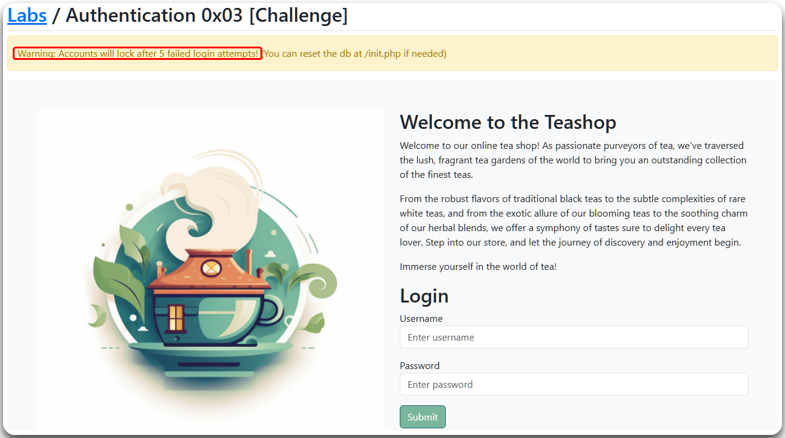
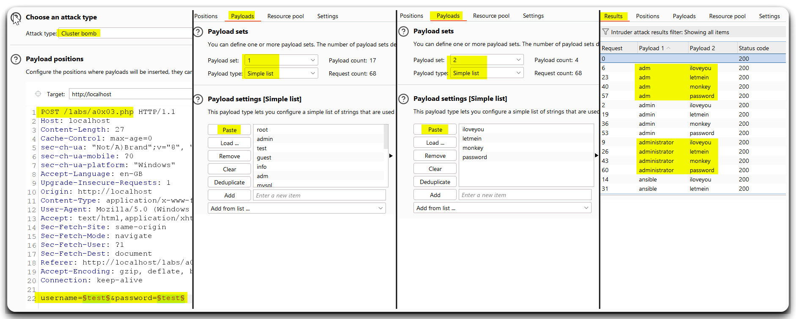
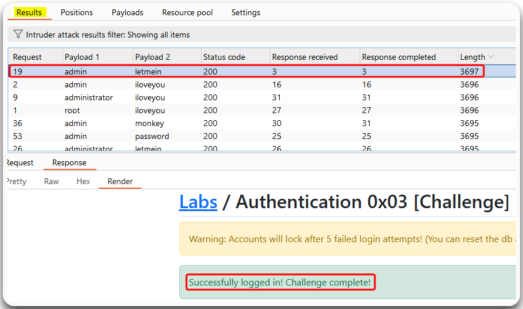

---
layout:
  title:
    visible: true
  description:
    visible: false
  tableOfContents:
    visible: true
  outline:
    visible: true
  pagination:
    visible: true
---

# Brute Force Attacks


**Brute Force Attacks** (_BFAs_) involve attackers systematically guessing combinations of usernames and passwords. By analyzing system responses, they can identify valid credentials, allowing unauthorized access to user accounts. This exploitation often relies on observing different responses to correct and incorrect guesses.


## Sniper Attack

> _The example below is based on PostSwigger's_ [_Username enumeration via different responses_](https://portswigger.net/web-security/authentication/password-based/lab-username-enumeration-via-different-responses) _lab._

We can perform username enumeration by performing a BFA (Figure 1) and then checking if any of the responses' `Content-Length` stands out (Figure 2).


_Note that the words `username` and `password` are both 8 characters long. The difference below is based on the words `Invalid` and `Incorrect` . If both used the same word, then we could try a_ [_time-based BFA_](rate-limiting.md)_, as there would be no difference in `Content-Length`._


<figure><figcaption>
Figure 1: Performing a BFA against usernames.
</figcaption></figure>

<figure><figcaption>
Figure 2: Performing a BFA against a user's password.
</figcaption></figure>

## Clusterbomb Attack

> _The example below is based on PostSwigger's_ [_Username enumeration via subtly different responses_](https://portswigger.net/web-security/authentication/password-based/lab-username-enumeration-via-subtly-different-responses) _lab._

Instead of brute-forcing the username and the password separately, we can also perform a Cluster bomb attack against both simultaneously (Figure 3).

<figure><figcaption>
Figure 3: Performing a Cluster bomb BFA against both usernames and passwords.
</figcaption></figure>

## Password Spray

> _The example below is based on TCM's_ [_Practical Bug Bounty_](https://academy.tcm-sec.com/p/practical-bug-bounty) _course._

This time the web application has an **account lockout policy** that is implement after five failed login attempts (Figure 4).

<figure><figcaption>
Figure 4: The web application's lockout policy.
</figcaption></figure>

To avoid locking out accounts, instead of brute-forcing the login page, we can perform a **password spray attack** by using a username list, such as the [top-usernames-shortlist.txt](https://raw.githubusercontent.com/danielmiessler/SecLists/master/Usernames/top-usernames-shortlist.txt), with just four common passwords at a time taken from a list such as [best15.txt](https://raw.githubusercontent.com/danielmiessler/SecLists/master/Passwords/Common-Credentials/best15.txt). This will result in four login attempts for each account, one shy of lockout (Figure 5).&#x20;


Typically, the lockout policy resets after a period of time, thus, we would have to wait for it before trying the next set of four passwords. In this case, we can just reset the database by visiting the `/init.php` directory.


<figure><figcaption>
Figure 5: Performing a password spray attack.
</figcaption></figure>

Repeating the password spray attacking using the third set of passwords, we successfully log in as `admin` (Figure 6).

<figure><figcaption>
Figure 6: Successfully logging in as <code>admin</code>.
</figcaption></figure>
