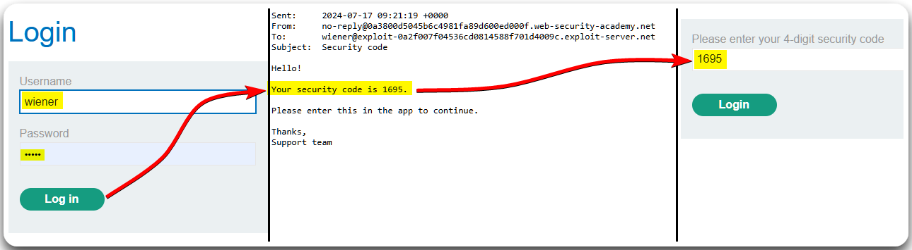
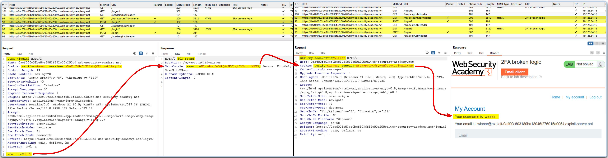
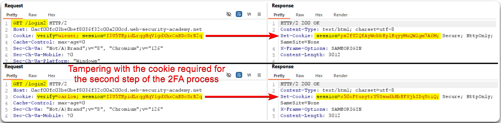
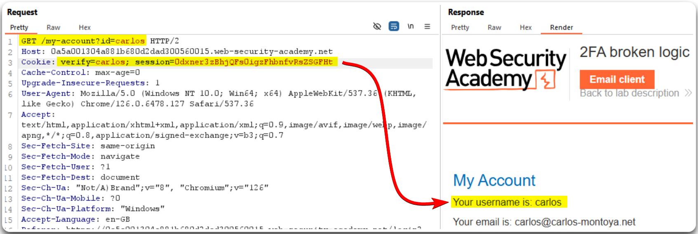
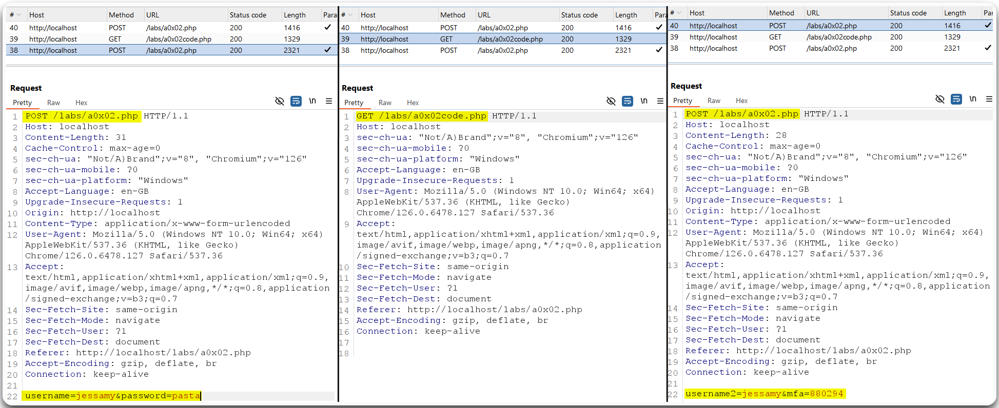

---
layout:
  title:
    visible: true
  description:
    visible: false
  tableOfContents:
    visible: true
  outline:
    visible: true
  pagination:
    visible: true
---

# MFA


Broken Multi-Factor Authentication (MFA) logic occurs when an attacker can bypass or exploit weaknesses in the MFA implementation, allowing unauthorized access despite the presence of additional authentication factors.



This can lead to unauthorized account access, as attackers may exploit flaws to bypass MFA protections and gain access to sensitive information or systems.



Ensure MFA is properly integrated and enforced, use strong and diverse authentication factors, regularly review and update MFA mechanisms, and monitor for suspicious activities or bypass attempts.


## Simple 2FA Bypass 

> _The example below is based on PostSwigger's_ [_2FA simple bypass_](https://portswigger.net/web-security/authentication/multi-factor/lab-2fa-simple-bypass) _lab._

We first need to login in as a normal user and understand how the 2FA process works (Figure 1).

<figure><figcaption>
Figure 1: Using the application as intended and understanding its behaviour.
</figcaption></figure>

We can also inspect what's happening behind the scene during this 2FA process (Figure 2).

<figure><figcaption>
Figure 2: Intercepting the traffic associated with the 2FA process.
</figcaption></figure>

It seems that each authentication step issues a different session cookie (Figure 2). There is a chance that we can use either of the two cookies to access the user's account. If this is the case, it means that the second authentication step is redundant and can be skipped altogether. We can test this by logging in as `carlos`, intercept the traffic, get the first session cookie, and then use it to access his account (Figure 3).

<figure><figcaption>
Figure 3: Bypassing the second authentication step &#x26; accessing <code>carlos</code>'s account.
</figcaption></figure>

## Broken 2FA logic 

> _The example below is based on PostSwigger's_ [_2FA broken logic_](https://portswigger.net/web-security/authentication/multi-factor/lab-2fa-broken-logic) _lab._

As before, the first thing we need to do, is to try and understand how the authentication process works (Figure 4 & 5).

<figure><figcaption>
Figure 4: Logging in as <code>wiener</code> and inspecting how the first part of the authentication process works.
</figcaption></figure>

<figure><figcaption>
Figure 5: Logging in as <code>wiener</code> and inspecting how the second part of the authentication process works.
</figcaption></figure>

We can tamper with the cookie generated in the second step of the authentication process, and create a valid session cookie tied in the account `carlos` (Figure 6).

<figure><figcaption>
Figure 6: Creating a valid session cookie tied to <code>carlos</code>.
</figcaption></figure>

Next, we can use this cookie to brute-force `carlos`'s `mfa-code` (Figure 7) and impersonate the user (Figure 8).

<figure><figcaption>
Figure 7: Brute-forcing <code>carlos</code>'s 4-digit code.
</figcaption></figure>

> _The session cookie differs between Figure 7 & Figure 8 due to a lab reset._

<figure><figcaption>
Figure 8: Impersonating user <code>carlos</code>.
</figcaption></figure>

## Broken 2FA logic (2)

> _The example below is based on TCM's_ [_Practical Bug Bounty_](https://academy.tcm-sec.com/p/practical-bug-bounty) _course._

We should first go through the MFA process to understand how it works. We first login it with valid credentials (Figure 8.1), we then get a link to grab our code (Figure 8.2), and finally we enter our `username` and `mfa` code to log into the application (Figure 8.3).

<figure><figcaption>
Figure 8: The web application's MFA process.
</figcaption></figure>

The last step of the MFA process is extremely weak as it only asks for our username and a predictable six-digit code. Thus, we can try and perform a BFA to the `mfa` code as `jeremy`. Unfortunately, the application breaks after a while, so we will need to find another solution.

We can check if the `mfa` code is tied to a specific user by logging in as `jessamy` (Figure 9.1) and modifying the username of the second authentication step to `jeremy` (Figure 9.3).

<figure><figcaption>
Figure 10: Bypassing the MFA process.
</figcaption></figure>
