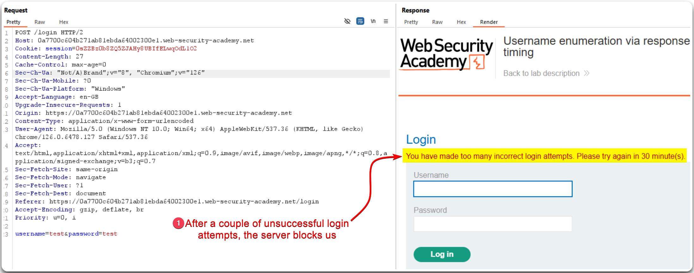
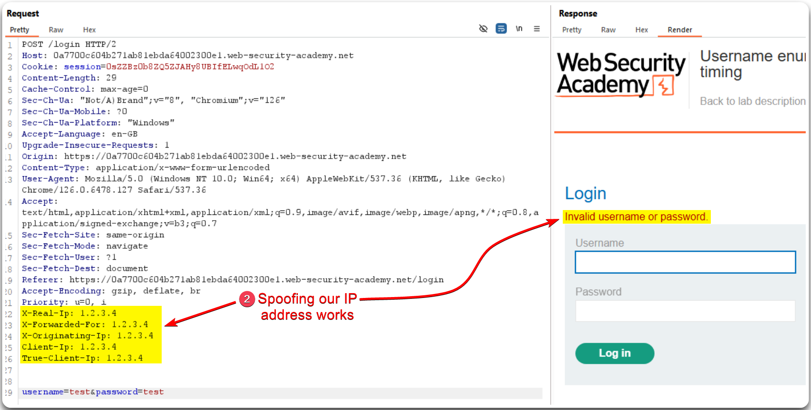
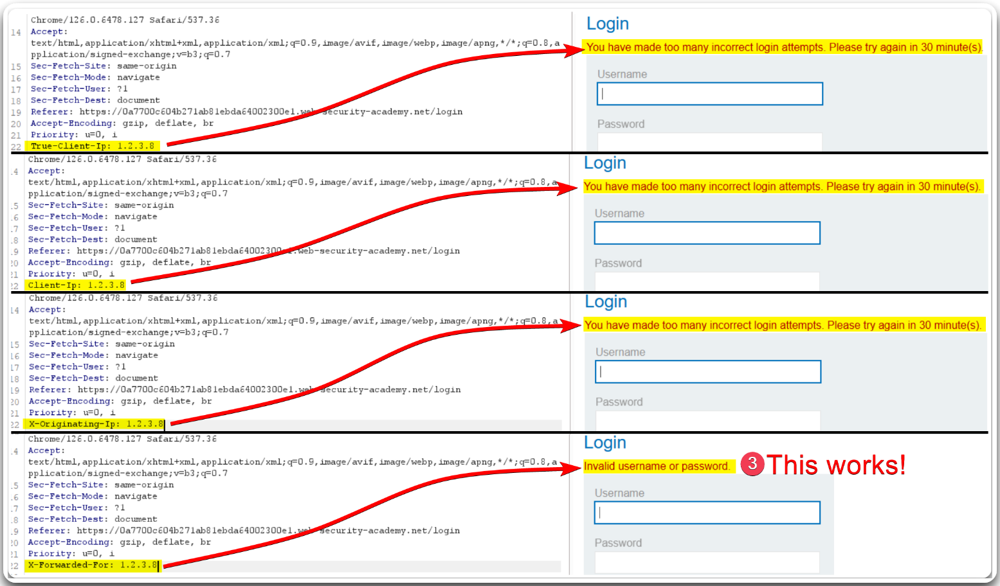
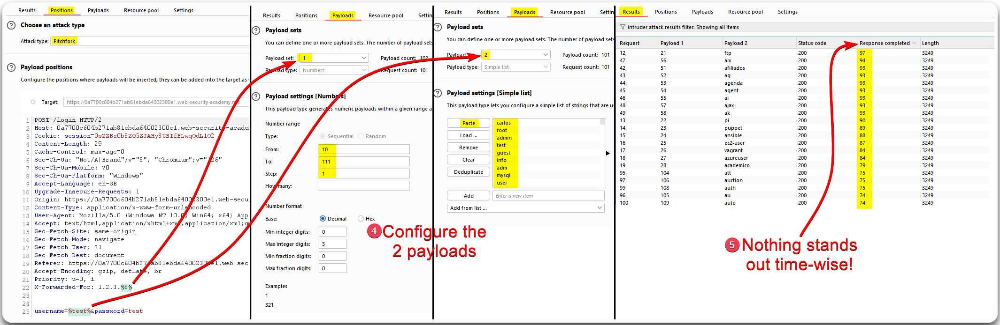
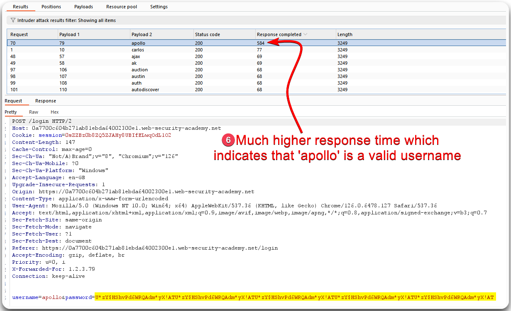

---
layout:
  title:
    visible: true
  description:
    visible: false
  tableOfContents:
    visible: true
  outline:
    visible: true
  pagination:
    visible: true
---

# Rate Limiting


Rate-limiting is a technique used to control the number of requests a user or client can make to a server within a specified time period.



Without rate-limiting, services can be vulnerable to abuse, such as brute force attacks or denial-of-service (DoS) attacks, where excessive requests can overwhelm and disrupt the service.



Implement rate-limiting policies to restrict the number of requests per user or IP address, use adaptive limits based on user behavior, and employ CAPTCHA or other verification methods to detect and mitigate automated abuse.


> _The example below is based on PostSwigger's_ [_Username enumeration via response timing_](https://portswigger.net/web-security/authentication/password-based/lab-username-enumeration-via-response-timing) _lab._

<figure><figcaption><p>Figure 1: Multiple requests result in our IP address being blocked.</p></figcaption></figure>

We can try spoofing our IP address by using the headers from Alex's [Rate-Liming checklist](https://appsecexplained.gitbook.io/appsecexplained/bypassing-controls/rate-limiting#checklist) (Figure 2).

```
X-Real-IP
X-Forwarded-For
X-Originating-IP
Client-IP
True-Client-IP
```

<figure><figcaption><p>Figure 2: Spoofing the source IP address bypass the rate-liming measures.</p></figcaption></figure>

Next, we need to find which of these headers is tracked by the server. This can be achieved via trial and error (Figure 3).

<figure><figcaption><p>Figure 3: Enumerating the working header.</p></figcaption></figure>

If we try a Pitchfork BFA attack with the creds `test:test` we can't really infer anything (Figure 4).

<figure><figcaption><p>Figure 4: Attempting a pitchfork BFA.</p></figcaption></figure>

The `test` password is too simple, so it does not take much time to get processed, hashed and compared within the database. A nice schematic of what is happening behind the scenes can be found below (Figure 5).

<figure><figcaption><p>Figure 5: Differences in response timing between a simple and a complex password (<em>image tkaen from</em> <a href="https://academy.tcm-sec.com/p/practical-web-hacking"><em>here</em></a>).</p></figcaption></figure>

If we repeat the Pitchfork attack with a complex password, something stands out (Figure 6).

<figure><figcaption><p>Figure 6: Attempting the same Pitchfork attack using a more complex password.</p></figcaption></figure>

Now that we have a valid username to use, we can perform a similar-type attack to get the password (Figure 7).

<figure><figcaption><p>Figure 7: Performing a Pitchfork attack against the user's password.</p></figcaption></figure>
